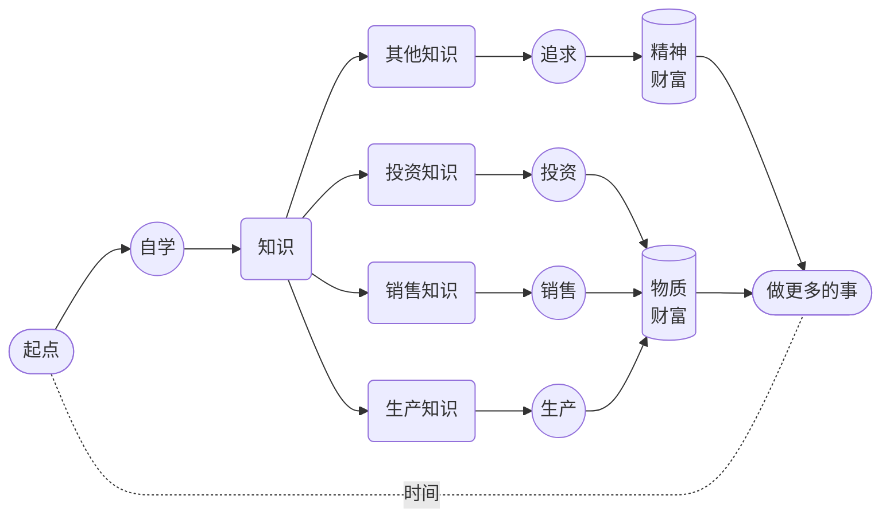

# 1. 用兵打仗

人们为教育从不吝于支付金钱…… 可惜的是，人们往往不愿意为教育支付注意力 —— 英文的习惯用法很准确，**注意什么东西**是 *pay attention to something*。

我们手里通常有三种资源，**金钱**，**时间**，**注意力**。教育的本质是**投资**自我。天下的投资都一样，投资就需要时间作为基本生产资料，不花时间的或者只花很少时间的不是**投资**，我们对这样的行为有另外一个称呼，叫作**投机**。

投资的时候，我们做的事情，本质上来看都一样，其实是在**往时间里倾注金钱**。如果采用定投策略的话，那就是**不断往时间里倾注金钱但绝不倾注注意力**。当我们学习的时候，或者说，当我们投资自我的时候，有个重点区别，我们要往**时间**里倾注的也有**金钱**，但与此同时，更重要的是**注意力**。

从这个角度望过去，一切学习失败的根源，无非以下两种：

> * 花钱不花时间
> * 花时间不花注意力

到最后，所有的失败都一样，只不过都是因为**没有往时间里倾注足够的注意力**而已。

人们总是误以为决定学习成败的关键在于智商，并且还总是误以为智商这个东西是一成不变的。可实际上，这两个观点都是基于误解的幻觉。

真正的决定性因素在于**注意力**。

 我有一个较为形象的说法。如果一个人可以做到持续 25 分钟左右注意力集中，那么，他就相当于是位**将军**，**有兵可用**。一次持续 25 分钟的注意力集中相当于一个兵。如果一个人在一整天的时间里能做到若干次持续 25 分钟的注意力集中，那就相当于**这位将军有若干个兵可用**。

兵越多当然就越好。只不过一天里的时间是有限的，与此同时，为了注意力集中大脑必需消耗大量的能量，所以，兵不可能无限多。然而，对绝大多数普通人来说，只要一天能带上七八个兵，就能做很多事情，若是能够持续下去，就一定能够达成相当惊人的成绩。

**有兵可用**之后要**有仗可打**。养兵靠打仗。没仗可打，兵就会慢慢废掉。只要兵在不断地打仗，它就会变得更为强大，具体表现就是，从**可以持续 25 分钟注意力集中**，发展成**可以持续 30 分钟 40 分钟甚至更长时间注意力集中**。兵当然越强越好。只要是强兵，用很少的兵也可以打很大的仗。

用强**兵**打什么**仗**呢？学习就是用兵打仗，自学就是自己用兵打仗…… 我们这一辈子的绝大部分时间都应该用来**自学**。学什么？学生产知识、学销售知识、学投资知识 —— 用来创造物质财富，然后还要学很多其他知识 —— 用来追求精神财富，然后才能用时间做更多的事情。

遗憾的是，大多数人压根就**无兵可用**，他们根本做不到持续 25 分钟注意力集中。所以他们也不大可能是这个类比中的将军。他们也**无仗可打**，所以他们也根本养不出兵…… 这跟智商或者天分没有任何关系，手里没兵，再聪明都没用。手里有点兵但无仗可打，还是没用，并且因为无仗可打，所以哪怕就那一点兵早晚还是会废掉…… 还是一样的，再聪明也没用。

猜一猜最令人遗憾的事情是什么？

> **每个人原本都有兵，并且还都是强兵**。

小朋友的注意力持续时间都很长，只要不被打扰，他们很容易被某个事物或者活动吸引，然后就会一直专注下去，除非饿了。

父母们往往并不知道要呵护自家孩子的注意力 —— 不管孩子在干嘛，他们都可能随时冲上去抱一下，亲一下，只顾着满足自己。学校也很可能是破坏大多数孩子注意力的帮凶，虽然肯定不是出于故意 —— 长期被迫坐在枯燥的课堂里一口气几十分钟，很多孩子并没有学会注意力集中，真正练出来的是如何坐在那里走神但不被发现。商品经济已经演化成注意力经济，全世界都在争夺我们的注意力。最近十几年兴起的移动智能设备，把地球上绝大多数人的注意广度（Attention Span）生生压缩到了两分钟之内……

就这样，大多数人逐步变成了彻底**无兵可用**、压根**无仗可打**的人 —— 可无比遗憾的是，他们每一个人都一样，在最初的时候，都是天生就带着强兵的强将。

表现出来被别人看得到的聪明，其实都是积累出来的 —— 别说聪明了，连所谓的天分都是如此，如果天分这个东西真的存在的话。

过去，人们认为**标准音高**（Perfect Pitch）是一种天分，有就是有，没有就是没有，人群中恨不得只有十万分之一的人拥有这种天分，比如莫扎特 —— 莫扎特可以分辨任何声音的音高（Pitch），哪怕是你在另外一个房间咳嗽一下，他都可以用琴键弹出你刚刚那声咳嗽的音高。

可后来研究者们发现，人们过往误以为的天分，其实都是**练**出来的，无一例外 —— **练出来**的诀窍竟然只不过是**练的久**…… 对那些被称为天才的人，他们真正的**优势**其实只不过是**练得早**，所以才**相对练得久**…… 越来越多的脑科学家们的研究结果在不断支持这个结论，每个人天生可能都有差不多的**潜力**，只不过这个潜力要**练**才能**实现**…… 换句话讲，很多人不是没有天分，而是因为虚度了时光才错过了失去了实现天分的机会。

练习标准音高没多难，没多复杂，网上甚至有很多免费的开源程序。今天，人群当中拥有标准音高的比例，早已不再是十万分之一，也不是万分之一、或者千分之一…… 早就超过了百分之一，并且，这个比例还在不断提高。无数实例表明，任何人都可以习得标准音高，只要练习的密度足够大时间足够久，从任何年龄开始都可以 —— 为什么？这压根不是什么**有就有没有就没有**的东西，它只不过是**练就有不练就没有的东西**……

人和人之间毕竟有所差异，所以，人们常说的**天分**还有另外一层意思指的是这种**不可避免的天生差异**。比如，手指短的人可能弹琴相对吃亏一点，个子矮的人可能打篮球相对吃亏一点，长得帅的人在人际沟通中相对可能更有优势，有标准音高的人在学外语尤其是练语音的时候肯定相对更有优势…… 这好像是不可否认的事实。但与此同时，我们总是可以看到更多的**反例**，手指短的钢琴大师其实不少，个子矮的篮球明星并不罕见，长得丑但成功率更高的谈判专家非常普遍……

学就是了，练就是了。反正，你应该是一位将军，你原本的确是一位将军，你要带兵打仗。

一场又一场的胜仗打下来，积累的不仅是成绩，还有越来越强越来越多的兵，以及调用指挥这些强兵的经验。如此看来，到最后，一个人能拥有的最强能力，就是**调用并指挥注意力的能力**。一旦真的拥有了这个能力，有兵可调，有仗可打，那就只能所向披靡，无往不利 —— 这跟智商和天分显然全无关系…… 如果真的有关系的话，应该是人们常常把这种能力的展现理解为智商或者天分吧。

还是**换个观念吧！**

> 天分这个东西就算真的存在，和所谓的智商一样，都是**练出来**的，都是**攒出来**的，而不是像某个配件一样可以直接安装或者干脆预装的。

在这方面换个更合理的观念非常划算的，因为那等于轻松且又瞬间地直接换了个脑子 —— 比所谓的脱胎换骨实在多了。

以下分步的陈述可能更准确更有效：

> - 你有无穷的**潜力**；
> - 你的**潜力**能否**实现**，取决于你**练不练**，**练多久**，**练多早**，**练多狠**；
> - 你能实现**多少潜力**，取决于你有**多少时间**；
> - **你的时间**是否有效，取决于你向其倾注了**多少注意力**。

学习的理由无数。但从这个角度望过去，倒也非常简单直接清楚：我们必须**拥强兵为强将**，否则多可怕啊！用我们的时间，调兵打仗。无仗可打的话就找仗去打。生命不息，战斗不止，能实现多少潜力就实现多少潜力。

