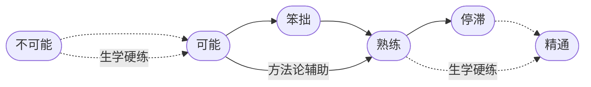

# 3. 生学硬练

无论我们做什么事情，大脑都要协调很多的器官才能够完成，它不仅要协调大脑外的各种器官，它还要协调自身内部的多个部位。无论是大脑外部的种种器官还是内部的各个部位，对大脑来说，都是大脑自身内部无数个**局域网**的联动……

这些局域网都是逐步建立起来的 —— 每一个都是通过学习建立，通过大量重复使用强化。无论我们想要学什么，第一步总是注意力集中地观察 —— 调用任何必要的感官，视觉、听觉或触觉等等  —— 然后我们才开始尝试……

几乎总是一模一样的流程：一旦开始**尝试**，首先遇到的肯定是**不可能**，要经过**反复尝试**之后才会遇到**可能**，可能之后马上遇到的是**笨拙**，再过一段时间才可能是**熟练**，而后可能是漫长的**停滞**，要经过很多刻意练习之后才可能**精通**……

这之中最重要且又最难的，当然是从**不可能**到**可能**的跨越，那可是 0 到 1 的突破。

核心的难度首先在于，**我们的观察永远不大可能完整**。举个例子，我的母语之一是朝鲜语，所以我能发出齿龈颤音（[Voiced alveolar trill](https://en.wikipedia.org/wiki/Voiced_dental,_alveolar_and_postalveolar_trills)）。我家有个小朋友小名叫都都（dū dū），平日里我逗他玩的时候，会故意用齿龈颤音喊他名字：

<audio controls><source src="/audios/dudu.mp3">Your browser does not support the audio element.</source></audio>

他们觉得很有趣，也想发出同样的声音。可在接下来的很长一段时间里，他们就是发不出这个音。他们会反复尝试，但就是做不到。他们发出的可能是用嘴唇发出来的颤音 —— 只不过，在那一瞬间他们自己也知道那不是他们听到的那种颤音。他们会继续想办法，换各种各样的方式尝试，但依然不行……

主要原因在于，他们看不到我的舌尖是如何在齿龈部位颤动的 —— 这就是无法完整观察造成的难度。另外，我还真讲不清楚我到底是怎么做到的，我会误以为我从小就会…… 实际上并非如此，当初的我和我现在的孩子一样，刚开始怎么也发不出这个声音，很久之后才能发出那种声音，但，我早就忘了自己其实是通过无数次尝试才习得的，竟然误以为那是一种天生的能力。

幸亏，在 Wikipedia 上，有这种齿龈颤音的完整且又系统的讲解 —— 有 37 种语言的翻译，其中，英文版是 [Voiced alveolar trill](https://en.wikipedia.org/wiki/Voiced_dental,_alveolar_and_postalveolar_trills)，中文版是[齿龈颤音](https://zh.wikipedia.org/?curid=274842)…… 不仅有详尽的文字讲解，还有慢动作视频演示：

<video controls width="480"> <source src="/videos/voiced-alveolar-trill.mp4" type="video/mp4"></source>Your browser does not support the video tag. </video>

现在，不仅观察完整，方法论也很系统…… 可是，看过之后就能做到吗？显然还是不可能。大脑内暂时还没有对应的可供调用的基础功能性局域网，需要新建。并且需要的还不止一两个，别看只是这么小小的一个动作，实际上却需要远比想象多得多的基础功能性局域网相互协调。新建连接新建网络就是需要时间，无论观察完不完整、方法论存不存在，时间总是不可跨越。

那如何才能**突破**呢？

在我长大的年代里，香港连续剧在中国大火，又由于那个时候可看的东西少，往往是一部剧全国都在追…… 在某部武侠剧里，一个**武林高手**在镜头面前有个特写，观众们看到的是，他的耳朵竟然会动！第二天，全班同学都互相问，你的耳朵能动吗？大家都不行…… 在此之前，每个人的耳朵都没动过，也没想到过要动。过了几天，有个同学说他**会动耳朵**了！大家惊讶地看他表演…… 再过几天，班上很多同学都**学**会了怎么**动**耳朵…… 当然，谁都说不明白**如何动耳朵**的**方法论**，都是一样的措辞，“多试试就可以了”。

就是这样 —— **多试试就可以了**。

在新疆，所有人在很小的时候就**学**会了**晃脖子**，那是一种其他民族的人少有能做出的动作。你去问他们，到底应该怎么晃脖子，他们真说不清楚，就算偶尔有人说得很清楚，你也学不会…… 真的**学不会**吗？肯定能学会，至于**方法论**么，不是没必要，而是它能起的作用并没有想象得那么大。

很少有人能**动鼻尖**，生活中，也没有什么这样的 **“需求”** …… 但，两个版本的《家有仙妻》的主演，无论是电视剧版里的伊丽莎白·蒙哥马利还是电影里的妮可·基德曼都学会了这个动作 —— 怎么学会的？跟 “动耳朵”、“晃脖子” 一样，**“多试试”** 就可以了。

突破的关键在于**不停地尝试**，一个方式不行就再换另外一个方式。反正新建连接新建网络就是需要时间，用什么填满那些时间呢？试错 —— 这可是大自然用来进化的唯一有效策略。进而，为什么可以不断尝试？又，为什么愿意不断失败不断尝试？因为它**肯定可能** —— 别人能做到，我也能做到……

这才是人生最凶悍的学习方式，我称其为**生学硬练** —— 不断试错直至可能，不断重复直至熟练：

> 因为肯定可能，所以才愿意不断尝试；失败很正常，换个方式接着尝试，直到可能。

一切的学习，对大脑来说都一样，最初 0 到 1 的突破，根本就没办法靠方法论解决，都只能靠生学硬练闯过去…… 等这一关过了，再把不可能变为可能之后，从笨拙走向熟练的过程中，方法论才开始有机会发挥作用。

可问题在于，方法论这个东西，即便有用，也常常并不能独立起作用。举个例子，我告诉你 t 夹在元音之间的时候要用弹舌音 t̬（[3.2.2.3.1](../sounds-of-american-english/3.2.2-td#_3-2-2-3-1-弹舌音-t)）—— 你当然瞬间能够理解，甚至能够记住，可是，下一次你开口说的时候，就能做到吗？十有八九做不到。这种例子比比皆是，绝大多数英语语法知识点对第二语言习得者来说都是这样的，考场上基本上都能把题做对，可是一开口说，一动手写，就接二连三出错，即便在出错过后瞬间还能够自我意识到……

很多重要的知识和技能就是这样，知道根本没有用，哪怕熟练也不够用，必须精通才真正有用 —— 因为必须做到能够下意识无意识都能做对的地步。大脑里必须为了这个所谓**知道**要建立新的连接和网络，并且还要不断强化，强化到一定地步才能够下意识甚至无意识地正确处理这种情况 —— 熟练只是卸载了部分负担，这需要极大量的重复，最好还是短期内足量重复；必须精通才能彻底卸载负担，这还需要极大量的重复，最好还是短期内足量重复…… 只有精通，大脑才能彻底无负担地同时做其他的事情……  说来说去，这不全都只能靠生学硬练嘛？

所以，生学硬练实际上贯穿着整个学习过程 —— 从始至终，任何时候都可能需要生学硬练，关键的时候尤其如此。之前的说法也应该调整一下了，所谓的生学硬练，应该是**不断试错直至可能，不断重复直至精通** —— 而不只是熟练而已。

**生学硬练，原本是我们与生俱来的能力**。毫无疑问，在最初的几年里，无论什么都是我们通过生学硬练掌握的。理论上来讲，自然语言处理，是人类的大脑终生能够处理的最高级最复杂的任务（没有之一）；与之相应的，自然语言习得，显然是我们这一生能够遇到的最复杂最艰难但又必须完成的学习任务。但是，自然语言习得的最基础部分，**语音塑造**和**记忆扩展**，却能在还没上学还不识字的过程中就逐步完成 —— 全靠生学硬练。

即便是到了很多所谓高级的领域，也还是一样的。有人能手把手教，当然很好。但总有一些是身边没有人会的，那怎么办？看书，然后自己学、自己练。有没有可能连书都找不到呢？当然。没有人可以在身边手把手教，书里也找不到，那怎么办？到最后永远都能仰仗的，再一次只能是生学硬练……

随着时间的推移，绝大多数人竟然彻底忘记了自己曾经拥有过的生学硬练的本领。这背后的根源虽然有点微妙但也格外简单。

每个人的时间都有限，刚开始的时候并不觉得，所以很难在意**效率**。随着岁数的增加，过去的占比越来越高，未来的占比越来越少，效率的重要性就显得越来越大，于是，越来越渴求一切可能会提高效率的方法论…… 越来越痴迷于方法论，甚至不惜欺骗自己去相信那些只是胡搞瞎搞但就是敢坚称自己有效的所谓方法论。甚至，开始莫名其妙地鄙视生学硬练。与此同时，一切需要生学硬练的，都直接跳过，借口说那需要一些自己没有的天赋，所以自己永远学不会 —— 倒是可以因此轻松原谅自己，以效率为名。

绝大多数人的问题只不过是，对自己要求太低，对世界要求太高。特别擅长糊弄自己，然后也习惯了糊弄世界…… 这个世界说实话倒也挺宽容，一般不会马上反击，可它总有忍不住的时候，万一它反手一个耳光扇过来，没有人能承受得住。

生学硬练也有技巧：**变着花样不断搞**。**试错**，总是需要不断地换新方式去尝试，然而，**重复**，也需要不断地换着方式重复，从各个角度、从各个层面去重复，变着花样去重复。只要你肯不断变花样，原本看起来无比枯燥的生学硬练就会变得趣味丛生，其乐无穷。
