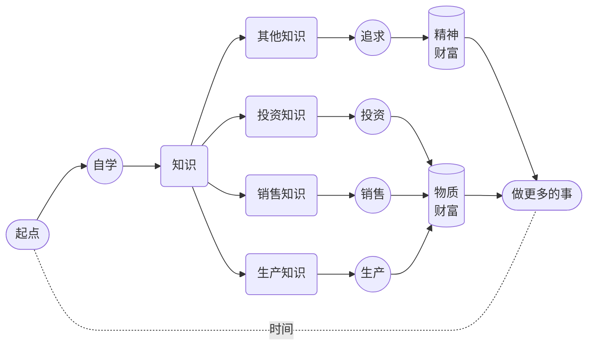

# 7. 自我鼓励

自我驱动很好。一旦启动，我们就好像正在行驶的汽车一样。遇到颠簸、遇到弯道，它可能需要放慢速度，遇到陡坡的时候它可能需要加大马力，甚至，它也有可能半路抛锚，需要重新启动…… 而这一切，总是需要我们自己完成，虽然借助外力并不是不可以，但，靠自己总是更有效率。

首先，我们需要不断强化我们的动机，让我们自己遇到**意外熄火**的时候更容易**重新启动**。

**正面做法**是主动为我们的目标、行动及其成果从各个层面赋予更多更大的**意义**。负面做法**是调用我们的**恐惧** —— 对我们的大脑来说**恐惧永远是最佳驱动力** —— 它会在潜意识层面不为人知地发挥巨大作用。

我们可以算一个**假账**。

《财富的真相》里我讲：

> 我们这一生的所有财富，不管是物质上的还是精神上的，都是从自己的**时间**里挖出来的……

既然，**时间就是生产资料**，那么，用它干什么最划算？

到最后，选来选去，只有**自学**。虽然**练英语**，好像与**生产**、**销售**、**投资**并未直接关联，**学它干嘛？** —— 我们先不说**赚钱**，先说说**省钱**。

从比例上来讲，父母把绝大多数钱都花在孩子身上，尤其是**学习**上，这种现象在全世界都很普遍…… 所谓的**绝大多数钱**，从比例上来看，超过父母总体收入的 *60%* 并不罕见，高达 *80%* 也不稀奇。

当我们说**一年内至少一千小时的注意力投入**去**练英语**的时候，核心不只是**英语**本身 —— 因为，实际上你用同样的方式练任何语言，或者练任何其它技能都一样的 —— 在这过程中，学得更多、练得更多，体会得更深的，其实是**自学**，是**自学能力**的养成与发展。

如果你作为父母，竟然真正拥有自学能力，你的孩子哪怕仅仅通过耳闻目染也会拥有相对更强的自学能力，更何况，这个训练本身，从一开始就可以全家人一起做。只要孩子有一定的自学能力，那么，父母在孩子身上花的钱，大部分都会省下来，不仅父母省钱，孩子也会恰恰因此长出更多的本事。

父母拼命赚钱花在孩子身上的一个**副作用**或者**负作用**，就是孩子不断**降智** —— 天下一切的**本事**，原本都只能在**遇到问题解决问题**的过程中**发展**出来，可是，绝大多数父母**拼命赚钱花在孩子身上**的结果，就是**遇到问题解决问题的**从来都是父母而绝对不是孩子。那些孩子原本应该遇到的问题，都被父母花钱解决了…… 至于是**真解决**了还是**假解决**了，往往并不知道 —— 真相总是很容易被掩盖。

原本遇到问题的是孩子，那可原本是他们**长本事**的机会，结果，机会被剥夺的同时，问题却实际上并未解决，但又误以为已经解决了，问题的积累与误解不断扩大，甚至连幻觉也在跟着不断扩大，到最后，神仙都没办法 —— 这绝对不是危言耸听，最终的恶果，在绝大多数人 15 岁左右的时候就会显现，就会爆发，并且只能一发不可收拾。
让我们简单算一笔账。假设夫妻二人的年收入是 30 万元人民币…… 那么，小学、初中、高中，12 年下来，平均每年在孩子身上花的钱，按 60% 计算，大约应该是 18 万。这其中，大约 60% 是花在各种**校外辅导**上的 —— 基础教育费用，事实上并不太高，因为全世界都一样，高中毕业之前，毕竟绝大部分是**义务教育** —— 那么，大约应该是 *10.8* 万元，12 年下来，总计是 *129.6* 万元…… 若是孩子有真正的自学能力，不说这些全都省下来吧，起码其中的 *80%* 能省下来，算一下，就是 *103.68* 万。

而你的**投资成本**呢？主要根本不是**钱**，也不仅仅是**时间**，而是**注意力**，只有时间成本没有金钱成本的**注意力**。一年内至少一千小时的注意力投入** —— 并且，还是你们夫妻二人中的某一个就可以。所以，在金钱上，几乎是零投入，而相对可能的收益呢？也许是 *103.68* 万，并且，还相当于是**一年之内赚出来**或者**一年之内攒出来**的 —— 那可是年收入 30 万的夫妻两人不吃不喝三年都赚不到更攒不下来的钱！打工也好、创业也罢，这样的投资收益很惊人吧？不算不知道，一算吓一跳。

到最后，**投资收益**可不只是**一年干出一百万**那么简单。你变成了**双语使用者** —— 甚至你的第一语言变成了英语。你也好孩子也罢，甚至你的另一半，都**长了见识**，亲眼目睹了健脑的真相和效果，你拥有了真正的**自学能力**，他们也在不知不觉之中迈过了最大的门槛

如果你的孩子被你影响 —— 如果你真做了，他们必然全方位受到影响 —— 那么，他们也会成为**多语使用者**，至少是**双语使用者**。无数的研究表明，**多语使用者**相对有更强的思考能力、学习能力、解决问题能力、组织能力管理能力，甚至连罹患老年痴呆的风险都会因此降低很多。从大脑结构上来看，他们的灰质相对密度更高、体积更大，而白质覆盖面积也更广。

更为重要的是，无数调查都表明，**多语使用者**的收入比**单语使用者**高，终其一生，起码会高出 *30%*…… 你估算一下你的孩子会有多少终生收入吧，再乘以 30%，那就是你用**一年内至少一千小时的注意力投入**可以为你的孩子额外赚到的金额…… 如果你再多生几个，那你就再算算？

用金钱刺激自己，总是相当有效的。说来好笑，所谓的**用金钱刺激自己**，只不过是**算个假账**而已。

不止金钱，还有很多。比如，你的一年努力，换来的肯定包括金钱买不来的**尊重**。人就是这样，自己做不到的事情，别人做到了，只能选择尊重。外人就算了，赢得另一半的尊重很重要，会使夫妻关系更为亲密；赢得孩子的尊重更重要，父母的**尊重**若是通过行动**赢**来的，孩子就不存在什么**叛逆** —— 天下一切的所谓**叛逆**，其实是**父母不值得孩子尊重**作为底色展现出来的光怪陆离而已，难道不是吗？**干上一年就能换来子女对自己终生的尊重** —— 请问，值不值？

如果你真的有什么技能，能做到**轻松超越九成以上的人群** —— 诀窍很简单啊，就是那句话，**一年内至少一千小时的注意力投入** —— 你整个人的**气质**都会变的。首先来自于别人对待你的态度，而后来自于你的**自信** —— 关键在于，你的**自信**不可能是**自负**，因为它是有成绩支撑的。没有实际支撑的时候，自信很可笑，但，众技傍身的你，由里至外地自信，为什么不呢？弄不好，你还得刻意低调呢 —— 为了让别人更舒服一点。淡定的表情，聚焦的眼神，舒展的动作，从容的态度，这样的神态其实都是自然发生的，装是装不出来的。外界越来越不重要，建设大脑皮层是你最喜欢干的事情……

再让我们看看如何调用**恐惧**作为底层驱动。其实很简单：

> 想尽一切办法让自己相信练不好还不如死了算了……

大脑最怕死了，只要有死亡威胁存在，它就会不惜不断抬高**安全阈值**，直至摆脱死亡威胁。这是我们完全无法改变的大脑运行机制，与其受其限制，不如反过来好好利用这个机制。把 “**\_\_\_\_ 练不好就得死！**” 这样一个填空句式完成，打印出来放在每天一睁眼就能看到的地方，甚至打印多份，或者干脆用这句话给[手机](/images/iPhone-wp.png)和[手表](/images/iWatch-wp.png)都做个壁纸…… 说来格外好笑，大脑很好骗的！只要重复次数多了，它就只能选择相信。

除了不断强化动机之外，我们还需要时不时进行**自我鼓励** —— 不能总是等别人来鼓励我们，对吧？自我鼓励的最佳方式，可能会出乎很多人的意料，其实是**不择手段地鼓励他人** —— 简单得很。

每个人都需要鼓励，但，鼓励总是稀缺的，所以，任何时候不择手段地鼓励他人都是正确的，多多益善。鼓励的本质是推动被鼓励者去完成**不相信**或者**不敢相信**的目标。你鼓励他人一次，在对方尚未做到的情况下，他们对可能性依然是存疑的 —— 这就是为什么大多数情况下大多数鼓励并不起作用的根本原因。然而，你不断鼓励他人的结果是**自己重复的次数足够多之后自己的大脑提前相信**了…… 你说，鼓励他人的最大受益者到底是谁？鼓励他人的最大受益者竟然是自己。
