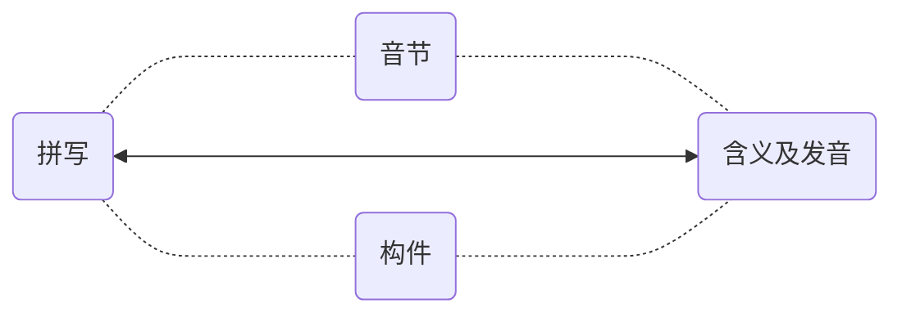
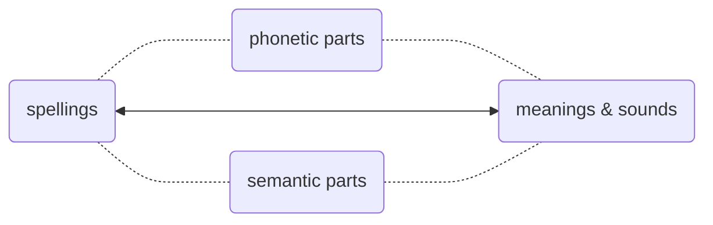
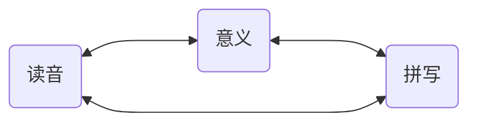
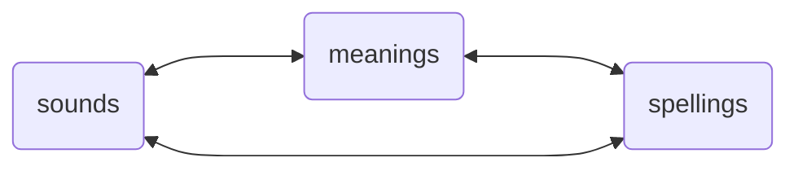

# 4. 而后（What's next）

语音是可以通过 3 ～ 6 个月的密集训练彻底搞定的 —— 至少可以获得极大的改善。下一步是什么？下一步是搞定语言的另一方面，除了语音之外的文字 —— 任何语言都一样，都是且只是语音和文字的组合。

With 3 to 6 months of intensive practice, you can really nail pronunciation — at least, you can see huge improvements. So, what's next? The next step is to master the other side of the language: the written word. Every language boils down to a combination of speaking and writing.

文字的最基本要素是词汇。英文的词汇基本上是 “拼音文字”。英文的拼写，若是借用中文概念的话，有两种，一种 “表音”，一种 “表意” —— 或者 “既表音又表意”。

The most basic element of writing is vocabulary. English words are fundamentally "phonetic script." If we borrow concepts from Chinese, English spelling falls into two categories: one is "phonetic," the other is "semantic" — or sometimes "both phonetic and semantic."

比如，*apple* ˈæp.əl  就是一个表音构成的词汇，总计两个音节，*app* 对应着第一个音节 ˈæp，*le* 对应着第二个音节 əl。所以，记忆它的时候，不是一个字母一个字母地背，说，“a、p、p、l、e…… *apple!*”。而是：æ 对应着 *a*；*app*，p 的拼写是两个叠加的 *pp*，而后是 le 对应着 əl —— 这样的拼写很常见，比如，*double* ˈdʌb.əl , *impossible* ɪmˈpɑː.sə.bəl ……

For example, *apple* ˈæp.əl  is *phonetic* and has two syllables. The first syllable is *app* ˈæp, and the second syllable is *le* əl. So, when you’re memorizing it, you don’t go letter by letter saying, "a, p, p, l, e... *apple!*". Instead, think of it like this: æ matches with *a*; *app* includes p spelled as double *pp*, and then le matches with əl. This spelling pattern is quite common, for example, in words like *double* ˈdʌb.əl  and *impossible* ɪmˈpɑː.sə.bəl .

另外，常用词汇中其实有不少是 “组合词汇”（*compound words*），各个组成部分也都是 “表意” 的。比如 *classroom* ˈklæs.ruːm , *doorbell* ˈdɔːr.bel , *handwriting* ˈhændˌraɪ.t̬ɪŋ , *sunshine* ˈsʌn.ʃaɪn , *upstairs* ʌpˈsterz  等等。

Besides, there are quite a few common words that are actually compound words, with each part contributing to the overall meaning, that is, they are *semantic*. For example, *classroom* ˈklæs.ruːm , *doorbell* ˈdɔːr.bel , *handwriting* ˈhændˌraɪ.t̬ɪŋ , *sunshine* ˈsʌn.ʃaɪn , *upstairs* ʌpˈsterz , and so on.

词根词缀，尤其是那些来自于拉丁语的词根词缀，在词汇量没达到一定程度之前，实际用处并不大 —— 但，到了一定地步，比如，词汇量超过 5,000 的时候，在这样扎实的基础上，稍微研究一下词根词缀，对快速且大量地做大词汇量是很有帮助的。

Roots and affixes, especially those from Latin, aren’t very useful until your vocabulary reaches a certain level. But once you get to around 5,000 words, having a solid foundation, delving into roots and affixes can really help you expand your vocabulary quickly and significantly.

举个例子，*ichthyosaur* ˈɪk.θi.ə.sɔːr ，这个一看就知道并非常用的词汇，其实很简单，先从表音构成去看，ˈɪk.θi.ə.sɔːr —— 剑桥词典把它划分成了 4 个音节…… 但感觉上，第二第三个音节可以合并，ˈɪk.θiə.sɔːr，*ich* ⭤ ˈɪk, *thyo* ⭤ θiə, *saur* ⭤ sɔːr…… 而从表意的角度去看呢？前半部 *ichthyo-* 的意思是 “与鱼有关的”…… 后半部 *-saur* 是什么意思呢？各种恐龙的 “龙” 都是 -saur 结尾，于是，这个词的意思是 “鱼龙”…… 换言之，这个单词的两个部分，都是拉丁词根词缀，也都是 “既表音又表意” 的，事实上很简单 —— 虽然拼写乍看起来很复杂。

Take *ichthyosaur* for example: ˈɪk.θi.ə.sɔːr . At a glance, you can tell it's not a common word. But it's actually quite simple. Let’s break it down by its sounds. The Cambridge Dictionary splits it into four syllables: ˈɪk.θi.ə.sɔːr. However, the second and third syllables feel like they can be combined: ˈɪk.θiə.sɔːr. So, *ich* is ˈɪk, *thyo* is θiə, and *saur* is sɔːr. From a *semantic* perspective, the first part, *ichthyo-*, means "related to fish." The second part, *-saur*, means "lizard" or "reptile," like in many dinosaur names that end in *-saur*. So, the word *ichthyosaur* means "*fish lizard*" or "*fish reptile*." In other words, this word's parts, drawn from Latin roots and suffixes, make it both *phonetically* and *semantically* simple, even if its spelling looks complicated at first glance.

记忆词汇的最朴素最有效方法，就是把它的拼写、读音和意义联系起来 —— 这原本是文字本来的结构和意义。

The simplest and most effective way to remember vocabulary is to connect its spelling, pronunciation, and meaning. This is essentially the structure and purpose of words.

所以，背单词的时候，要边说边写，即然说出来了就能听得到，即然写出来了就能看得到 —— 它应该是一个同时调动多个感官的活动。

When you're building vocabulary, you should say and write the words at the same time. If you speak it, you hear it. If you write it, you see it. It should be an activity that engages multiple senses at once.

除此之外，其他的任何所谓的 “方法”，都不仅无效，甚至只有副作用，弊大于利。比如什么 “谐音记忆法” 或者 “趣味记忆法” 什么的，它们都违背大脑对语言文字的基本工作机制，根本不可能提高效率，只会增加不必要的负担 —— 虽然有时候觉竟然觉得有点意思……

Apart from this approach, any other so-called "method" is not only ineffective but also counterproductive. Techniques like "homonym mnemonics" or "fun memory tricks" go against how the brain naturally processes language, speaking or writing. They don't improve efficiency; they just add unnecessary work, even if they sometimes seem somewhat amusing.

人们失败的原因很简单，他们总想 “更省事儿一点”。坐在那里只用眼睛看，既不动口也不动手，也因此实际上更少动脑。只调用一个器官和同时调用多个器官是不一样的，前者好像更省事儿，可实际上由于脑力调用太少，导致的结果是 “效果几近于零”。

The reason people fail is simple: they want to take the easy way out. They just sit there looking at words with their eyes, without speaking or writing, which means they engage their brains less. Using just one sense is not the same as using multiple senses simultaneously. The former might seem easier, but due to minimal brain engagement, the results are almost negligible.

学外语的人十有八九失败。很多失败的人都曾经去问过老师，“老师，我背单词不记发音行不行？” “老师，我背单词不记拼写行不行？” 这种荒谬至极的问题问出来，并不是想要什么答案，只是想要一个 “偷懒认证”，给自己的偷懒找个背书…… 还别说，还真有老师说 “可以！” 因为真的有相当数量相当比例的老师，通过这种方法获得更多来自学生的好感，进而提高自己的收入……

Most people fail at learning a new language. Many of them have asked their teachers, "Can I memorize words without learning their pronunciation?" or "Can I memorize words without learning how to spell them?" These absurd questions aren't looking for real answers; they are just seeking a justification to cut corners. And believe it or not, some teachers say "yes" to gain popularity and, as a result, increase their income.

扩充词汇，是有 “加速度” 的过程 —— 可以越来越快…… 可是，在最初的时候，速度很低，加速度为零，所以总是感觉超级吃力。然而，词汇之间是有关联的，对大脑来说，一个生词与已有的词汇关联越多，越容易记住。也就是说，已有词汇量越多，新词可能与它们产生的关联越多，所以才越来越容易。当你的词汇量超过三五千的时候，你就会感觉很多生词几乎看一眼就记得住，无论是拼写还是读音还是其意义甚至其用法。

Building your vocabulary has a snowball effect—you can pick up speed as you go. However, at the beginning, the speed is very low, and it feels incredibly hard. Words are interconnected. For your brain, the more links a new word has with the words you already know, the easier it is to remember. So, the larger your vocabulary, the more connections there are, and it becomes increasingly easier to learn new words. When your vocabulary exceeds three to five thousand words, you'll find that you can almost remember new words at a glance, including their spelling, pronunciation, meaning, and even usage.

所以有个窍门。**直接背例句**…… 对大脑来说，“多朗读几遍例句” 远比 “只把力气花在某一个单词或者词组上” 来得更为轻松。在语言方面就是这样，你做得越多，对大脑来说越轻松，反过来，你做得越少，所谓 “省事儿” 逐步形成的，对大脑来说只能是不可逾越的障碍。

Here's a tip: *memorize **sentences** directly*. For your brain, reading a few example sentences repeatedly is much easier than focusing all your effort on a single word or phrase. In language learning, the more you do, the easier it gets for your brain. Conversely, the less you do, the so-called "easier way" forms an insurmountable obstacle.

进而，最靠谱的扩大词汇量方法：**精读**。找到自己真正感兴趣的书（小说类、非小说类各几本），遇到生词就查，逐一消灭 —— 每本书都要读若干遍（所以一定要选自己真迷恋的书）…… 读着读着，词汇量就大了，句法障碍就消失了，理解能力就提高了，阅读速度就飞快了…… 各种语言都是这样的。哪怕是我们的母语，我们对母语的掌控能力，也是这么练出来的 —— 学校里的语文课和语文老师，从来都帮不上什么忙…… 说点刻薄的话，这些语文老师啊，他们的唯一作用就是在考试里给绝大多数学生设置奇怪的障碍。

The most reliable method to expand your vocabulary is *intensive reading*. Find books you are genuinely interested in (both fiction and non-fiction). Look up unfamiliar words and eliminate them one by one. Read each book several times, so make sure you really love these books. As you read, your vocabulary will grow, syntax barriers will disappear, your comprehension will improve, and your reading speed will soar. This applies to all languages. Even in our native language, our proficiency comes from practice—not from schools or language teachers. In fact, these teachers often only serve to create odd obstacles in exams.
