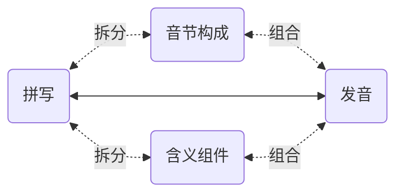
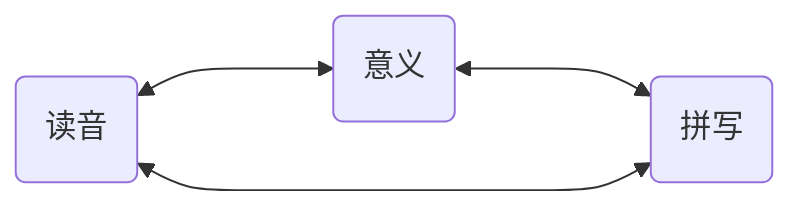

# 6. 词汇构建

千万不要天真地把 “背单词” 和 “学英语” 等同起来…… 构建词汇量，的确是一个重要的环节，但，它不仅不是全部，甚至不是最重要的环节。

另外一个关键在于，在构建词汇量的过程中，最重要的是 “**文本与语音之间不可分割的紧密联系**” —— 不知道为什么，觉得大多数人竟然觉得这最关键的东西根本无所谓…… 但，那些人早晚会因为他们的误解付出惨重的代价。

## 6.1. 背单词的最有效方法

在第三章《音素详解》中，在每个小节，针对每个音素都罗列出了 “常见拼写” —— 这才是未来扩充词汇的时候，最有效的辅助记忆手段和工具。

英文的词汇构成，主要分为 “表音” 和 “表意” 两种。

*apple* ˈæp.əl 就是一个表音构成的词汇，这是两个音节的词汇，app 对应着第一个音节 ˈæp，le 对应着第二个音节 əl。所以，记忆它的时候，不是一个字母一个字母地背，说，“*a、p、p、l、e…… apple!*”。而是，æ 对应着 a；app，p 的拼写是两个叠加的 *pp*，而后是 *le* 读作 əl —— 这样的拼写很常见，比如，*double*, *impossible*……

而 *impossible* ɪmˈpɑː.sə.bəl 这个词里，就有表意的构成，*im*- 是个常见词头（prefix），和 *un*- *ir*- 一样，表示否定的含义，*possible* 是 “可能的”，*impossible* 就是 “不可能的”。进而，*possible* ˈpɑː.sə.bəl 就可以把它完全当作只有表音构成的词汇，*po* 读作 ˈpɑː，或者反过来，ˈpɑː 写作 *po*，*ssi* ⭤ sə，*ble* ⭤ bəl…… 反正不应该是 “*p、o、s、s、i、b、l、e…… possible!*”…… 生硬地按顺序记住 7 个字母，显然不如 “只记三个音节” 来的容易 —— 这其中，需要多注意一下的，不过是 ss（double s）而已。

另外，常用词汇中其实有不少是 “组合词汇”（*compound words*），各个组成部分也都是 “表意” 的。比如 *classroom* ˈklæs.ruːm , *doorbell* ˈdɔːr.bel , *handwriting* ˈhændˌraɪ.t̬ɪŋ , *sunshine* ˈsʌn.ʃaɪn , *upstairs* ʌpˈsterz  等等。

词根词缀，尤其是那些来自于拉丁语的词根词缀，在词汇量没达到一定程度之前，实际用处不大 —— 但，到了一定地步，比如，词汇量超过 5,000 的时候，在这样扎实的基础上，稍微研究一下词根词缀，对快速且大量地做大词汇量是很有帮助的。

举个例子，*ichthyosaur* ˈɪk.θiə.sɔːr，这个一看就知道并非常用的词汇，其实很简单，先从表音构成去看，ˈɪk.θi.ə.sɔːr —— 剑桥词典把它划分成了 4 个音节…… 但感觉上，第二第三个音节可以合并，ˈɪk.θiə.sɔːr，*ich* ⭤ ˈɪk, *thyo* ⭤ θiə, *saur* ⭤ sɔːr…… 而从表意的角度去看呢？前半部 *ichthyo*- 的意思是 “与鱼有关的”…… 后半部 -*saur* 是什么意思呢？各种恐龙的 “龙” 都是 -*saur* 结尾，于是，这个词的意思是 “鱼龙”……

记忆词汇的最朴素最有效方法，就是把它的拼写、读音和意义联系起来 —— 这原本是文字本来的结构和意义。

除此之外，其他的任何所谓的 “方法”，都不仅无效，甚至只有副作用，弊大于利。比如什么 “谐音记忆法” 或者 “趣味记忆法” 什么的，它们都违背大脑对语言文字的基本工作机制，根本不可能提高效率，只会增加不必要的负担 —— 虽然有时候觉竟然觉得有点意思……

人们失败的原因很简单，他们总想 “更省事儿一点”。坐在那里只用眼睛看，既不动口也不动手，也因此实际上更少动脑。只调用一个器官和同时调用多个器官是不一样的，前者好像更省事儿，可实际上由于脑力调用太少，导致的结果是 “效果几近于零”。

学外语的人十有八九失败。很多失败的人都曾经去问过老师，“老师，我背单词不记发音行不行？” “老师，我背单词不记拼写行不行？” 这种荒谬至极的问题问出来，并不是想要什么答案，只是想要一个 “偷懒认证”，给自己的偷懒找个背书…… 还别说，还真有老师说 “可以！” 因为真的有相当数量相当比例的老师，通过这种方法获得更多来自学生的好感，进而提高自己的收入……

刚开始的时候，记忆单词无论如何都是吃力的。这是一个真诚的忠告，谁不信谁吃亏，爱信不信：

> 千万不要尝试用任何手段去提速……

—— 因为事实上谁都不可能提速，无论什么手段都不可能提速…… 真正提速的方法只有一个，**积累**。

扩充词汇，是有**加速度**的过程 —— 可以越来越快…… 可是，在最初的时候，速度很低，加速度为零，所以总是感觉超级吃力。然而，词汇之间是有关联的，对大脑来说，一个生词与已有的词汇关联越多，越容易记住。也就是说，已有词汇量越多，新词可能与它们产生的关联越多，所以才越来越容易。当你的词汇量超过三五千的时候，你就会感觉很多生词几乎看一眼就记得住，无论是拼写还是读音还是其意义甚至其用法 —— 整个看似来是个**复利曲线**一样有**越来越大的加速度**的过程。

倒是有个窍门。**直接背例句**…… 对大脑来说，“多朗读几遍例句” 远比 “只把力气花在某一个单词或者词组上” 来得更为轻松。在语言方面就是这样，你做得越多，对大脑来说越轻松，反过来，你做得越少，所谓 “省事儿” 逐步形成的，对大脑来说只能是不可逾越的障碍。

进而，最靠谱的扩大词汇量方法：**精读**。找到自己真正感兴趣的书（小说类、非小说类各几本），遇到生词就查，逐一消灭 —— 每本书都要读若干遍（所以一定要选自己真迷恋的书）…… 读着读着，词汇量就大了，句法障碍就消失了，理解能力就提高了，阅读速度就飞快了…… 各种语言都是这样的。哪怕是我们的母语，我们对母语的掌控能力，也是这么练出来的 —— 学校里的语文课和语文老师，从来都帮不上什么忙…… 说点刻薄的话，这些语文老师啊，他们的唯一作用就是在考试里给绝大多数学生设置奇怪的障碍。

## 6.2. 多音拼写

之前的章节里，都罗列了对应每个音素可能的拼写。有些拼写只对应一个读音，比如，**h** 就只对应着 h；但，有一些拼写可能对应着多个读音。以下是一个总结整理，需要经过反复对照而谙熟于心。

In the previous chapters, we listed the possible spellings for each phoneme. Some spellings correspond to just one sound, like **h**, which only corresponds to h. However, some spellings can correspond to multiple sounds. Here's a summary that needs to be reviewed repeatedly until it becomes second nature.

## 6.2.1. 元音拼写

- "**a**": `ɑː`, `æ`, `e`, `eɪ`, `ə`
- "**ai**": `e`, `eɪ`
- "**al**": `ɑː`, `æ`, `ɔː`
- "**ar**": `ɑːr`, `ɚ`
- "**au**": `ɑː`, `aʊ`, `ɔː`
- "**e**": `e`, `ə`, `ɪ`, `iː`
- "**ea**": `e`, `iː`, `eɪ`
- "**ear**": `er`, `ɪr`, `ɝː`
- "**er**": `ɚ`, `ɝː`
- "**ew**": `uː`, `oʊ`
- "**i**": `ɪ`, `aɪ`, `ə`, `j`,
- "**ie**": `iː`, `e`, `aɪ`
- "**o**": `ʌ`, `ɑː`, `ə`, `ɔː`, `uː`, `oʊ`
- "**oo**": `ʌ`, `ʊ`, `uː`
- "**oor**": `ʊr`, `ɔːr`
- "**or**": `ɚ`, `ɝː`, `ɔːr`
- "**ou**": `ʌ`, `ʊ`, `ə`, `aʊ`
- "**ough**": `ɑː`, `oʊ`
- "**our**": `aʊr`, `ʊr`, `ɔːr`
- "**ow**": `aʊ`, `oʊ`
- "**u**": `ʌ`, `ʊ`, `uː`, `ə`
- "**ure**": `ɚ`, `ʊr`

## 6.2.2. 辅音拼写

- "**c**": `s`, `k`
- "**ch**": `ʃ`, `k`, `ʧ`
- "**d**": `d`, `dʒ`
- "**g**": `g`, `dʒ`, `ʒ`
- "**j**": `j`, `dʒ`
- "**s**": `s`, `z`, `ʃ`, `ʒ`
- "**ss**": `s`, `ʃ`
- "**th**": `ð`, `θ`, `t`
- "**y**": `ɪ`, `aɪ`, `i`, `j`
- "**z**": `z`, `ʒ`

## 6.3. 常见组合词汇

1. airplane ˈer.pleɪn 
2. airport ˈer.pɔːrt 
3. backyard ˌbækˈjɑːrd 
4. bedroom ˈbed.ruːm 
5. birthday ˈbɝːθ.deɪ 
6. blackboard ˈblæk.bɔːrd 
7. bookstore ˈbʊk.stɔːr 
8. brainstorm ˈbreɪn.stɔːrm 
9. breakfast ˈbrek.fəst 
10. classroom ˈklæs.ruːm 
11. cupcake ˈkʌp.keɪk 
12. daydream ˈdeɪ.driːm 
13. dishwasher ˈdɪʃˌwɑː.ʃɚ 
14. doorbell ˈdɔːr.bel 
15. downtown ˌdaʊnˈtaʊn 
16. earthquake ˈɝːθ.kweɪk 
17. everyday ˈev.ri.deɪ 
18. eyewitness ˈaɪˌwɪt.nəs 
19. firefighter ˈfaɪrˌfaɪ.t̬ɚ 
20. football ˈfʊt.bɑːl 
21. greenhouse ˈɡriːn.haʊs 
22. handwriting ˈhændˌraɪ.t̬ɪŋ 
23. headache ˈhed.eɪk 
24. highway ˈhaɪ.weɪ 
25. homework ˈhoʊm.wɝːk 
26. iceberg ˈaɪs.bɝːɡ 
27. jellyfish ˈdʒel.i.fɪʃ 
28. laptop ˈlæp.tɑːp 
29. lighthouse ˈlaɪt.haʊs 
30. mailbox ˈmeɪl.bɑːks 
31. moonlight ˈmuːn.laɪt 
32. notebook ˈnoʊt.bʊk 
33. nobody ˈnoʊ.bɑː.di 
34. pancake ˈpæn.keɪk 
35. postcard ˈpoʊst.kɑːrd 
36. rainbow ˈreɪn.boʊ 
37. sailboat ˈseɪl.boʊt 
38. sandbox ˈsænd.bɑːks 
39. seashore ˈsiː.ʃɔːr 
40. skateboard ˈskeɪt.bɔːrd 
41. snowflake ˈsnoʊ.fleɪk 
42. spaceship ˈspeɪs.ʃɪp 
43. sunflower ˈsʌnˌflaʊ.ɚ 
44. sunshine ˈsʌn.ʃaɪn 
45. superhero ˈsuː.pɚˌhɪr.oʊ 
46. tablecloth ˈteɪ.bəl.klɑːθ 
47. toothbrush ˈtuːθ.brʌʃ 
48. toothpaste ˈtuːθ.peɪst 
49. typewriter ˈtaɪpˌraɪ.t̬ɚ 
50. underwater ˌʌn.dɚˈwɑː.t̬ɚ 
51. upstairs ʌpˈsterz 
52. volleyball ˈvɑː.li.bɑːl 
53. waterfall ˈwɑː.t̬ɚ.fɑːl 
54. watermelon ˈwɑː.t̬ɚˌmel.ən 
55. weekend ˈwiːk.end 
56. wheelchair ˈwiːl.tʃer 
57. windmill ˈwɪnd.mɪl 
58. workshop ˈwɝːk.ʃɑːp 

## 6.4. 常见词根词缀

英文的词根大多来自拉丁语；而常用词缀，包括前缀和后缀 —— 它们都是表意的。

### 6.4.1. 常见前缀

1. **un-** (not, opposite of)
  * unhappy ʌnˈhæp.i 
  * unknown ʌnˈnoʊn 
  * unusual ʌnˈjuː.ʒu.əl 

2. **re-** (again, back)
  * redo riːˈduː 
  * review rɪˈvjuː 
  * return rɪˈtɝːn 

3. **in-** (not, into)
  * incomplete ˌɪn.kəmˈpliːt 
  * invisible ɪnˈvɪz.ə.bəl 
  * inside ɪnˈsaɪd 

4. **dis-** (not, opposite of)
  * disagree ˌdɪs.əˈɡriː 
  * disappear ˌdɪs.əˈpɪr 
  * disconnect ˌdɪs.kəˈnekt 

5. **pre-** (before)
  * preview ˈpriː.vjuː 
  * predict prɪˈdɪkt 
  * preschool ˈpriː.skuːl 

6. **mis-** (wrongly)
  * misunderstand ˌmɪs.ʌn.dɚˈstænd 
  * misplace ˌmɪsˈpleɪs 
  * mislead ˌmɪsˈliːd 

7. **non-** (not)
  * nonstick ˌnɑːnˈstɪk 
  * nonprofit nɑnˈprɑf·ɪt 
  * nonviolent ˌnɑːnˈvaɪə.lənt 

8. **over-** (too much)
  * overeat ˌoʊ.vɚˈiːt 
  * overwork ˌoʊ.vɚˈwɝːk 
  * overheat ˌoʊ.vɚˈhiːt 

9. **sub-** (under)
  * submarine ˌsʌb.məˈriːn 
  * subtitle ˈsʌbˌtaɪ.t̬əl 
  * subconscious ˌsʌbˈkɑːn.ʃəs 

10. **inter-** (between, among)
  * international ˌɪn.t̬ɚˈnæʃ.ən.əl 
  * interact ˌɪn.t̬ɚˈækt 
  * interrupt ˌɪn.t̬əˈrʌpt 

11. **trans-** (across, beyond)
  * transport ˈtræn.spɔːrt 
  * transfer ˈtræns.fɝː 
  * transform trænsˈfɔːrm 

12. **under-** (too little, below)
  * underpaid ˌʌn.dɚˈpeɪd 
  * underestimate ˌʌn.dɚˈes.tə.meɪt 
  * underground ˌʌn.dɚˈɡraʊnd 

13. **super-** (above, beyond)
  * superhuman ˌsuː.pɚˈhjuː.mən 
  * supermarket ˈsuː.pɚˌmɑːr.kɪt 
  * supervisor ˈsuː.pɚ.vaɪ.zɚ 

14. **semi-** (half, partly)
  * semicircle ˈsem.iˌsɝː.kəl 
  * semifinal ˌsem.iˈfaɪ.nəl 
  * semiconscious ˌsem.aɪ.ˈkɑːn.ʃəs/ 

15. **anti-** (against)
  * antibiotic ˌæn.t̬i.baɪˈɑː.t̬ɪk 
  * antifreeze ˈæn.t̬i.friːz 
  * antisocial ˌæn.t̬iˈsoʊ.ʃəl 

16. **de-** (down, away from)
  * devalue ˌdiːˈvæl.juː 
  * defrost ˌdiːˈfrɑːst 
  * decode diːˈkoʊd 

17. **en-** (make, put into)
  * enable ɪˈneɪ.bəl 
  * enrich ɪnˈrɪtʃ 
  * encourage ɪnˈkɝː.ɪdʒ 

18. **em-** (cause to)
  * empower -ˈpaʊr 
  * embrace ɪmˈbreɪs 
  * employ ɪmˈplɔɪ 

19. **non-** (not)
  * nonexistent ˌnɑn·ɪɡˈzɪs·tənt 
  * nonsense ˈnɑːn.sens 
  * nonprofit nɑnˈprɑf·ɪt 

20. **mid-** (middle)
  * midnight ˈmɪd.naɪt 
  * midterm ˈmɪd.tɝːm 
  * midfield ˈmɪd.fiːld 

### 6.4.2. 常见后缀

1. **-able** (capable of)
  * readable ˈriː.də.bəl 
  * manageable ˈmæn.ə.dʒə.bəl 
  * comfortable ˈkʌm.fɚ.t̬ə.bəl 

2. **-ible** (capable of)
  * visible ˈvɪz.ə.bəl 
  * flexible ˈflek.sə.bəl 
  * edible ˈed.ə.bəl 

3. **-al** (relating to)
  * natural ˈnætʃ.ɚ.əl 
  * musical ˈmjuː.zɪ.kəl 
  * personal ˈpɝː.sən.əl 

4. **-ful** (full of)
  * helpful ˈhelp.fəl 
  * joyful ˈdʒɔɪ.fəl 
  * careful ˈker.fəl 

5. **-less** (without)
  * hopeless ˈhoʊp.ləs 
  * fearless ˈfɪr.ləs 
  * endless ˈend.ləs 

6. **-ly** (in the manner of)
  * quickly ˈkwɪk.li 
  * slowly ˈsloʊ.li 
  * happily ˈhæp.əl.i 

7. **-ment** (action or process)
  * development dɪˈvel.əp.mənt 
  * agreement əˈɡriː.mənt 
  * improvement ɪmˈpruːv.mənt 

8. **-ness** (state or quality)
  * kindness ˈkaɪnd.nəs 
  * darkness ˈdɑːrk.nəs 
  * happiness ˈhæp.i.nəs 

9. **-er** (one who, comparative)
  * teacher ˈtiː.tʃɚ 
  * runner ˈrʌn.ɚ 
  * faster fæst 

10. **-or** (one who)
  * actor ˈæk.tɚ 
  * inventor ɪnˈven.t̬ɚ 
  * conductor kənˈdʌk.tɚ 

11. **-ist** (one who practices)
  * artist ˈɑːr.t̬ɪst 
  * scientist ˈsaɪən.tɪst 
  * pianist ˈpiː.ən.ɪst 

12. **-ion** (action or condition)
  * celebration ˌsel.əˈbreɪ.ʃən 
  * decision dɪˈsɪʒ.ən 
  * creation kriˈeɪ.ʃən 

13. **-tion** (action or condition)
  * education ˌedʒ.əˈkeɪ.ʃən 
  * suggestion səˈdʒes.tʃən 
  * transportation ˌtræn.spɚˈteɪ.ʃən 

14. **-sion** (state or condition)
  * admission ədˈmɪʃ.ən 
  * confusion kənˈfjuː.ʒən 
  * extension ɪkˈsten.ʃən 

15. **-ous** (full of)
  * dangerous ˈdeɪn.dʒɚ.əs 
  * nervous ˈnɝː.vəs 
  * famous ˈfeɪ.məs 

16. **-ive** (tending to)
  * active ˈæk.tɪv 
  * creative kriˈeɪ.t̬ɪv 
  * attractive əˈtræk.tɪv 

17. **-ic** (relating to)
  * artistic ɑːrˈtɪs.tɪk 
  * athletic æθˈlet̬.ɪk 
  * energetic ˌen.ɚˈdʒet̬.ɪk 

18. **-ity** (state or quality)
  * reality riˈæl.ə.t̬i 
  * ability əˈbɪl.ə.t̬i 
  * simplicity sɪmˈplɪs.ə.t̬i 

19. **-ance** (state or quality)
  * performance pɚˈfɔːr.məns 
  * importance ɪmˈpɔːr.təns 
  * acceptance əkˈsep.təns 

20. **-ence** (state or quality)
  * difference ˈdɪf.ɚ.əns 
  * independence ˌɪn.dɪˈpen.dəns 
  * existence ɪɡˈzɪs.təns 

### 6.4.3. 常见词根

1. **aqua** (water)
  * aquarium əˈkwer.i.əm 
  * aquatic əˈkwæt̬.ɪk 
  * aqueduct ˈæk.wə.dʌkt 

2. **aud** (hear)
  * audience ˈɑː.di.əns 
  * audio ˈɑː.di.oʊ 
  * audition ɑːˈdɪʃ.ən 

3. **bene** (good, well)
  * benefit ˈben.ə.fɪt 
  * benevolent bəˈnev.əl.ənt 
  * benefactor ˈben.ə.fæk.tɚ 

4. **cent** (hundred)
  * century ˈsen.tʃər.i 
  * percent pɚˈsent 
  * centennial senˈten.i.əl 

5. **dict** (say, speak)
  * dictionary ˈdɪk.ʃən.er.i 
  * predict prɪˈdɪkt 
  * dictate ˈdɪk.teɪt 

6. **duc** (lead)
  * conduct kənˈdʌkt 
  * produce prəˈduːs 
  * reduce rɪˈduːs 

7. **fract** (break)
  * fracture ˈfræk.tʃɚ 
  * fraction ˈfræk.ʃən 
  * infraction ɪnˈfræk.ʃən 

8. **ject** (throw)
  * project ˈprɑː.dʒekt 
  * inject ɪnˈdʒekt 
  * reject rɪˈdʒekt 

9. **jud** (judge)
  * judicial dʒuːˈdɪʃ.əl 
  * prejudice ˈpredʒ.ə.dɪs 
  * judgment ˈdʒʌdʒ.mənt 

10. **mal** (bad, ill)
  * malnutrition ˌmæl.nuːˈtrɪʃ.ən 
  * malicious məˈlɪʃ.əs 
  * malfunction ˌmælˈfʌŋk.ʃən 

11. **mater** (mother)
  * maternal məˈtɝː.nəl 
  * maternity məˈtɝː.nə.t̬i 
  * matriarch ˈmeɪ.tri.ɑːrk 

12. **mit** (send)
  * transmit trænsˈmɪt 
  * admit ədˈmɪt 
  * submit səbˈmɪt 

13. **mort** (death)
  * mortal ˈmɔːr.t̬əl 
  * mortician mɔːrˈtɪʃ.ən 
  * mortify ˈmɔːr.t̬ə.faɪ 

14. **multi** (many)
  * multiple ˈmʌl.tə.pəl 
  * multiply ˈmʌl.tə.plaɪ 
  * multinational ˌmʌl.t̬iˈnæʃ.ən.əl 

15. **pend** (hang, weigh)
  * pendant ˈpen.dənt 
  * suspend səˈspend 
  * depend dɪˈpend 

16. **port** (carry)
  * transport ˈtræn.spɔːrt 
  * export ˈek.spɔːrt 
  * import ˈɪm.pɔːrt 

17. **scrib/script** (write)
  * describe dɪˈskraɪb 
  * manuscript ˈmæn.jə.skrɪpt 
  * subscription səbˈskrɪp.ʃən 

18. **sect/sec** (cut)
  * section ˈsek.ʃən 
  * dissect daɪˈsekt 
  * intersect ˌɪn.t̬ɚˈsekt 

19. **sent/sens** (feel)
  * sensation senˈseɪ.ʃən 
  * sensitive ˈsen.sə.t̬ɪv 
  * consent kənˈsent 

20. **spec/spect** (look)
  * inspect ɪnˈspekt 
  * spectator spekˈteɪ.t̬ɚ 
  * spectacle ˈspek.tə.kəl 

21. **struct** (build)
  * construct kənˈstrʌkt 
  * structure ˈstrʌk.tʃɚ 
  * destruct ˌself.dɪˈstrʌkt 

22. **tele** (far)
  * telephone ˈtel.ə.foʊn 
  * television ˈtel.ə.vɪʒ.ən 
  * telegraph ˈtel.ə.ɡræf 

23. **terra** (earth)
  * terrestrial təˈres.tri.əl 
  * territory ˈter.ə.tɔːr.i 
  * terrain təˈreɪn 

24. **vac** (empty)
  * vacant ˈveɪ.kənt 
  * vacuum ˈvæk.juːm 
  * evacuate ɪˈvæk.ju.eɪt 

25. **vid/vis** (see)
  * video ˈvɪd.i.oʊ 
  * vision ˈvɪʒ.ən 
  * invisible ɪnˈvɪz.ə.bəl 

