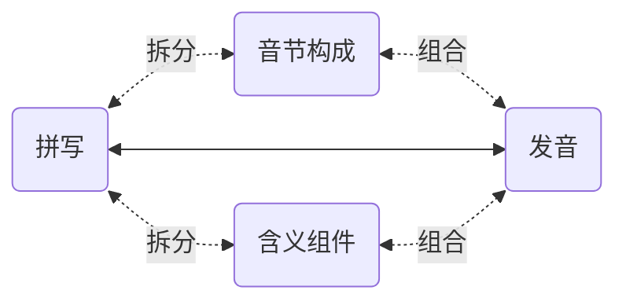
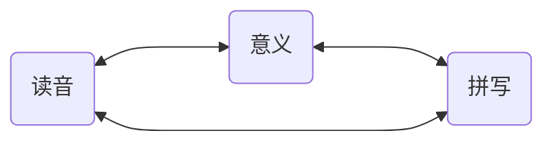

# 6.1. 有效记忆单词

在第三章《音素详解》中，在每个小节，针对每个音素都罗列出了 “常见拼写” —— 这才是未来扩充词汇的时候，最有效的辅助记忆手段和工具。

英文的词汇构成，主要分为 “表音” 和 “表意” 两种。

*apple* ˈæp.əl 就是一个表音构成的词汇，这是两个音节的词汇，app 对应着第一个音节 ˈæp，le 对应着第二个音节 əl。所以，记忆它的时候，不是一个字母一个字母地背，说，“*a、p、p、l、e…… apple!*”。而是，æ 对应着 *a*；p 的拼写是两个叠加的 *pp*，而后是 *le* 读作 əl —— 这样的拼写很常见，比如，*double*, *impossible*……

而 *impossible* ɪmˈpɑː.sə.bəl 这个词里，就有表意的构成，*im*- 是个常见词头（prefix），和 *un*- *ir*- 一样，表示否定的含义，*possible* 是 “可能的”，*impossible* 就是 “不可能的”。进而，*possible* ˈpɑː.sə.bəl 就可以把它完全当作只有表音构成的词汇，*po* 读作 ˈpɑː，或者反过来，ˈpɑː 写作 *po*，*ssi* ⭤ sə，*ble* ⭤ bəl…… 反正不应该是 “*p、o、s、s、i、b、l、e…… possible!*”…… 生硬地按顺序记住 7 个字母，显然不如 “只记三个音节” 来的容易 —— 这其中，需要多注意一下的，不过是 ss（double s）而已。

另外，常用词汇中其实有不少是 “组合词汇”（*compound words*），各个组成部分也都是 “表意” 的。比如 *classroom* ˈklæs.ruːm , *doorbell* ˈdɔːr.bel , *handwriting* ˈhændˌraɪ.t̬ɪŋ , *sunshine* ˈsʌn.ʃaɪn , *upstairs* ʌpˈsterz  等等。

词根词缀，尤其是那些来自于拉丁语的词根词缀，在词汇量没达到一定程度之前，实际用处不大 —— 但，到了一定地步，比如，词汇量超过 5,000 的时候，在这样扎实的基础上，稍微研究一下词根词缀，对快速且大量地做大词汇量是很有帮助的。

举个例子，*ichthyosaur* ˈɪk.θiə.sɔːr，这个一看就知道并非常用的词汇，其实很简单，先从表音构成去看，ˈɪk.θi.ə.sɔːr —— 剑桥词典把它划分成了 4 个音节…… 但感觉上，第二第三个音节可以合并，ˈɪk.θiə.sɔːr，*ich* ⭤ ˈɪk, *thyo* ⭤ θiə, *saur* ⭤ sɔːr…… 而从表意的角度去看呢？前半部 *ichthyo*- 的意思是 “与鱼有关的”…… 后半部 -*saur* 是什么意思呢？各种恐龙的 “龙” 都是 -*saur* 结尾，于是，这个词的意思是 “鱼龙”……

记忆词汇的最朴素最有效方法，就是把它的拼写、读音和意义联系起来 —— 这原本是文字本来的结构和意义。

除此之外，其他的任何所谓的 “方法”，都不仅无效，甚至只有副作用，弊大于利。比如什么 “谐音记忆法” 或者 “趣味记忆法” 什么的，它们都违背大脑对语言文字的基本工作机制，根本不可能提高效率，只会增加不必要的负担 —— 虽然有时候觉竟然觉得有点意思……

人们失败的原因很简单，他们总想 “更省事儿一点”。坐在那里只用眼睛看，既不动口也不动手，也因此实际上更少动脑。只调用一个器官和同时调用多个器官是不一样的，前者好像更省事儿，可实际上由于脑力调用太少，导致的结果是 “效果几近于零”。

学外语的人十有八九失败。很多失败的人都曾经去问过老师，“老师，我背单词不记发音行不行？” “老师，我背单词不记拼写行不行？” 这种荒谬至极的问题问出来，并不是想要什么答案，只是想要一个 “偷懒认证”，给自己的偷懒找个背书…… 还别说，还真有老师说 “可以！” 因为真的有相当数量相当比例的老师，通过这种方法获得更多来自学生的好感，进而提高自己的收入……

刚开始的时候，记忆单词无论如何都是吃力的。这是一个真诚的忠告，谁不信谁吃亏，爱信不信：

> 千万不要尝试用任何手段去提速……

—— 因为事实上谁都不可能提速，无论什么手段都不可能提速…… 真正提速的方法只有一个，**积累**。

扩充词汇，是有**加速度**的过程 —— 可以越来越快…… 可是，在最初的时候，速度很低，加速度为零，所以总是感觉超级吃力。然而，词汇之间是有关联的，对大脑来说，一个生词与已有的词汇关联越多，越容易记住。也就是说，已有词汇量越多，新词可能与它们产生的关联越多，所以才越来越容易。当你的词汇量超过三五千的时候，你就会感觉很多生词几乎看一眼就记得住，无论是拼写还是读音还是其意义甚至其用法 —— 整个看似来是个**复利曲线**一样有**越来越大的加速度**的过程。

倒是有个窍门。**直接背例句**…… 对大脑来说，“多朗读几遍例句” 远比 “只把力气花在某一个单词或者词组上” 来得更为轻松。在语言方面就是这样，你做得越多，对大脑来说越轻松，反过来，你做得越少，所谓 “省事儿” 逐步形成的，对大脑来说只能是不可逾越的障碍。

进而，最靠谱的扩大词汇量方法：**精读**。找到自己真正感兴趣的书（小说类、非小说类各几本），遇到生词就查，逐一消灭 —— 每本书都要读若干遍（所以一定要选自己真迷恋的书）…… 读着读着，词汇量就大了，句法障碍就消失了，理解能力就提高了，阅读速度就飞快了…… 各种语言都是这样的。哪怕是我们的母语，我们对母语的掌控能力，也是这么练出来的 —— 学校里的语文课和语文老师，从来都帮不上什么忙…… 说点刻薄的话，这些语文老师啊，他们的唯一作用就是在考试里给绝大多数学生设置奇怪的障碍。