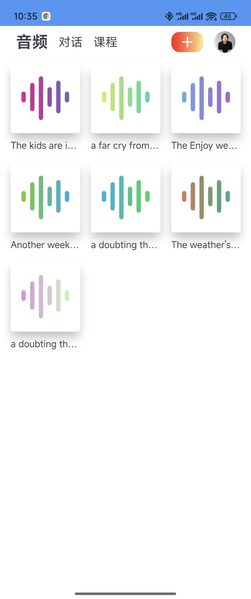
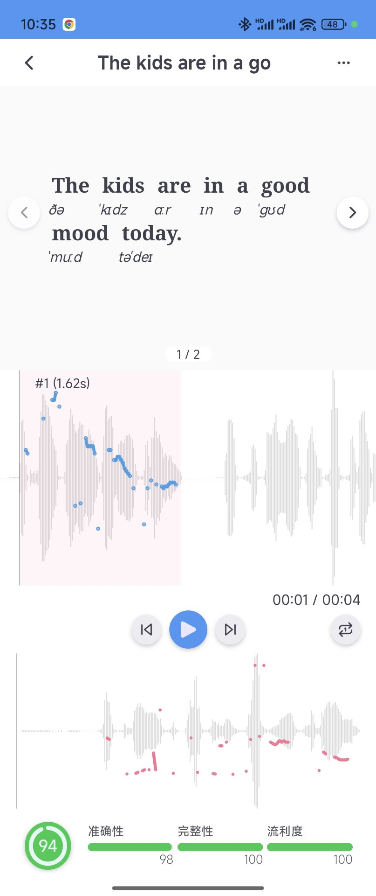
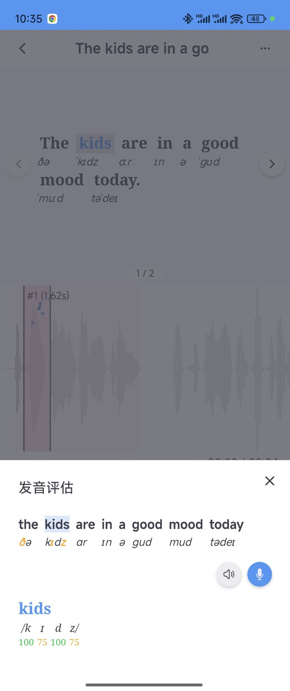
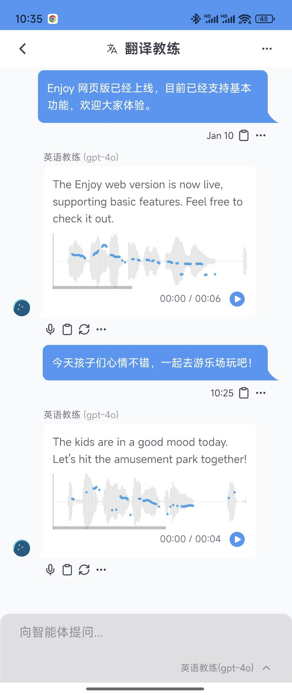

<div align="right">
  <details>
    <summary >🌐 Language</summary>
    <div>
      <div align="center">
        <a href="https://openaitx.github.io/view.html?user=ZuodaoTech&project=everyone-can-use-english&lang=en">English</a>
        | <a href="https://openaitx.github.io/view.html?user=ZuodaoTech&project=everyone-can-use-english&lang=zh-CN">简体中文</a>
        | <a href="https://openaitx.github.io/view.html?user=ZuodaoTech&project=everyone-can-use-english&lang=zh-TW">繁體中文</a>
        | <a href="https://openaitx.github.io/view.html?user=ZuodaoTech&project=everyone-can-use-english&lang=ja">日本語</a>
        | <a href="https://openaitx.github.io/view.html?user=ZuodaoTech&project=everyone-can-use-english&lang=ko">한국어</a>
        | <a href="https://openaitx.github.io/view.html?user=ZuodaoTech&project=everyone-can-use-english&lang=hi">हिन्दी</a>
        | <a href="https://openaitx.github.io/view.html?user=ZuodaoTech&project=everyone-can-use-english&lang=th">ไทย</a>
        | <a href="https://openaitx.github.io/view.html?user=ZuodaoTech&project=everyone-can-use-english&lang=fr">Français</a>
        | <a href="https://openaitx.github.io/view.html?user=ZuodaoTech&project=everyone-can-use-english&lang=de">Deutsch</a>
        | <a href="https://openaitx.github.io/view.html?user=ZuodaoTech&project=everyone-can-use-english&lang=es">Español</a>
        | <a href="https://openaitx.github.io/view.html?user=ZuodaoTech&project=everyone-can-use-english&lang=it">Italiano</a>
        | <a href="https://openaitx.github.io/view.html?user=ZuodaoTech&project=everyone-can-use-english&lang=ru">Русский</a>
        | <a href="https://openaitx.github.io/view.html?user=ZuodaoTech&project=everyone-can-use-english&lang=pt">Português</a>
        | <a href="https://openaitx.github.io/view.html?user=ZuodaoTech&project=everyone-can-use-english&lang=nl">Nederlands</a>
        | <a href="https://openaitx.github.io/view.html?user=ZuodaoTech&project=everyone-can-use-english&lang=pl">Polski</a>
        | <a href="https://openaitx.github.io/view.html?user=ZuodaoTech&project=everyone-can-use-english&lang=ar">العربية</a>
        | <a href="https://openaitx.github.io/view.html?user=ZuodaoTech&project=everyone-can-use-english&lang=fa">فارسی</a>
        | <a href="https://openaitx.github.io/view.html?user=ZuodaoTech&project=everyone-can-use-english&lang=tr">Türkçe</a>
        | <a href="https://openaitx.github.io/view.html?user=ZuodaoTech&project=everyone-can-use-english&lang=vi">Tiếng Việt</a>
        | <a href="https://openaitx.github.io/view.html?user=ZuodaoTech&project=everyone-can-use-english&lang=id">Bahasa Indonesia</a>
        | <a href="https://openaitx.github.io/view.html?user=ZuodaoTech&project=everyone-can-use-english&lang=as">অসমীয়া</
      </div>
    </div>
  </details>
</div>

<div align="center">
  
</div>

<h3 align="center">
AI 是当今世界上最好的外语老师，Enjoy 做 AI 最好的助教。
</h3>

[](https://github.com/ZuodaoTech/everyone-can-use-english/actions/workflows/deploy-1000h.yml)
[](https://github.com/ZuodaoTech/everyone-can-use-english/actions/workflows/test-enjoy-app.yml)
[](https://github.com/ZuodaoTech/everyone-can-use-english/actions/workflows/release-enjoy-app.yml)


---

## 网页版

Enjoy 网页版已经上线，可访问 [https://enjoy.bot](https://enjoy.bot) 直接使用。

<div align="center" style="display:flex;overflow:auto;gap:10px;">
  
  
  
  
  
  
</div>

---

## 桌面版安装及使用

下载及使用相关说明，请参阅 [文档](https://1000h.org/enjoy-app/)。

## 预览

<div align="center" style="display:flex;overflow:auto;">
  

  

  

  

  
</div>

## 桌面版开发

```bash
yarn install
yarn enjoy:start
```

## 相关阅读

### 一千小时（2024）

- [简要说明](https://1000h.org/intro.html)
- [训练任务](https://1000h.org/training-tasks/kick-off.html)
- [语音塑造](https://1000h.org/sounds-of-american-english/0-intro.html)
- [大脑内部](https://1000h.org/in-the-brain/01-inifinite.html)
- [自我训练](https://1000h.org/self-training/00-intro.html)

### 人人都能用英语（2010）

- [简介](./book/README.md)
- [第一章：起点](./book/chapter1.md)
- [第二章：口语](./book/chapter2.md)
- [第三章：语音](./book/chapter3.md)
- [第四章：朗读](./book/chapter4.md)
- [第五章：词典](./book/chapter5.md)
- [第六章：语法](./book/chapter6.md)
- [第七章：精读](./book/chapter7.md)
- [第八章：叮嘱](./book/chapter8.md)
- [后记](./book/end.md)

## 常见问题

请查询 [文档 FAQ](https://1000h.org/enjoy-app/faq.html)。
