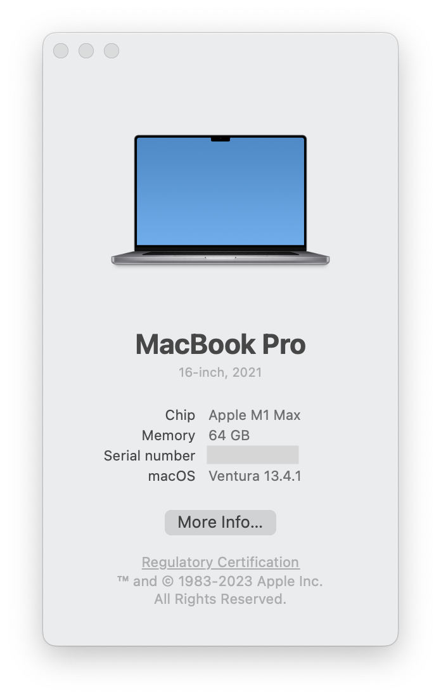
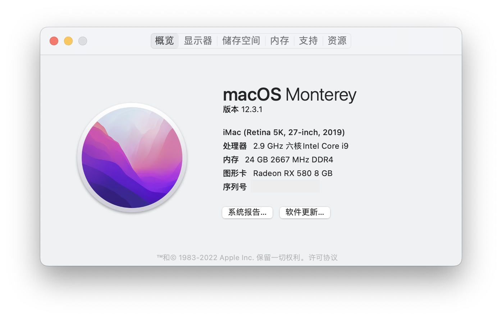
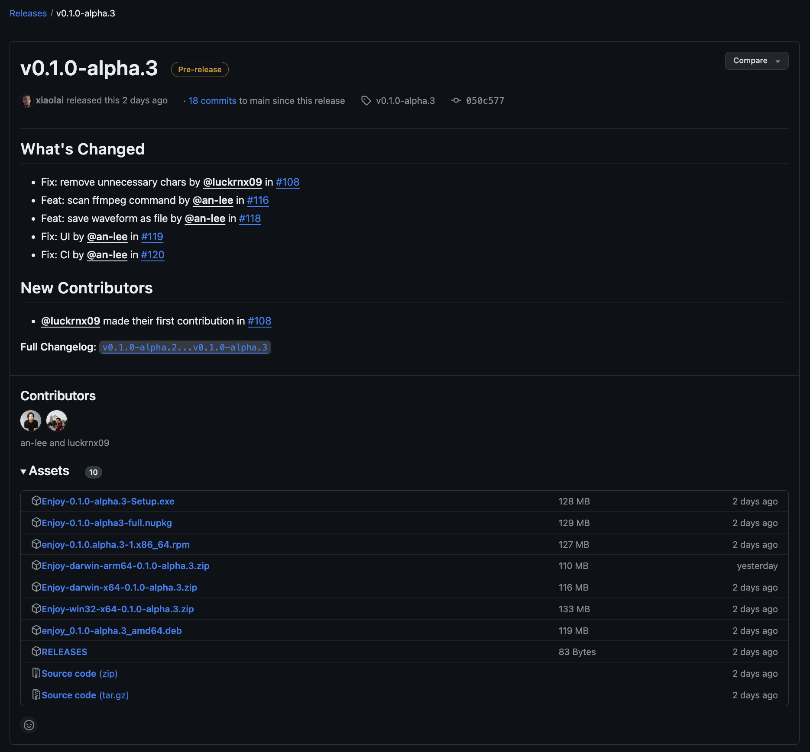
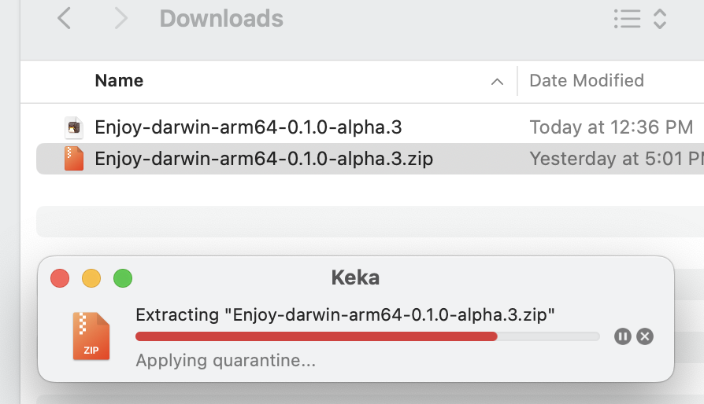

# 人人都能用英语

## 目录

- [简介](./book/README.md)
- [第一章：起点](./book/chapter1.md)
- [第二章：口语](./book/chapter2.md)
- [第三章：语音](./book/chapter3.md)
- [第四章：朗读](./book/chapter4.md)
- [第五章：词典](./book/chapter5.md)
- [第六章：语法](./book/chapter6.md)
- [第七章：精读](./book/chapter7.md)
- [第八章：叮嘱](./book/chapter8.md)
- [后记](./book/end.md)

## 应用

- [Enjoy App](./enjoy/README.md)

## * 开发者

### 本地启动

```bash
yarn install
yarn start:enjoy
```

### 编译

```bash
yarn make:enjoy
```

------

#### * 普通小白用户下载和安装指南

> Enjoy APP 提供两种下载安装的方法。

##### 方法一：直接下载编译好的预发布版本

这是**最直接简单的方法**，直接去 [releases 页面](https://github.com/xiaolai/everyone-can-use-english/tags)下载与电脑系统架构相匹配的程序，马上就能用。

###### MacOS 用户下载以及安装：

点击屏幕左上方的  符号，在弹出来的菜单中，选择第一个选项 “关于本机（About This Mac）”


在弹出来的窗口中，就可以看到本机的硬软件配置：



如果你看到的画面和上面的图片类似，说明你的 Mac 是配置了 Apple M 系列（M1、M2、M3）的芯片，这是 **ARM64 架构**的处理器，我们一会要下载 **ARM64 版本**的软件。

如果看到的画面是下面这样的，有 **Intel 字样**：



说明你的 Mac 是 **x64 架构**，我们一会要下载 **x64 版本**的软件。

点击[这里](https://github.com/xiaolai/everyone-can-use-english/tags)跳转到 [releases 页面](https://github.com/xiaolai/everyone-can-use-english/tags)下载软件。


注意看发布的日期，**越靠前的版本越新**，我们点击 “Downloads” 跳转到下载页面



我们要下载的 Enjoy APP 就在 Asset 里，如果 Assets 像这样，没有展开：


可以点击 “ ▶ Assets ” 旁边的 “ ▶ ” 符号展开


如果你是 **ARM 架构**的 Mac，点击包含 “**darwin-arm64**” 字样的链接下载 Enjoy 程序；

如果你是 **intel 架构**的 Mac，点击包含 “**darwin-x64**” 字样的链接下载 Enjoy 程序；

下载完成后，双击这个下载好的 ZIP 文件，系统会自动解压



打开 “终端” 输入下面的命令

```bash
sudo xattr -rd com.apple.quarantine 
```

> 注意：`sudo xattr -rd com.apple.quarantine` 这行命令后面，**要加一个 “空格”**

然后把刚才解压出来的 Enjoy APP 拖到这行命令后面


按 “return ↩ ” 键，输入电脑**登陆密码**

> 输入密码的时候屏幕上**不会有任何反馈**，这是[类 Unix](https://zh.wikipedia.org/wiki/类_Unix) 操作系统的特性

输完密码后，按 “return ↩” 键，如果终端**没有抛出任何异常**，说明赋权成功，双击软件图标就可以打开软件。

自此，你就可以正常的使用 Enjoy 软件了！

> Enjoy APP 配置使用教程**即将更新**

------

###### Windows 用户：

点击[这里](https://github.com/xiaolai/everyone-can-use-english/tags)跳转到 [releases 页面](https://github.com/xiaolai/everyone-can-use-english/tags)下载软件。


注意看发布的日期，**越靠前的版本越新**，我们点击 “Downloads” 跳转到下载页面


我们要下载的软件就在 Asset 里，如果 Assets 像这样，没有展开：


可以点击 “ ▶ Assets ” 旁边的 “ ▶ ” 符号展开


点击包含 “Setup.exe” 字样的链接下载 Enjoy 安装程序，下载完成后，按向导完成安装，即可使用。

> Enjoy APP 配置使用教程**即将更新**

------

##### 方法二：下载原代码，自己编译运行

这个方法操作比较复杂，好处是可以立即**试用最新的版本**，如果需要请按下面操作进行。

### MacOS 用户

1. 打开命令行工具 Terminal
2. 安装 Homebrew（请参阅这篇文章：《[从 Terminal 开始…](https://github.com/xiaolai/apple-computer-literacy/blob/main/start-from-terminal.md)》）
3. 安装 yarn：

   ```bash
   brew install yarn
   ```
4. 克隆此仓库至本地，而后安装、启动：

   ```bash
   cd ~
   mkdir github
   cd github
   git clone https://github.com/xiaolai/everyone-can-use-english
   cd everyone-can-use-english
   yarn install
   yarn start:enjoy
   ```

### Windows 用户

系统要求：Windows 10 22H2 以上版本、 [Windows PowerShell 5.1](https://aka.ms/wmf5download) 以上版本、互联网网络连接正常。

1. 将鼠标移至任务栏的 “Windows 徽标” 上单击右键，选择 “PowerShell”

   > tips 1 ：在最新的 Windows 11 上，你看不到 “PowerShell” 选项，只有 “终端”
   >
   > tips 2 ：不能用管理员权限运行 PowerShell ，否则会导致 Scoop 安装失败
   >
2. 在弹出的 PowerShell 窗口中依次执行运行以下命令，安装Scoop：

   ```powershell
   # 设置 PowerShell 执行策略
   Set-ExecutionPolicy -ExecutionPolicy RemoteSigned -Scope CurrentUser
   # 下载安装脚本
   irm get.scoop.sh -outfile 'install.ps1'
   # 执行安装, --ScoopDir 参数指定 Scoop 安装路径
   .\install.ps1 -ScoopDir 'C:\Scoop'
   ```

   如果出现下面的错误：

   > <span style="color:red">irm : 未能解析此远程名称: 'raw.githubusercontent.com'</span>
   

说明你的**网络连接**有问题，请自行研究解决：
3. 安装 Nodejs 和 yarn 以及其他依赖环境 ：

   ```powershell
   scoop install nodejs
   scoop install git
   npm install yarn -g
   ```
4. 克隆此仓库至本地，而后安装 Enjoy APP：

   ```powershell
   cd ~
   mkdir github
   cd github
   git clone https://github.com/xiaolai/everyone-can-use-english
   cd everyone-can-use-english
   cd enjoy
   yarn install
   yarn start:enjoy
   ```

   出现 `Completed in XXXXXXXXXX` 类似字样说明安装成功！
5. 运行 Enjoy APP ，在终端执行下列命令：

   ```powershell
   yarn start:enjoy
   ```

## 更新Enjoy

更新并使用最新版本的Enjoy：

1. 将仓库最新内容拉取到本地，在命令行工具中执行：

   ```bash
   git pull
   ```
   结果显示为：

   ```shell
   Already up to date.
   ```
2. 运行Enjoy APP：

   ```shell
   yarn start:enjoy
   ```
