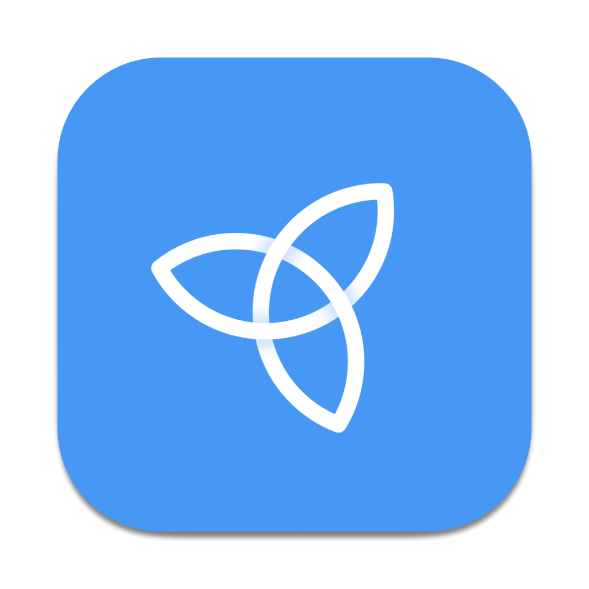
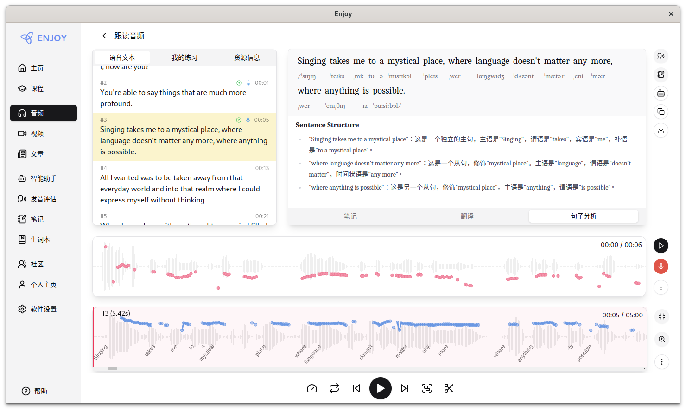
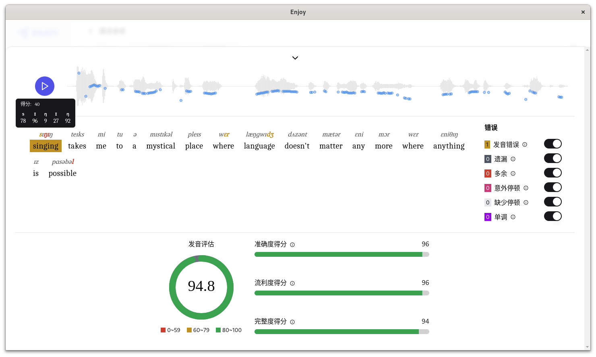
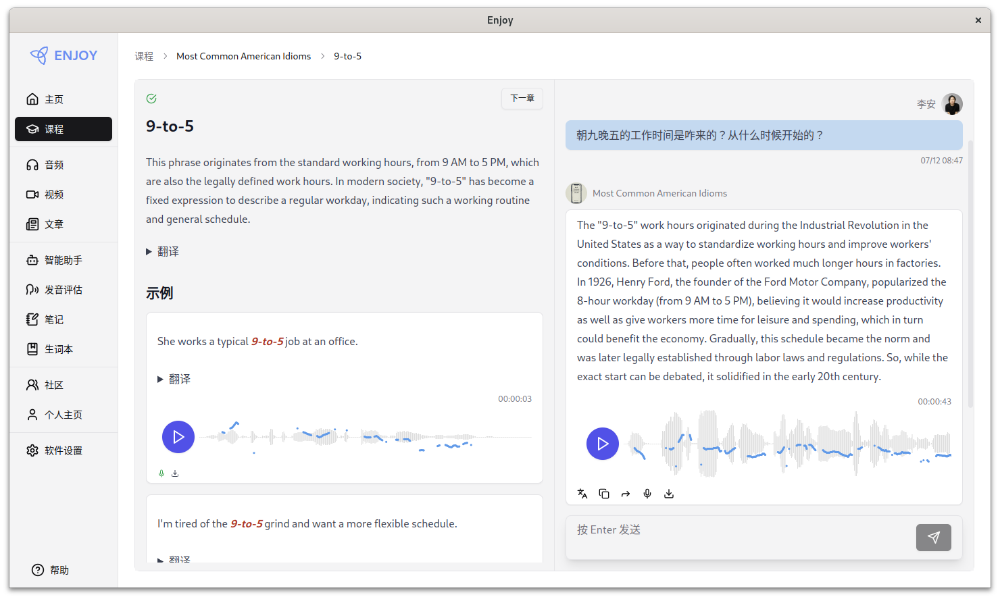

<h1 align="center">
  
</h1>

<h3 align="center">
AI 是当今世界上最好的外语老师，Enjoy 做 AI 最好的助教。
</h3>

## 安装及使用

下载及使用相关说明，请参阅 [文档](https://1000h.org/enjoy-app/)。

## Enjoy APP 预览

<div align="center" style="display:flex;overflow:auto;">
  

  

  

  
</div>

## 开发

```bash
yarn install
yarn enjoy:start
```

## 相关阅读

### 一千小时（2024）

- [简要说明](https://1000h.org/intro.html)
- [训练任务](https://1000h.org/training-tasks/kick-off.html)
- [语音塑造](https://1000h.org/sounds-of-american-english/1-basics.html)
- [大脑内部](https://1000h.org/in-the-brain/01-inifinite.html)
- [自我训练](https://1000h.org/self-training/00-intro.html)

### 人人都能用英语（2010）

- [简介](./book/README.md)
- [第一章：起点](./book/chapter1.md)
- [第二章：口语](./book/chapter2.md)
- [第三章：语音](./book/chapter3.md)
- [第四章：朗读](./book/chapter4.md)
- [第五章：词典](./book/chapter5.md)
- [第六章：语法](./book/chapter6.md)
- [第七章：精读](./book/chapter7.md)
- [第八章：叮嘱](./book/chapter8.md)
- [后记](./book/end.md)
