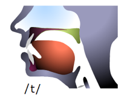
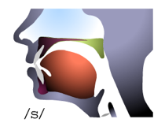
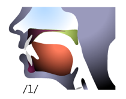
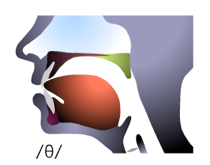

# 第三章 语音

## 1. 发音很重要，但显然不是最重要的

2009 年 4 月 17 日，大卫莱特曼（David Letterman）邀请了一位嘉宾，黄西（Joe Wong）。现在在优酷上搜索一下 “黄西” 就能能找到很多视频。

黄西非常消瘦，戴着副眼镜，一脸木纳。可他一开口只一句话全场已经笑翻。接下来的六分钟里，一个又一个的段子（翻译成中文就失去了味道的美式笑话）当在场观众笑得东倒西歪，数次掌声雷鸣。到了最后，连他的沉默都成了笑料 —— 这可是大师级的表现。这位一炮而红的黄西，1970 年出生于吉林省白山市；本科就读吉林大学化学系，1994 年赴美留学，1999 年获得莱斯大学生化博士学位。

黄西讲着一口浓重中国口音的英语征服了美国的观众。这在绝大多数国内正在拼命学习英语的学生来说是件匪夷所思的事情。从小学起，无论是老师还是学生，主流的看法就是 “发音一定要标准”。无数的老师以自己被认为能够讲一口 “标准” 的美音或者英音而自豪、而被羡慕。学生也好、老师也罢，常常相互争论应该学习 “美音” 还是 “英音”，甚至为此面红耳赤。

中国学生往往不是不会说英文，也不是不愿说英文，更不是不能说英文，基本上都是不敢说英文。为什么不敢呢？很多原因。其中有一个是最普遍的，害怕自己的发音不标准。可是第二语言习得者发音不准不是很正常的事情么？就算是母语，我们都是花了很长时间才可以做到基本上说清楚的。当你能够用母语清楚地表达自己的时候，多大了？那凭什么一个人可以从一开始就能用第二语言做到清楚准确表达呢？并且还要 “发音标准”？

不妨试一下，以下十个中文词汇，能够读得标准的有多少？

标识、绯闻、嫉妒、潜力、勾当、慰藉、连累、卑鄙、情不自禁、人才济济[^1]

睁开眼睛看看我们身边的世界吧。事实上，绝大多数母语使用者的发音都并不标准，不信的话，你可以先审视一下你自己，然后再看看身边有多少人平卷舌不分？多少人前鼻音后鼻音不分？即便你身处北京（据说是祖国的心脏，中文的 “标准发音” 据说以北京话为准），你每天还是可以听到各式各样的口音。在我们国家，究竟有多少比例的人能够讲一口标准且悦耳的普通话？有 1%么？去广播学院看看吧，那些专业主持人（毫无疑问都是母语使用者）需要花费多大的时间精力才能把自己训练到达标的地步？中国如此，外国在这方面也不应该有太大的差别。在英语国家，同样也只有 1%不到的人能够讲一口标准且悦耳的某种特定腔调。

全世界所有的语言都是如此，每种语言都有各种各样的口音。英语也许是地球上口音最多的语言。在美国，南加利福尼亚和北加利福尼亚的口音就已经非常不同，大 抵上相当于在中国山东人之间山西人讲中文的差异。纽约人和底特律人的发音当然也非常不一样。在伦敦，东部和南部的口音差异就已经非常明显。更不消说还有 “苏格兰口音”、“加拿大口音”、“澳大利亚口音”、“新西兰口音”、“印度口音”……

Paul Meier（paulmeier.com）是享誉全球的语音培训专家，很多到好莱坞打天下的演员都要求助于他，经由他的训练把自己的 “外地口音消除”，说一口 “地道” 的美式英语。他的学生包括（这里所罗列的只是其中的一小部分）：

John Ales, Jonathan Brandis, A.J. Buckley,Jewel Kilcher, Jim Caviezel, Simon Baker Denny, Peter Coyote, Stewart Finlay-McLennan, Louise Fletcher, Bill Irwin, Gabrielle Fitzpatrick, Diana Hardcastle, Tom Hulce, Kris Kristofferson, Elizabeth Lackey, Tobey Maguire, Stephen Mailer, Terrence Mann, Callum Keith Rennie, Jonathan Rhys Meyers, Kim Myers, Mark Ruffalo, Skeet Ulrich, Celia Weston, David Wenham, Valerie Wildman, Peter Wingfield, Tom Wilkinson, Jeffrey Wright…

在 Paul Meier 的网站上，有一个[页面](http://www.paulmeier.com/booklets.html)，其中有各种各样口音的英语方言示范，包括：

- Cockney
- Hampshire
- Irish
- Liverpool
- Northern Ireland
- Scottish
- Welsh
- Yorkshire; American Southern (Kentucky/Tennessee)
- Deep South (Alabama, Georgia, Louisiana, and Mississippi)
- Down East New England
- General New York
- South Boston…

几乎其中的每一种都不是在中国大陆多年只习惯 “某种发音” 的学生可以听懂的。而在[这个页面](http://alt-usage-english.org/audio_archive.shtml)上也可以找多种方言的语音示范，读者也不妨去仔细听听。然后再仔细想想，有必要一定 “标准” 么？就算真的有必要，又应该使用哪一个 “标准” 呢？

显然会有很多人不同意 “发音其实没那么重要” 的观点，但这并不妨碍这个观点的正确性及其重要意义。英语课堂上，老师过分强调 “标准发音”，甚至不惜嘲弄一些 “典型”，其实是在扼杀学生进步的可能，尽管这并非那些老师的本意。首先，所谓 “标准发音” 可能并不存在。每个人的声线、音色都各不相同，怎么可能 “一致地标准”？尤其又是在使用外语的情况下。其次，又因为英语本身是世界上 “口音” 最多的语言（没有之一），如果发音不 “标准” 就不可以说英语的话，那爱尔兰人、加拿大人、印度人都不要讲英语了 —— 因为他们用的既不是 “标准美音”，也不是 “标准英音”。

我并不是在说发音并不重要，而是在说它只不过是良好表达的众多因素之一。某种意义上，那些发音并不好（更谈不上标准）但是却可以自如表达的人更值得羡慕（比如黄西），因为他们早已经上路，而非像大多数人那样 “永远” 徘徊在起点。

所以，作为将英语作为第二语言使用的人，完全不必因为自己的发音不标准、不好听、不清楚感到自卑，那其实是正常的、自然的、不可避免的。而语言使用，本质上以沟通为目的。要知道仅仅发音标准，并不意味着说就肯定可以有效沟通。有效沟通还需要用词、文法、逻辑、内容等等更多因素，而后面提到的所有这些因素，无一不比 “标准发音” 更重要。想像一下吧，联合国开会的时候，难道每个国家的发言人都用的是 “标准英音”？或者 “标准美音”？尽管每个国家的发言人都要用英文发言，但全都用掺杂自己特定口音，可是从未影响有效沟通。

作为英语使用者，也不要被英语老师所迷惑。作为老师，教育产品的一部分，他当然会强调 “正确”、“准确”、“标准” —— 无论他们自己是否真的 “正确”、“准确”、“标准”。有时候想想挺悲哀的，大部分老师不得不抬高对自己的要求，并不是出于对进步的渴望，而只不过是为了满足 “消费者” 的实际上并不合理的期望，英语老师也是人，于是其中的大多数有着与其他大多数人一样的心理局限或者说人性局限。一个人做不到的时候，就会装，一直装到自己都信了为止 ——之后就不用装了，因为已经到了 “真诚地虚伪” 的境界。那些在课堂上反复强调 “标准发音” 的老师（就算他自己竟然真的 “标准”），其实并没有认真想过他们那么做的副作用 —— 吓倒了学生，自己倒是获得了 “敬重” 或者 “敬畏”，而后这些学生一生都对说英语有着严重的心理障碍。

[^1]: 标识(zhì)、绯(fēi)闻、嫉(jí)妒、潜(qián)力、勾(gòu)当、慰藉(jìe)、连累(lěi)、卑鄙(bǐ)、情不自禁(jīn)、人才济(jǐ)济(jǐ)

## 2. 我们完全有能力大幅度改善发音

让我们再看看科学事实。地球上究竟有多少种语言，无从得知，保守估计应该有 6700 种以上的语言，这些语言所使用的语音全部加起来大约 6000 种左右。[Patricia K. Kuhl](http://ilabs.washington.edu/kuhl/)博士是华盛顿大学听说科学系（Department of Speech & Hearing Sciences）的教授，她的[研究](http://ilabs.washington.edu/news/Times_Pacific_3_6_05.pdf)表明，刚出生的婴儿实际上有能力习得地球上的任何一种语言；也就是说，刚出生的婴儿实际上是 “世界公民”（Citizens of the world），他们的大脑有能力处理那 6700 多种语言所用到的大约 6000 种语音中的任何一种。

而大约到了 6 个月的时候，婴儿已经开始对母语更为关注，Kuhl 教授的解释是这样的：

> 这个时候，这些婴儿并非是“失去”了语音分辨能力，而是他们的大脑开始发展出一套过滤（filter）机制，能够把那些与母语无关的语音过滤掉，或者，把那些与母语中存在的语音相似的语音归为同一类。于是，最终的表现是他们无法分辨某些语音以及某些语音之间的差别了——当然是与母语无关的语音。后文还会提到，大脑需要这样的过滤器还有另外一个理由，那就是还要把不同的音色的人发出的同一个语音归为一类，大脑才能不出错地理解语言。

实际上，每一种语言所使用的语音都是有限的。瑞典语使用 16 个元音，英语使用 8 个元音，日语只使用 5 个元音；而中文使用 6 个元音 —— 比日语多了一个，这也能从侧面解释为什么中国人学英语的语音要比日本人稍微容易一些。在我们国家，有些地区的人分不清楚 “r” 和 “l” 的区别，在他们（成年人）的听觉中，“row” 和 “low”、“rake” 和 “lake” 都是没区别的。大约到了婴儿 11 个月的时候，他们的大脑中那个过滤机制已经非常健全了，于是他们就从 “世界公民” 变成了 “某一语言的公民”。到了 18 个月的时候，婴儿已经多多少少开始关注语法现象、语言模式了，例如他们可以猜得出来 “-ing” 和 “-ed” 结尾的词大抵上是动词了。

Kuhl 教授的研究中更为有趣的是她进一步调查了多语环境中成长的婴儿的大脑发育过程。地球上有一些区域是 “天然的多语区域”，比如欧洲的卢森堡[^2]、再比如我国许多少数民族聚居区[^3]。在这样的区域中长大的孩子，真正受到影响的应该是他们大脑中的那个 “过滤机制”。由于他们从小接受多种语言的刺激，于是，他们的 “过滤器” 与单语使用者不一样，因此他们能够识别更多的语音。

这样的研究结果，显然会被 “语言习得关键期” 的支持者当作支持自己看法的论据。因为，事实摆在那里 —— 又有一个研究表明成年之后第二语言习得难上加难。但，同样的研究结果也可以证明 “我们原本有能力习得任何一种语音”，“我们现在也有能力习得任何一种语音”，只不过，我们要花时间修正我们的 “过滤器”，甚至，我们可以干脆重建我们的 “过滤器” —— 因为大脑是可塑的，大脑甚至是可以重组的。只不过，需要时间而已。

“语言习得关键期” 滥用者最大的谬误在于他们把 “语音” 等同于 “语言” —— 明摆着是两回事儿的东西竟然分不清楚。事实上，尽管关键期真的存在，但它所影响的准确地来说，是 “语音”，而非 “语言”。语音只不过是语言的一个方面。年幼的人更容易习得的其实只有语音而已，而语言的其它方面并非都是如此，比如，词汇的习得，显然是越学越快，青年人强过少年，老年人（那些活到老学到老的人）强过青年人；本质上来看，一个人知识越渊博，对他来说习得新概念和新词汇就越容易。再比如，逻辑能力是文字运用的重要基础，缺乏逻辑训练的人，能够使用的和接触到的语言文字范围就要狭窄许多许多，语音再 “标准” 又如何？学外语不简单，但从另外一个角度来讲，又没有难到不可能学好的地步，说穿了，不就是说话、识字吗？世界的各个角落都有无数没文化的人也能讲一口流利的、语音几近完美的母语，可是，仅仅靠语音能解决什么问题呢？语音学习和语言学习是两回事儿，退一万步讲，仅仅语言本身都是无意义的，因为它最终只不过是记录、传递、交流思想的载体和媒介而已。

在科学家看来，学习一门技能，本质上来看就是大脑中的神经细胞建立连接的过程。美国加利福尼亚大学的退休名誉教授[Michael Merzenich](http://en.wikipedia.org/wiki/Michael_Merzenich)认为，每一项新技能的习得，都需要在大脑神经细胞之间中建立亿万个新的连接。这样艰巨的任务当然要耗费大量的时间。而在这耗时费力的过程中还存在所谓的 “平台期” —— 即，某一段时间无论如何大量训练都看起来毫无进步。神经可塑性研究的鼻祖，Paul Bach-y-Rita 教授认为，“平台期” 只是一种表象，在此期间大脑并未停止发展，神经细胞之间新建的连接在不停地被巩固；如果中断练习，那么大脑就会遵循 “不用即废” 的原则丢弃那些无用的连接。那么神经细胞之间的连接需要巩固多长时间才能变得 “难以弃用” 呢？Paul Bach-y-Rita 教授的解释是 “六个月” —— 这个时限与人类生育普遍需要十月怀胎一样很难跨越。

“改装” 自己的语音过滤器绝对是有可能的，甚至连 “重建” 自己的过滤器都是有可能的。可是为什么大多数人做不到呢？[Paul Bach-y-Rita](http://en.wikipedia.org/wiki/Paul_Bach-y-Rita)教授的解释给了我们一个相对清楚的线索，大多数人很少能够坚持六个月以上。更为可惜的是那些坚持了五个月的人，因为他们明明快跨过平台期了，但由于提前那么一点点放弃，于是，“前功尽弃” —— 脑神经细胞的突触可不知道惋惜，它们只有一个原则：“不用即弃”。如若想要重建，对不起，还是需要至少六个月 —— 而且这个时间会随着年龄的增长而越来越长。

[^2]: 因为卢森堡毗邻法国和德国，那里的人从小就熟练使用三种语言：卢森堡语、法语和德语。到了中学，他们开始学习英语。他们所学的第四语言——相当于我们学“二外”。
[^3]: 比如我的老家，吉林省延边朝鲜族自治区。在那里很多人都能够同等熟练地使用中文和韩文——两个完全不同语系的语言。事实上，中国幅原辽阔，很多地方都是多语地区。从语音上来看，上海话、粤语、吴语等等都是不同的语言。

## 3. 最大的障碍：害怕被嘲弄

不敢开口说英语还有另外一个重要的担心，被周围的人所嘲弄。这确实令人厌烦。可是，想想吧：一个正常的人会嘲弄婴儿蹒跚的脚步么？不会。一个正常人会嘲弄残疾人么？不会，也不应该。那么再看看，有人讲外语发音不标准或者难听却会招致嘲弄，有道理么？有人讲外语一辈子带着口音并且改不过来而招致嘲弄，有道理么？

每个人身边都一定有喜欢嘲弄别人的人。可是，嘲弄他人是愚蠢的。如果仅仅因为某个人在某方面比另外一个人更好或者做得更好就可以嘲弄对方的话，那么，此人终究也会被其他人嘲弄，有谁可能在任何方面都比别人更好呢？嘲弄他人对他人来讲永远是破坏性的，对自己来讲也不可能是建设性的，因为嘲弄他人本身并不会提高自己的水准，顶多获得一些快乐的幻觉。

婴儿是先学会听后学会说的，之所以如此的根本原因在于 “说” 比 “听” 难多了 —— “听” 也许只需要 “分辨”，可是 “说” 则要在 “分辨” 清楚的基础上再运用另外一个器官发出声音，并且还经常需要矫正和调整。所以，日常生活中，一个人只要多少有点基础就可以分辨出别人的外语发音好不好，无论自己的发音怎么样。有趣的是，大部分的嘲弄恰恰来自于这种 “宽于律己、严于律人” 的感受而已，本质上来看毫无价值，即便是发出嘲弄的人获得的也只不过是虚假的幻觉而已。

真正文明的人，是不会嘲弄别人的。文明的人可能处于愤怒而说粗话、脏话，但他们不会随便骂人，更不会随意嘲弄他人，因为他们早就学会了建设性批评，也懂得尊重他人尊重自己。只有不文明的人才会嘲弄他人。随意嘲弄他人的人是可耻的，比随地吐痰更不文明。

凡事做得好的人，也很难去嘲弄他人。因为他们都知道做好一件事情究竟有多难 —— 他们自己亲身经历过。有一学生曾经问大提琴大师[Pablo Casals](http://en.wikipedia.org/wiki/Pablo_Casals)怎么还在天天长时间练琴，大师说：“因为我每天还在进步啊！” 很难想象这样的大师有什么心思和欲望去嘲弄别人。梅兰芳先生晚年教弟子唱戏，从不批评他们。每当他们犯了错的时候，梅兰芳先生总是说，“再练练就好了，练好很难的……”

所以，真的不要意来自他人的嘲弄。如果犯了错，改了就好。如果改不了，只要没有伤害他人就好 —— 其实你根本无法仅仅用带点口音的英语伤人。英语发音差一点，带的口音重了点，根本不是你的错，你也从未、也不大可能因此伤害任何其他人。嘲弄你的人应该被你嘲弄，只不过因为你是文明人，所以没办法跟他一般见识而已。对于来自他人的嘲弄，如果你竟然在意了，那就真的让人家得逞了，因为你受伤了，他幸灾乐祸了。如果你全然不在意，他就没劲了，因为无法因此获得快感了 —— 脆弱的家伙就只能自己生气了，或者生自己的气了。

## 4. 多听多听再多听

重塑自己的语音，应该从 “改建” 或者 “重建” 自己的语音过滤器开始。我们必须重新习得对目标语言（比如，英语）所使用的语音的识别能力。因为我们很难说清自己分辨不清楚的语音。去报各种各样的口语培训班往往除了心理安慰作用之外并没有太多实际的帮助。最有效的方法其实是零成本的 —— 大幅度提高听觉输入量。

我们在习得母语的过程中，听觉几乎是全天接受母语语音刺激的，可是学外语的过程中相对来看却少得可怜。据我观察，大多数大学生，尽管声称自己已经学了十多年的英语，可实际上每天英语听觉输入的时间最长不会超过两个小时，并且，从未持续输入很多天。为了达到最好的效果，必须保证大量输入，并且正如之前所提到的那样，起码要持续如此六个月才行。

很多人也许没有想到的是 “是否听懂” 在这里并不重要。大幅度提高听觉输入量的目的在于重建语音识别能力，重点并不在于文字理解能力。婴儿在 18 个月的时候，已经构建好母语的语音过滤器，可是他们其实并不能全然听懂他们每天听到的内容。Kuhl 教授的研究结果启发我们，其实英语幼教是可以不花钱的：父母不会说英语没关系，只要在孩子活动的环境里不停地播放各种英语语音（童谣、小说、电视剧等等），并长期持续。只要这么做，小孩子根本就不需要上什么培训班，到小学入学的时候，孩子的 “双语语音过滤器” 早就应该固化了。事实上，我很怀疑各种英语幼教占用了太多原本可以用来习得其它技能的时间，进而限制了幼儿大脑的发展。不过，不能指望只听听录音看看电视，孩子就可以学会外语 —— 刚刚已经说过，语音学习和语言学习是两回事儿。语言学习还需要很多其它方面的刺激和努力。对于成年人来说也一样，大幅度提高听觉输入量是为了迅速重建自己的语音过滤器。在此之后，想要获得进步，“听得懂” 就非常重要了。因为只有听得懂才可以注意力集中，而注意力集中是一切学习的根本前提。

另外一个很多人没想到的事情是 “循序渐进” 不一定是好策略，至少在 “重建语音过滤器” 时不是好策略。应该从一开始就听正常语速的材料。美国之音(VOA)有个著名的节目，叫做 Special English，是很多中国人学习英语的 “入门” 或者 “中级” 学习资源。曾几何时，无数的人冒着可能被扣上 “偷听敌台” 之罪名的风险去收听这个节目，只为了学好英语。我相信这个节目的设计初衷是好的，它认为人们学英语应该 “循序渐进”，正常语速、正常措辞的英语对初学者太难了；所以，它只使用大约 1500 个左右的 “基础词汇”、只使用最初级的语法结构，并且以刻意降低的语速播音。但我很怀疑它的真正作用。我的观察是很多人一旦开始听 VOA SE，没多久就放不下来了 —— 因为 “能够完全听懂” 的感觉实在是太好了；过一段时间转头去听 CNN 或者其他的正常语速的材料，马上就觉得吃力，而后 “觉得” 自己 “基础还不够好”，于是又退回 VOA SE，转眼许多年过去了，还在听 VOA SE。最重要的理由和上一点一样：这个时候，是否听得懂并不重要；真正重要的是要让自己负责听觉的那部分大脑长期持续接受足够多的英语语音刺激。

还有一个看似不合常理的建议是 “不要只听标准录音”。很多人的学习之所以事倍功半，就是因为他们的做法与 “语言自然习得方式” 相左。婴儿的大脑之所以要发展出 “母语语音过滤器”，除了这么做会更容易理解母语之外，还有另外一个原因：大脑要处理很多同一个语音的许多变体 —— 因为婴儿每天听很多不同的人使用同样的语音，而每个人的音质、音色、音调都可能是有他自己的独特之处。所以，大脑必须要有这样的过滤器，能够将输入的同一语音的不同变体归为一类 —— 只有这样才能不出差错地处理语音输入。所以，在大幅度提高自己的英语听觉输入量之时，要涉猎不同的音质、不同的音色、不同的音调，甚至不同的口音才对。这个意义上来看，广播剧要比课本录音强出不知道多少倍，因为有好多个人在说话，而非从头至尾只有一个 “标准” 声音。进而，我常常建议自己的学生不要把自己的输入材料只限制于 “标准美音” 或者 “标准英音”；其实无所谓的，连颇具特色的 “黑人英语” 都可以听，甚至，越杂越好。我常常推荐的是[CNN 的广播](http://www.cnn.com/audio/radio/radio.html)，里面有各种各样腔调的英语，真的可以大开 “耳” 界。

二十多年前，学英语的设备很落后，全班用一个台式录卡座音机，一学期就那么一盘磁带翻过来掉过去地放。现在的学生可以用很便宜的价格买到可以装载无数材料的 MP3 播放器，甚至，随身携带的手机就可以播放 MP3，实在是方便。我自己近十来年里每天都听 audiobook，设备换过不少，从新加坡创新出品的 32M 播放器开始，到后来的惠普 PDA，到后来的 HTC 智能手机，再到现在的 iPhone。有一个小技巧，听英语音频的时候不要两只耳朵全都戴上耳机 —— 只用一只耳朵戴耳机。因为自然语音输入和耳机输入是不一样的。在自然环境中，我们听到的语言语音从来都不是 “单独” 的 —— 总是伴随着各种各样的背景声音。戴着耳机的时候却基本上就只有 “纯粹的语音” 了，这对我们重建自己的语音过滤器来说并不是好事。只用一只耳朵戴耳机的另外一个好处是可以经常换着耳朵听，不至于损伤耳朵。

正如之前所提到的那样，至少要坚持六个月，我个人建议每天的输入时间不要低于四个小时 —— 只要开始做，就会发现其实并不难，因为 “哪怕听不懂都无所谓”。听得多了，听得久了，早晚有一天想听不懂都不太容易。当然，即便是最初的时候，为了效果更佳，可以有意识地渐渐提高文本难度，并且最好配合精读。这期间几乎所有的人都会感觉没什么进步，但是，这种 “感觉” 是不靠谱的 —— 事实上，我们的感觉几乎总是极不靠谱。看看下面的两条直线哪个更长？

感觉上当然是下面第二条直线更长，可实际上这两条直线是一样长的。有些人甚至觉得上面的两个方块比下面的两个方块更小，那也是错觉；有些人觉得下面那条直线比上面的直线更粗，那还是错觉。每当因觉得自己毫无进步而觉得气馁的时候，不妨想想这张图片，提醒自己 “感觉并不靠谱”，而后再回想一下刚刚 Paul Bach-y-Rita 教授对 “平台期” 的解释。而后尽快恢复心平气和的状态，接着干活就是了。

## 5. 计算机辅助工具

另外，如果熟悉计算机操作的话（其实也必须熟悉才对），还可以找一些音频编辑软件作为辅助工具，如 Cool Edit，Audio Edit Deluxe，Audacity 等等。这些软件对用户来说相当于 “音频视觉化”，可以通过音频图谱清楚地看到语音之间的空隙、音量的大小强弱等等。并且，用它们很容易做到把某一段音频（比较精确地定义起点和终点）反复播放无数遍。

AudioEdit Deluxe v4.10 截图

### AudioEdit 使用简要说明

如图中所示：

1. 打开声音文件（mp3、wav）文件
2. 循环播放按钮
3. 用鼠标左键点击定义起点，用鼠标右键点击定义终点，选中音频中的一段
4. 将鼠标指针放在选中区域，用鼠标滚轮放大缩小音频图

尽管成年之后再学英语（或成年之后才开始好好学英语）的人语音无论如何都做不到完美，但是，只要方法的当，尽心尽力，总是可以有很大的改善余地。我个人就是明证。小时候我的英语发音据说不错，可那是我的初中老师说的，现在想来并不靠谱。再后来与国内大多数在校学生一样，若干年没有开口说过哪怕一个英文单词。毕业之后很多年，阴差阳错开始在新东方教书的时候，口语发音差得一塌糊涂。刚开始教的是阅读，再后来教的是写作，期间还教过各种各样的课程。尽管课教得足够好，但发音还是经常遭到嘲笑。

如果说我有什么让我自己偷着乐的优良品质的话，那就是我不太容易受到他人嘲弄的打击。这也许跟我不太在意自己的缺点的同时善于安慰自己有关系。长得难看就难看吧，反正男人也不靠长相（事实上是，我这样的想靠也没得靠）；个子不高就不高吧，反正长得太高穿衣服还费布料（事实上我也知道，高个子的人相对来看更容易获得信任 —— 这不是我说的，是心理学家调研出来的结果）；发音差就差吧，反正我也不是最差的（那时候我还在新东方，最差的是谁不能说，否则可能会被他解雇，哈哈；现在我已经离开新东方，还是不能说，否则人家会认为我不厚道，嘿嘿）—— 再怎么差也比大多数日本人强吧？

不过，我还是挣扎着重塑了一下自己的语音，用的材料是[托福听力考试的录音](http://toefl.xdf.cn/bj/ziliao/listening/201207/108000714.html)。集中训练的时间其实真的不是很长，大约三个月左右，就大大改善了一次。而后就是长期听各种各样的有声电子书籍，一转眼已经许多年过去，已经不再有谁因为我的发音嘲弄我了。也许是他们已经嘲弄疲劳了，也许是因为我的语音已经基本上过关了 —— 我想，后者的可能性应该更大一些。因为说话这东西，说着说着就好起来了。

## 6. 要宽于律己

“严于律己” 是好习惯。但是，在尝试着重塑自己的语音之时，则大可 “宽于律己”。实践中，我甚至告诉学生，第一原则就是（至少）暂时不必过分追求 “标准” —— 事实上，追求也没用，因为无论是谁也做不到短时间之内就达到所谓 “标准”。

使用不同语言的人之间，口腔动作习惯是很不一样的。刚刚出生的婴儿不会说话，是因为他还不知道怎样运用嘴唇、舌头、咽喉、声带等器官，也不知道应该控制气流振动进而发出不同的声音。他要周而复始地听、观察、分辨、模仿、矫正之后才能够咿咿呀呀地开始说话。之后还要经过若干年，甚至更长的时间，小孩子才能做到口齿清晰 —— 当然还有相当一部分人也许一辈子都做不到口齿清晰（比如大家比较熟悉的周杰伦先生）。

一旦各个参与发声的器官开始适应一种语言之后，各个器官将慢慢更习惯于做某些动作，而同时渐渐更难做出一些讲母语时不常用或者甚至干脆不用的动作。说外语的时候，某些口腔动作很难做出的话，各个器官将组合起来不由自主地做出一个相对最为接近的动作，于是最终说出来的听起来却是另外一个音。比如大多韩国人很难发出 “v” 这个音 —— 因为他们的语言中不存在这个音，所以当他们把语音教程中的讲解研习完毕之后，“依葫芦画瓢” 发出的声音却永远是 “b”。这个道理和很多南方人发不出辅音 “f”、“n”、或者分不清前鼻音后鼻音一样，他们可能把 “皮肤” 说成 “皮乎”，把 “女子” 说成 “驴子”，或者把 “女篮” 说成 “女郎”……

我有个韩国朋友，永远把 “video” 说成 “bideo”，刚开始我很不习惯，不自觉地纠正了他一两次，却发现他好像并不知道自己把 “video” 说成了 “bideo”，而更像是他一直以为自己说的就是 “video”。后来有一天我逗他玩，学着他把 “video” 说成 “bideo”，结果他马上跳起来（一点都没发现我实在开玩笑）说，“哈，你发音不对，那个词应该读成'bideo'！” —— 这我才明白还有这么好玩的事儿：发错音的人听不出来自己的发音是错的，但是同样的错误别人说出来他瞬间就能判断出来。于是我想 “我自己也很可能有这样的时候罢” —— 后来发现果不其然，只不过我发错的、并且不知道自己错的是另外一些音而已。

很多语音教程尽管出发点是无可厚非的，但是它们把各个发音的过程讲解的太细、太繁琐，乃至于过分复杂难以学会。事实上，先做到个大概就可以了。这并不是说，那些发音的原理是不应该学的，恰恰相反，要学，还应该好好学；只不过，事实是就算暂时不学也不是完全不行 —— 只要多听多说，慢慢就会越来越接近标准。只不过大多数人误会 “多听多说” 中的 “多” 究竟是怎样的一个练习量而已。而所谓的 “多”，肯定不是一两个小时，不是一两天，也不是一个月两个月，而是至少每天不间歇的一两年。有些人据称是学了好多年，事实上，那些年里真正用来练习的时间其实断断续续间隔太长乃至于等同于零。所以其实还需要更多、更密集的练习。小孩子是从无到有地习得那些常用口腔动作模式，那还需要好多年才慢慢做到熟练（即口齿清晰）呢；而成年人往往需要运用更多的努力去与已经养成的习惯作斗争，难道不应该需要更长的时间吗？

人们在学习外语发音的时候，大多都不自觉地把短期目标设得太高，最终导致必然遭遇不可想象的挫折感，只因为给自己设了个根本达不到的目标。老师们对学生的要求往往太高 —— 刚开始没多久就开始指责学生的发音不标准，过早急于纠正。事实上学生们也对自己要求太高，刚刚开始学的时候就要求自己标准是不可能做到的。练习一段时间之后，就要更加仔细地研习语音教程中的发音原理，尝试着去理解各种规则，而后通过反复的实践运用这些知识矫正自己。但更重要的还是要多说多练。只要听的说的练的足够多，其实无论是谁都可以做得足够好。

## 7. 放慢你的语速

回头再看的时候，我发现自己和其他许多人一样，犯了很多低级错误。比如，曾经竟然以为 “说得快” 就是 “说的流利”。稍加观察、稍加思考，就应该知道其实 “快” 和 “流利” 根本不是一这回事儿。

事实上，很多中国学生都在抱怨正常速度的英文 “太快、听不懂” 的同时，他们自己讲英文的时候却比老外快很多 —— 这并不是一个很容易观察清楚，也不是一个很容易能够说清楚的现象。人们往往混淆因果。听外语的时候，其实并不是 “因为人家说得太快所以我才听不懂”，而是 “因为我听不懂所以才觉得人家说得太快”。

例如，你听到的某句话里有个你并不认识的词，比如，“idiosyncratic”；当时你听到的是一串组合起来之后并不知道是什么意思的音节，于是你的大脑就会不由自主地去思索（哪怕是猜测）那到底是什么 —— 这是需要时间精力的（哪怕以毫秒为单位）。而在不熟练的情况下，我们的大脑很难同时处理一个以上的任务，而在你费力思索的时候，讲话者却自顾自地说下去，于是你就可能 “漏掉” 了一些信息 —— 你当然觉得人家 “说得太快” 了。

搞清楚这个因果关系其实很重要。因为这是很多人讲不好英文的重要原因之一。正是因为搞错了这个因果关系，很多人在讲英语，尤其是想讲 “好” 英语的时候（比如考试的时候，比如面试的时候），就会不由自主地快起来，不仅快，还快得过分，最后可能会快到老外都听不懂的地步。

就算没有这个因素，中国人讲英语还是会不由自主地更快。其原因在于中文的每个字都是一个声母加上一个韵母构成的，而中文的韵母是不分长短的。英文则不同，元音不仅有长短之分，还单双不同，另外还有一个 “短” 元音比别的短元音稍微长一点、比长元音稍微短一点：/æ/（读者不妨听听韦氏词典里 “ab” 这个单词的读音和 “ebb” 这个单词的读音，区分一下/æ/和/e/）。所以，中国学生说 apple 的时候其实说出来的都是 epple（还好没有这个词存在，所以也就不会被听话者混淆）；大多中国学生都把 important 读成/ɪmpɔtənt/，而非/ɪmpɔːtənt/，尽管他们也都知道 “海滩” 这个单词 “beach” 要是读短了就是另外一个意思；再比如，/aɪ/这个双元音，中国学生也基本上都读成中文的 “爱” 字。

由于每个长元音都被读成短元音，所以，中国学生在讲英文的时候动不动就在某些地方比老外快了 “半拍”，一句话说下来，不知不觉就比老外快了好几拍 …… 所以，刚开始练习跟读的时候，要跟自己较较劲，一方面要克服自己想 “快” 一点的欲望，另外一方面还要刻意防止自己一不留神地快起来 —— 元音该长的就要长，而双元音要尽量饱满。

## 8. 比连读更重要的是停顿

也许是因为人们在讲外语的时候总是不由自主地想更快一点，所以，在研究自然语流特征的时候，都不由自主地更为关注 “连读”。事实上，连读可能是所有自然语流特征中最不重要的一个，道理也很简单，熟练了自然就连起来了，不熟练的时候非要连起来就格外地生硬。

英文与中文不一样的另外一个地方就是中文的基本单位是 “字”，一个声母加上一个韵母，即，每个字都有且只有一个音节；英文的基本单位是 “词”，可能是一个音节，也可能是多个音节。与中文的 “词” 对应的是英文的 “词组”。最长的英文单词据说由 189,819 个字符构成，是目前已知最大的蛋白质 “titin” 的化学名称，鬼知道那词究竟有多少个音节，不知道这辈子能否遇到哪一个人能读出那个单词？而英文字典里最长的词汇是 45 个字符构成的——pneumonoultramicroscopicsilicovolcanoconiosis——韦氏词典的电子版（ver 3.0）里也没有它的真人朗读发音文件，要听听这个单词究竟怎么读，只能将就着听一听微软语音引擎的朗读 —— 金山词霸里的《简明英汉词典》里就有。

由于英文中有很多词汇是多音节构成的（刚才那个 “pneu” 打头的词汇总计有 18 个音节！），所以，英文的音节就有重音和非重音之分。为了把一个落在重音上的音节读成重音，其实有个特别重要的细节需要注意，就是在重音音节之前要有一个停顿 —— 可能是很短促的，也可以是很夸张的。而这个停顿的存在，将使其后重音清楚地读出成为可能。

比如 “especially” 这个单词，我们在练习的时候不妨夸张一点。从有重音音节的位置开始把这个单词分成两部分：“e”|“specially”。在读出 “e” 之后把嘴闭上（准备发 “spe” 这个音节）等上足足一秒钟，然后再用力发出刚刚准备好的 “spe” 以及紧跟着的 “cially”。是不是感觉 “spe” 这个音节更清楚了呢？可以多拿几个单词练练，比如：un|fortunately、im|portant、under|stand、edu|cation，par|ticular，fi|nancial……

由于我们自己的母语之中，一个词中的每个字都是匀速连贯读完的，期间没有停顿 —— 比如 “高低不平”，比如 “嚎啕大哭” —— 所以，我们很不习惯在说一个英文单词的时候期间竟然还有停顿。但事实上，在英语母语使用者脑子里，一个单词确实是可以分开说出来的。有很多例子可以很好地说明这一点，比如，好莱坞电影里，就经常有人把 “absolutely” 说成 “ab-fucking-solutely” 或者 “abso-fucking-lutely”。

好玩的是，字典里的单词读音（真人发音朗读录音），尽管是单个词发音，重音音节之前却往往没有能够明显感觉到的停顿（也可能恰恰是因为只读一个单词）。这可能也是大多数初学者很少注意到这种停顿存在的原因。

在读一个单词的时候内部都可能出现停顿，那更不消说读整个句子的时候了。可是，一旦机理搞明白，并且通过反复练习不断进步之后，我们就会觉得语流之间的停顿越来越清楚。要知道，无论是讲哪一种语言的人说话的时候都会不由自主地根据句意使自己的声音不断地在轻重缓急之间变换。分不清楚停顿，就无法掌握节奏，而如果掌握不了节奏，一切都很难办。所以，最先需要养成的习惯是该停顿的地方就要停顿。跟读的时候，越是初学者就越觉得录音里的语速快，他们甚至体会不到人家在读长句子的时候也有换气的时候 —— 不换气怎么说话么！而最终，当我们真的能做到听懂一个人说话的时候，哪怕他说得再快，我们都能听得清清楚楚；就算某些地方不足够清楚，也都猜得出来。（还记得之前提到过的 “模块” 吗？）

## 9. 很多的时候，其实并不是 “不准”，而是干脆错了！

当我们被嘲笑发音不好的时候，嘲笑者可没耐心告诉我们究竟是哪里错了，怎么错了，应该怎么纠正 —— 当然，首先是他们也可能不会，也从来没有认真思考过。几乎肯定的是我们很少见到一个英语母语使用者嘲笑我们这些第二语言习得者发音差。事实上，只要我们的发音没差到一定程度，母语使用者往往会 “惊讶” 地说，“哇，你的英语真好！” 尤其是那些在中国境内呆过一段时间的老外更是如此，因为将心比心，他们知道学外语有多难 —— 当然，他们可能不知道的是，他们正在学的中文，是地球上最难以学会的外语，没有 “之一”。我很少（我猜别人也一样）遇到那些做得很好的人嘲笑别人做得不好。因为那些真正做到极致的人都确实知道走到那一步究竟有多难。梅兰芳先生在教学生的时候惊人地耐心；当学生做错的时候，梅先生只是说，“做好很难的……”。大概也是这个原因吧。

其实，很多的时候（也应该是更多的时候），我们所谓的 “发音不好”，并非我们哪些英语音素发音不准确、不标准，而是干脆把单词整个都念错了。我自己印象中记忆特别深刻的是 “façade” 这个单词，最初见到它的时候，印刷体里写的不是 “façade”，而是 “facade”，英文里没有 “ç” 这个字母（带尾巴的 “c”）；于是我就想当然地把它读成/ ˈfækeɪd/——还觉得自己读得很标准！和大多数学生一样，我也曾经把 “specific” 读成/ ˈspesɪfɪk/而不是/ spɘˈsɪfɪk/。一般来说，国内的大学生大多可能会读错以下五个单词中的至少三个：“cellist”、 “facade”、“heir”、“niche”、“specific”。我自己当初就全部读错。

所以，1）一定要恶补音标；2）查单词一定要读音标，并且在自己的文本上做出相应的记号；3）不要想当然地读单词。最后一条格外重要。比如，很多人都是先学这个词 “penalty”，再学 “penalize” 的，于是，不认真的他们一不小心就会把 “penalize” 读成/ˈpenəˌlaɪz/而不是/ˈpɪnəˌlaɪz /。再比如 “economy”, “economics”, “economist” 这三个词，“economics” 中的第一个音节读/e/，而其它两个的第一个音节是/ɪ/，很多人都会搞错，更不用说这三个单词每个单词的重音音节究竟是哪一个了。

为了避免因想当然而自以为是带来的尴尬，最好每学一个单词都要查词典。这是个学习工具丰富而又先进的时代，过去的人（哪怕仅仅十年前）根本无法想象现在学习的方便。几乎每个辞典都有电子版，哪怕是几百元的电子辞典也都有真人发音系统。每学一个单词，都要多花一点点时间精力把这个单词的衍生词都读一遍 —— 当然是根据音标，或者词典里的真人发音。

这一点上千万不要嫌麻烦，因为错误都是一点一点积累出来的，一旦错误积累到一定程度的时候，其可怕程度无法想象。经常有学生问我，“老师，背单词还要记发音么？” 遇到这样的提问，我非常堵得慌，因为我知道我自己一两句话根本说服不了他们；事实上，他们问我这个问题的时候，很可能要的并不是我的回答，只是我的认同而已。

我自己走过这条路，真的知道个中的艰辛。当年我开始纠正自己发音的时候，GRE 都考完了，词汇量非常大 —— 但这就意味着说读错的单词量也很庞大。我自己有一个本子，满满记载着几十页的单词，都是曾经读错过的（从来没敢数过究竟有多少个）。并且其中最大比重的是那种重音位置错误。这种错误非常讨厌，因为它们平时不太明显，就算有人听到了也可能懒得帮你纠正，因为一两个重音读错了单词往往并不会彻头彻尾地扭曲句意。所以，即便到了今天，也常常 “又” 发现一个读错重音，非常痛苦。我真的无比地幸运：恰好在那样的时候找了一份教英语的工作得以既有时间又有动力还有实践机会。否则的话，我猜自己一辈子连改善的机会都不会有，因为错误已经积累成灾难，肯定是望洋兴叹、有心无力啊。

## 10. 一定要学会音标

音标很重要，这谁都知道。可是很多人都觉得学音标特别难。甚至因此失去继续深入学习英语的信心。他们这么想是有一定来由的。想想看，音标是什么东西？说穿了不就相当于中文的拼音么？怎么学个拼音都这么难呢？难道我真的没有天分？

然而，当初我们学拼音的时候，所面临的境遇确实与后来学音标的时候大不相同。很多人在幼儿园的时候已经被教授过拼音，只不过，那时候学不学得会不那么重要，幼儿园老师也知道她的目标不是一定要教会，而是反正一定要教。而后来小学低年级的时候，拼音要再学一遍。细细回想就知道，哪怕 “仅仅再学一遍” 本身也不够用。事实上，真正起决定性作用的是其后长达三五年时间里，我们一直在运用拼音去查字典（还记得小时候书包里背着《新华字典》上学么？——当然后来还有一阵子这本字典被换成了更大更厚的《现代汉语大词典》）—— 后来这种长期运用才使得我们如同本能一般熟练使用汉语拼音。也就是说，我们中的大多数人是在至少系统地学了两遍之后，又在其后长达几年的时间里不断运用，才习得这个今天我们回头再看觉得无比简单的东西的。

中文是我们的母语，我们在上学之前已经有过好几年的语言使用经验 —— 我们不是等到上学才会说话的。事实上，大多数人在幼儿园的时候（有些人更早）就已经开始识字了。也就是说，当我们学习拼音的时候，我们早就会说话、能听懂相当数量的语言、而识字量也早就超过一定的数量。而一旦习得拼音之后，我们识字的速度就会大大提高，最终，大多数人在小学的前三年已经习得三千常用汉字（至少其中的绝大多数）。换言之，我们在学英语的时候，首先音标学的太快了，其次也学得太早了。甚至，音标竟然不得不成了语音教学的起始课程 —— 而我们习得母语的时候可是在已经基本获得了基本完善的发音能力之后才开始（有能力）学拼音！

所以说，某种意义上，音标学习确实是一个难关。但是，一旦把机理弄清楚，就可以想出正确的方式去 “轻松掌握” 音标。首先，不要急于求成；其次，要通过大量反复运用去掌握音标；再次，运用大量的朗读训练使自己不知不觉地跨过语音养成的最初障碍。我个人认为，只有当一个人的语音达到正常水准（或者接近正常）之后，才算是具备轻松掌握音标的基础能力。而一旦习得音标的基础之后，就要时时应用，直到像了解汉语拼音一样了解英语音标。

中国学生学习音标还有另外一个苦恼。我们的课本里大多所使用的是 D.J.音标（英音），但这并不是唯一的音标体系。除了 D.J.之外，有些地方的教材使用的是 K.K.音标（美音）；牛津词典和剑桥词典尽管都声称自己使用的是 IPA 国际音标，但多多少少各不相同；而有些学生在准备 SAT 或者 GRE 的时候，根据学长的建议开始使用 Merriam-Webster 词典，结果发现里面是彻头彻尾另外一个体系的音标 —— 事实上，几乎市面上所有的词典都在使用各不相同的音标体系。原本就不太好学的东西却又有那么多的版本 —— 当然更加令人气馁。

还好，今天的学生早已有机会使用更好的学习工具 —— 词典早就变成了电子词典。目前大多数电子辞典或者计算机上的词典软件都是配有真人发音的。所以，查到一个单词的时候，就算不认识音标，也可以听得到那个单词的发音。不过，最好还是能够用手写音标，因为查过字典之后，最好在文本上做个标记，以便将来更容易记得住。到这里，学习音标的目标多少就有了些变化 —— 对大多数人来说，这些标记不是写给别人看的，是写给自己看的，所以，只要自己能认得就好。（尽管能做到任何一处都规规矩矩更好。）

事实上，我早就发现自己在给文本标注音标的时候所使用的是一种 “独创” 的 “杂种体系”。比如，不知道什么时候起，我开始用/ɛ/替代了/e/；而自从慢慢偏向美音之后，就会经常在/t/下面加上浊化符号/t̬/；即便偏向美音了之后，也还是不习惯使用/ɚ/，而是用/ər/；即便是在最初学 K.K 音标的时候，我也不喜欢用手写/a/，而是写/ɑ/……即便如此，我从未觉得这种 “乱七八糟” 的体系对我个人的进一步学习有什么影响，不仅能用，还用得挺好。

以下是一个总结性的音标学习策略

- 首先确定自己有足够的朗读经验。比如，每日晨读一小时（听录音读课本就好）坚持了至少三个月以上。在这样的过程中，大多数语言都已经把握得足够好（要很久以后才能做到接近 “标准” 呢），于是，学习音标就有了保障。
- 只完整学习一个体系。如果还在初中，那么可以选择 D.J.音标，或者是 K.K 音标 —— 即，你的课本所使用的那种。如果已经是学英语多年了的人，那么就要选用自己正在使用、最常使用的词典的音标体系。
- 最好使用计算机上的有声版词典，这样就可以把所有例词都查出来，并录制成 mp3。反复跟读。
- 对照着音标表，抄写每一个例词的音标，反复若干遍（最好 7 遍以上）。
- 抄下例词表，而后默写相应音标，而后检查（至少两遍）。
- 以后每查一个单词，都要把音标标记在原文边上。
- 有必要花时间学习英文的拼读规则。忽略拼读规则是绝大多数英语学习失败的人犯下的错误。他们宁可去学好像更有短效、或者感觉更加 “高级” 的 “词根词缀”，也不去学最基本的，并且一生都用得到的拼读规则。

实际上，很多的人只不过是因为嫌麻烦才不去抄写音标的。尽管他们会不停地遇到 “咦，这个单词我查过，可是怎么读来着？” 的尴尬 —— 然而显然，这些尴尬并不足以使他们下决心从此一丝不苟 —— 于是， “一丝不苟” 的成本越积越多，到最后高到绝大多数人不愿承受的地步。

而事实上，只要方法上稍加改造，就没那么麻烦了。比如，查到 “façade” 这个单词之后，不一定非要把音标完整地抄写为[fə'sɑːd] ，其实，只需要在 “ç” 这个字母上标记/s/，在第二个 “a” 字母上标记/ɑː/，而后再在/s/之前加上重音符号。反正，字母 “f” 只能读成/f/，字母 “d” 只能读成 /d/，最后一个字母 “e” 不发音，这是绝大多数英文单词的规则。再比如，查 “resumé” 之后，最重要的可能是在最后一个 “e” 字母上面标记带有重音符号的 /'ei/就行。而那些完全符合拼读规则的单词（其实 96%以上的英文单词基本上符合拼读规则）就基本上无需标注音标了，比如 “ichthyosaur” 这个单词，“ch” 的读音是/k/，“yo” 的读音是/ɪə/，“aur” 的读音是/ɔː/，重音在第一个音节 —— 其实，好像只需要标记一下重音所在音节就可以了。当然，有些人觉得应该在 “ch” 处标记上/k/也未尝不可，但总之，无需写下这么一长串：['ɪkθɪəsɔː]。少数情况下，遇到某个单词里的某个字母是不发音的 ——比如 “debt” 这个单词里的 “b” —— 那我就会直接用铅笔在那个字母上划一道，以便提醒自己，那个字母不发音。

通常情况下，无论如何我都会在读音节单词上标注重音，而后把那些原本有多种发音可能的元音组合在当前这个单词中的读音标记出来，而少数情况下，有些特殊的辅音才需要标记，因为辅音大多跟字母读音一样。

今天这世界，好的英语学习资源几乎随处可见，我经常推荐学生以下两个资源：

- 学习英式发音及其音标，可以用牛津大学出版社香港中文站的 Flash 教程《Guide to English Phonetc Symbols》
- 学习美式发音及其音标，可以使用爱荷华大学的美国音标在线学习程序《 Phonetics: The Sound of American English》

## 11. 音节的划分

大多单词的音节划分，基于单词拼写的和基于音标拼写的差不多，比如 “pri•ma•ry ”/ˈprai-mə-ri/，比如 “ich•thyo•saur”/ˈɪk-θɪə-sɔː/。但也有很多单词的音节划分，基于单词拼写的和基于音标拼写的很不相同，比如 “tax•i”/ˈtek-si/，比如 “cur•dling ”/ˈkər-də-liŋ/。

我们的教科书上，对于音节的划分都是基于单词拼写的，而不是基于音标拼写的。划分音节的作用主要是为了能够把单词的发音正确地标记出来以便学习者正确地把它读出来。如果是这样，那么基于单词拼写的音节划分就不如基于音标拼写的划分有意义了。而如果说音节划分还有其它作用的话，那么可能可以是用来助记单词的拼写。可是，基于音标拼写的音节划分同样可以用来助记单词的拼写，而无论用哪一种音节划分方法，为了将其作为助记法，都要习得同样的拼读规则。（至于划分音节还有什么其它的作用，我还真的不知道。）

另外，如果学生只学习（假如真的学会了的话）基于单词拼写的划分，则很可能也很容易陷入想当然的陷阱之中。比如，“create” 这个单词，实际上是两个音节/kriː-ˈeɪt/，很多初学者（又因为他们刚刚学过一点拼读规则）一不小心就会把这个单词理解为单音节单词；我见过很多学生把这个单词读成/ kriːt /，大抵上就是这个原因了吧。

所以说，作为英语学习者，对我们更有用的可能是基于音标拼写的音节划分方法。

基于单词拼写的音节划分非常麻烦而又罗嗦。我不记得那个老师为我讲解清楚过 “移行法则”，倒是在什么书里看过，反复看了几遍之后觉得对英语学习者来说格外不实用，甚至干脆没用。而基于音标拼写的音节划分很简单，只需要一个最重要的原则：一个音节必须有、且只有一个元音。

常见的音节结构有以下几种（以下单词都是单音节单词）：

- 元音：a /eɪ/, eye /aɪ/
- 辅音+元音：tea /tiː/, bay /beɪ/
- 辅音+辅音+元音：fly /flaɪ/, sky /skaɪ/
- 元音+辅音：ebb /eb/, odd /ɔd/
- 辅音+元音+辅音：beep /biːp/, big /bɪg/
- 元音+辅音+辅音：east /iːst/，axe /æks/
- 辅音+辅音+元音+辅音：stop /stɔp/, bleed /bliːd/
- 辅音+元音+辅音+辅音：last /læst/, lapse /læps/
- 辅音+辅音+元音+辅音+辅音：blast /blæst/, frost /frɔːst/

而多音节单词，就用以上的模式去套，看看能够划分出多少个合乎以上模式的音节出来 —— 辅助原则很简单：多音节的单词，除了最后一个音节之外，基本上是以上 9 种之中的前 5 种居多。

## 12. 自然语流中的强读与弱读现象

如前所述，很多英文单词是多音节的。一个英文单词如果由多个音节构成，那么其中至少有一个音节是重音；如果，音节足够多的话，那么可能还有次重音（比如 “archaeopteryx”），以及一个以上的重音（比如 “postmoernity”）。而同样的道理，一个句子里有多个单词，那么，其中将至少有一个单词被强读，而相对来看其它的单词会被弱读。（为了区分方便，单词内音节的强弱轻重用 “非重音”、“次重音”、“重音”，或者 “重读” 来表示；而句子内单词的强弱轻重用 “强读” 和 “弱读” 来表示。）

掌握强读弱读规律，是使自己的语流变得自然的关键。只要掌握了强读弱读的规律，哪怕某些音素的发音不够好，语流依然会显得很自然，也更容易被别人听懂。我们在美国惊悚电影里经常可以听到外国特工，比如俄国特工或者伊朗特工，所讲的英语。他们尽管讲话有着明显的口音，但不仅流利，并且沟通无障碍 —— 而对方讲一口 “地道标准” 的美式英语，却也并不因为这些外国特工有口音而听不懂他们在说什么。这样的情况能够说明的是，单独的音素发音尽管很重要，但显然有比这个更重要的东西需要关注，比如现在正在讲的强读弱读规律。

> - 以下所使用的例子，音频文件位于 `files/TOELFL-PartC-93/audios/` 目录之下……
> - [使用鼠标右键点击此链接将本节使用的音频文件 '另存为...' 至本地文件夹](https://raw.githubusercontent.com/zuodaotech/everyone-can-use-english/master/files/TOELFL-PartC-93/audios/1.mp3)

以下是 TOEFL 听力录音中第一篇中的前两个句子，请注意同一个单词 “community” 第一次出现和第二次出现时的具体不同：

Community service is an important component of education here at our university. We encourage all students to volunteer for at least one community activity before they graduate. ...

请仔细注意以上录音中的两处 “community”。第一处 “Community” 是被强读的，所以，其中的第二个音节/mju:/被读得非常饱满，且带着声调（tone）和更高的音高（pitch）。而第二处 “community” 没有被强读，于是，第二个音节/mju:/变得很短，并且没有明显的声调。

这段录音中所有被强读的词汇在以下的文本中被加重标记（而没有标记的，就是被弱读的）：

**Community** **service** is an **important** **component** of **education** **here** at our **university**. We **encourage** **all** **students** to **volunteer** for at **least** **one** community **activity** **before** they **graduate**.

某个单词被强读或者被弱读的时候，该单词的元音长短和重音所在（如果是多音节单词的话）都会相应发生变化，具体常见变化如下：

如果一个单词被强读，那么这个单词中的：

- 长元音会被读的很清楚，并且足够长，甚至显得更长一些；
- 双元音会被读的很饱满，并且显得很有弹性；
- 落在重音上的短元音都会显得更长一些；
- 重音所在的音节可能带着不同的声调（平调、升调、降调）……
- 重音所在的音节可能带着不同的音高（往往是 “高”、“中”、“低” 中的 “高”）……

如果一个单词被弱读，那么这个单词中的：

- 长元音会变得短一些（几乎与短元音的长度相当）；
- 重音音节会变得与非重音音节一样轻；
- 很多元音都会发生变化，向/ə/靠拢；
- 轻辅音/s/、/t/、/k/、/f/之后的元音/ə/可能会直接被省略掉；
- 整个单词所处的音高往往是 “高”、“中”、“低” 之中的 “低”，最多是 “中”……

其实，哪怕在单独读某一个单词的时候，其中元音的长短都会受到重音重读的影响。比如，“city” 这个单词，重音在第一个音节上，而两处的元音是一样的：/ˈsi-ti/；但是只要你把第一个音节读得足够重，自然而然就能感觉到第一个/i/要比第二个/i/长。

大多数助动词、系动词、介词、连词、冠词、代词，都有两种发音形式：强读式、弱读式。这些单词往往都是单音节单词。在自然语流中，它们更多的情况下是以弱读式读出的。以下是其中最常见最普及的强读式、弱读式对照列表。注意，以下的列表不能当作规则使用，不是所有的虚词在任何情况下都必须弱读；也不是所有的实词都必须被强读。下面的列表只是在描述现象。

- a: /eɪ/→/ə/
- am: /æm/→/əm, m/
- an: /æn/→/ən, n/
- and: /ænd/→/ənd, nd, ən, n/
- any: /'eni/→/ni/
- are: /a:/→/ə/
- as: /æs/→/əz/
- at: /æt/→/ət/
- but: /bʌt/→/bət/
- can: /kæn/→/kən, kn, kŋ/
- could: /kud/→/kəd, kd/
- do: /duː/→/du, də, d/
- does: /dʌz/→/dəz, z, s/
- for: /fɔː/→/fə/
- from: /frɑːm/→/frəm, frm/
- had: /hæd/→/həd, əd, d/
- has: /hæz/→/həz, əz, z, s/
- have: /hæv/→/həv, əv, v/
- he: /hiː/→/hi, iː, i/
- her: /həː/→/hə, əː, ə/
- him: /him/→/im/
- his: /hiz/→/iz/
- I: /ai/→/aː, ə/
- is: /iz/→/s, z/
- many: /'meni/→/mni/
- me: /miː/→/mi/
- must: /mʌst/→/məst, məs/
- my: /mai/→/mi/
- of: /əv/→/əv, v, ə/
- our: /ɑʊɚ/→/ar/
- shall: /ʃæl/→/ʃəl, ʃl/
- she: /ʃiː/→/ʃi/
- should: /ʃud/→/ʃəd, ʃd, ʃt/
- so: /səʊ/→/sə/
- some: /sʌm/→/səm, sm/
- such: /sʌʧ/→/səʧ/
- than: /ðæn/→/ðən, ðn/
- that: /ðæt/→/ðət/
- the: /ði:/→/ði, ðə/
- them: /ðem/→/ðəm, ðm, əm, m/
- then: /ðen/→/ðən/
- to: /tuː/→/tu, tə/
- us: /us/→/əs/
- was: /wɔz/→/wəz, wə/
- we: /wiː/→/wi/
- were: /wəː/→/wə/
- when: /wen/→/wən/
- will: /wil/→/əl, l/
- would: /wud/→/wəd, əd, d/
- you: /juː/→/ju/

这些词的弱读形式在托福听力中都特别常见，比如，“our” 这个单词，大多数情况下都被读成/ar/。比如在以下两句话中：

I hope you've all finished reading the assigned chapter on insurance -- so that you're prepared for our discussion today. （第 2 篇第 1 句）

One of our main jobs is to keep detailed records of the migration patterns of raptors. （第 90 篇第 3 句）

## 13. 精雕细琢/t/、/d/和/s/

学习的过程中，越是容易的内容往往越容易被学生忽略，进而造成很多人为的困难。英文中的/t/、/d/以及/s/的发音就是这样的知识点。

英文中的/t/与中文拼音中的[t]是不一样的，尽管它们听起来非常接近。而/d/与/s/也是如此。不过，由于中文中的[t]、[d]、[s]和英文中的/t/、/d/、/s/相当接近，所以，中国学生基本上全都是干脆直接用[t]、[d]、[s]替代/t/、/d/、/s/。刚开始的时候，很难发现这种 “替换” 有什么大不了的，也看不出什么致命的影响。然而，坏习惯一旦养成，就会很难纠正，成为很多人进步的玻璃顶。

不妨先尝试着说说以下这句简单的中文：

    我踢——死—你……
    我打——死—你……

再多说两遍。请故意把 “踢” 字拉长一些，这样容易体会到中文中的[t]在发音的时候舌尖起始位置在哪里 —— 舌尖是先贴到牙齿上，然后离开，同时口腔中的气流振动。另外，也可以同时体会[d]（说 “打” 的时候）和[s]（说 “死” 的时候）在中文发音中的舌尖起始位置。在 IPA 国际音标标注法中，像中文中这样舌尖抵住牙齿作为发音起点的[t]和[d]（dental t/d）有专门的标注方法：/t̪/、/d̪/（请注意 t/d 下小小的 “门” 字形符号）。
【注】该系列文章中所使用的口腔侧剖面图片摘自爱荷华大学的图解在线教程，[Phonetics: The sounds of American English](http://www.uiowa.edu/~acadtech/phonetics/english/frameset.html)：

如上图所示，而英文中的/t/，在发音的时候，舌尖起始位置并不是在牙齿上，而是在上牙龈上 —— 牙齿与牙龈交界处上方一点点。所以，英文中的/t/与中文中的 [t]音色是不同的 —— 中文中的[t]更多一些对气流的阻塞。而同样，英文中的/d/的舌尖起始位置也是在同样的位置上，如下图：

另外，而英文中的/s/舌尖起始位置不是贴着上牙齿。舌尖的起始位置与/t/、/d/大致相同，但是，并未顶到上牙龈上，而是略微留出一点空隙（如下图所示）。再次，因为舌尖起始位置的不同，英文的/s/与中文的[s]有很大的不同。

练习这几个辅音并不是很难，读者只需要反复练习一个词就够了，这个单词是：“student”。练习这个单词多遍之后，再练习 “students” —— 可想而知，英文中的/ts/，发音起始位置应该与/t/的发音起始位置相同，而/dz/也应该与/d/一样。

> We encourage all **students** to volunteer for at least one community activity before they graduate. A new community program called "One On One" helps elementary **students** who've fallen behind.（第 1 篇第 2~3 句）

这里有两处 “students”，不妨反复模仿，反复体会。如果，已经熟悉这样的舌尖起始位置，那么以后读 “**teacher**”、“**particular**” 这样的单词的时候，都会感到其音色与过往未纠正时有很大的不同。

由于舌尖起始位置不同，相对于英文中的/t/、/d/、/s/来看，中文中的[t]、[d]、[s]在发音的时候，阻塞更多的气流；[t]和[d] 几乎是完全阻塞气流的，而尽管[s]无论如何都必须有气流通过舌尖才能发出，但也比/s/发音的时候舌尖对气流的阻塞更多。我们很多人在与老外讲话的时候，总是感觉他们讲话的时候 “送气更多”，有更多气流振动的感觉，就是这个原因了。

还有一个挺好玩的反向练习方法。就是把 “我踢死你” 和 “我打死你” 这两个中文短句中的[t]、[d]、[s]全都换成以上讲解过的英文的/t/、/d/、/s/，反复练习，最后这两个短句说得听起来感觉像是老外说中文一样就对了。

另外，这句话里面有一处非常清楚的连读，“helps_elementary...”，请反复体会，反复练习。回忆一下 “停顿” 那一节讲述的内容—— 练习这个连读的时候，关键在于先发出/hel/这个音节之后把嘴闭上（就等于已经把/p/这个音的口型做足了），然后停顿足够长的时间，而后再发出/s /的音的同时开始读后面的单词。并且要把 elementary 这个单词的重音音节重读（即，第一个音节），而后这个重读音节还带有升调。把这几个要点搞清楚之后，我们就会发现所谓的 “连读” 只不过是自然而然的事情而已。

关于/t/和/d/，后面的内容中还有更深入的讲解。

## 14. 攻克所谓连读，从辅音/l/做起

先说说辅音/l/。这个音和中文中的[l] 没什么区别。只不过，英文中很多元音之后跟着/l/的音节，而中文中却只有[l]作为声母后面（必然）跟着一个韵母（即，相当于英文中的元音）。很可能是由于中文中不存在韵母之后跟着声母[l]的情况，所以，很多中国学生实际上说不好的只有/l/处于音节尾部的情况。（而有些南方同学分不清/l/和/n /，是他们使用母语时就存在的问题，跟英语无关。）

大多数学生读/l/位于音节首部的单词都是完全没问题的，比如 law，value，fly 等等。说出这些单词中的/l/的时候，和说 “你吃了吗？” 这句中文的时候说出的[l]几乎是一样的，当然不费什么劲。然而他们一读/l/位于音节尾部的单词就不对了。比如，“lawful”, “valuable”, “financial”, “still” 等等。这几个单词大多数学生会把它们分别读为/ˈlɔːfəu/、/ˈvæljəbəu/、/faɪˈnænʃəu/，和/ˈstɪəu/，每个词的结尾都会被他们读成字母 “o” 的发音。

出这种错的重要的原因在于/l/这个音的准确发出是靠舌头在口腔内持续移动完成的。由于一切重要动作都是在口腔内完成，而舌头的运动方式从外部无法观察得到，所以，很多人学这个音的时候，其实基本上与 “盲人摸象” 的效果差不多。

读这几个单词的时候，词尾基本上都是/əl/，而不是/əu/。读出/əu/的时候，舌头在口腔内是几乎没有任何动作的。然而，读/əl/的时候，舌头是有动作的。从发出/ə/这个音开始，舌尖就在往牙龈的方向移动，直至抵住牙龈才算是发音结束。这个舌位运动的不完整，或者干脆缺失，造成了大多数学生把/əl/读成/əu/。

把刚刚提到的那几个单词反复朗读即便，体会一下舌尖滑动直至抵住牙龈的位置带来的发音变化：“lawful”, “valuable”, “financial”, “still”。

然后，请读者自己先尝试着朗读一下这句话，多读几遍，直至读熟为止：

> I'm sure you'll enjoy this community service, and you'll gain valuable experience at the same time.

现在然后再认真听这段文字的录音：第 1 篇倒数第 4 句。初学者马上就会发现自己读得与录音之中有明显的差别：录音中，有两个词末尾的/l/音与紧邻单词开头的元音连读了：

> I'm sure you'**ll_en**joy this community service, and you'll gain valuab**le_e**xperience at the same time.

先看看怎样才能把 “valuable experience” 读成录音中的样子。如果，valuable 这个单词词尾的/əl/结束的时候，舌尖位置不在牙龈上的话，那么为了读出录音中的 “连读” 效果，就需要重新启动舌尖的运动，于是听起来就非常笨拙。所以，读/əl/的时候，舌尖运动完整非常重要。进而，在运用前面讲过的关于 “停顿” 的知识，为了能够把重音所在的音节/ˈpɪ/读清楚，之前故意夸张点加进停顿。这样读：/ˌvæ-ljə-bə-liks-...-ˈpɪ-rɪəns/，在/liks/发音之后马上把嘴唇合上，稍等一会儿，然后稍微用点劲把/ˈpɪ/读出来，感觉就对了。多试几遍就肯定能够掌握。其实，上面句子中的 “you'll enjoy” 也是一样的机理。

如果，自我感觉还是非常生硬的话，那就是还有一处需要改进。之所以在改进了/l/发音结束时的舌尖位置之后连读依然别扭、生硬，通常是因为后一个单词的重音没有被清楚地重读。不妨在练习的时候，有意夸张地重读第二个单词的重读音节：

> You'll_en**joy**，valuable_ex**pe**rience

如果，以/l/结束的单词后面跟着的单词，第一个音节是被重读的，那么，就整个/l+元音/都会被重读，比如 “real audio”，会被读成/ri-ˈlɔ:-diəʊ/

再仔细听听以下这句话：

> Professor Dodge wi**ll_a**ct as a mentor to the tutors...（第 1 篇第 9 句）

如果说 “连读” 需要注意什么的话，就是相连的两个词汇中，第二个单词的重音音节一定要讲清楚（事实上，如果后面的单词不强读的话，也就自然不会产生连读效果，抑或即便产生了连读效果也没那么明显）。而为了把重音音节讲清楚，重音音节之前还可能要多少有点停顿才可以。

看到了吧？所谓连读，其实并不是故意连起来的，而是之前辅音的口腔运动完整的话，那么就会自然而然地得到 “连读” 的效果。甚至包括之后要讲解的所谓 “音变”，也都是同样的机理，不是故意而为之，而是自然而然才对。连读根本没有很多老师所声称的以及很多学生所以为地那么重要，而解决方法也不能是为了 “连” 而 “连”，那只不过是治标不治本。

而其它的辅音，相对/l/来看，对于中国学生都要容易得多，甚至没必要专门练习（而最为重要的/t/、/d/和/s/，之前已经讲过了）。跟读多了，朗读多了，以后说话说多了，自然而然地就全都好了。

## 15. 掌握浊化，从/t/做起

/t/真的是个很值得为其花费时间精力的辅音，就算这节结束之后还要再次提起呢。

在已经知道了/t/这个音的舌尖起始位置与中文的[t]不同之后，还要知道/t/这个辅音的另外一个重要特征：当/t/夹在两个元音之间的时候，/t/就会被浊化。最明显的例子 city 这个单词，/t/前后都是元音，所以，读出来的时候，不再是/t/而是/t̬/（请注意 t 下小小的 “v” 字形符号 ）。再比如，meet 这个单词，读作/miːt/，而加上 ing 之后，就是/ˈmiːt̬ɪŋ/——/t/变成了/t̪/，听起来很接近/d/的一个音。/t/正是因为如此才被称为 “清辅音”，而/d/则是因为发音的时候有声带振动而被称为 “浊辅音”。

而在自然语流中，/t/前后都是元音的情况就更多了，因为很多单词以/t/结尾，而另外还有很多单词以元音开头。请仔细听听下面的录音：

> You education majors might be especially interested in it because **it offers** the opportunity to do some teaching -- **that is**, tutoring in math and English.（第 1 篇第 4 句）

这其中，“it offers” 两个词之间发生了连读现象，于是，/t/被夹在两个元音之间；而 “that is” 中的/t/也是一样的道理；被浊化的/t̬/与/d/非常接近，因为舌尖起始位置是相同的，并且不再像/t/那样只有气流振动没有声带振动——/t̪/不仅有气流振动还有比/d/相对轻微一点的声带振动。只不过，/t̪/相对更加短促一些，感觉上更加具有弹性 —— 而事实上，直接把/t̪/读成/d/也是可以的，因为差别实在不大。

严格意义上来讲，应该是这样的：当清辅音/t/夹在两个元音之间，前一个是重读元音，后一个是轻读元音时，/t/才会被浊化为/t̬/。比如，“writer” 和 “rider”、“latter” 和 “ladder”、“petal” 和 “pedal” 听起来都差不多。所以，前文中 “opportunity” 的 “第二个 t”，以及 “tutoring” 中的 “第二个 t”，都没有被浊化。

但平心而论，这确实很难分辨，尤其对把英语当作外语来学的中国学生来说，更是如此。所以，先去了解 “浊化” 现象，而后尽力模仿，但也没必要过分苛求。实际上，说多了之后，即便不刻意 “浊化”，也会自然而然地在该怎样就怎样。更何况，这只是发音中的小细节，在达成良好沟通的过程中，其作用仅占一个很小很小的比例。

另外，在自然语流中，落在重音上的音节中，位于/s/后面的清辅音/t/、/k/、/p/、/ʧ/往往被浊化。所以，“[study](http://cougar.eb.com/soundc11/s/study001.wav)” 读得像/sdʌdɪ/、“[school](http://cougar.eb.com/soundc11/s/school01.wav)” 读得像/sgu:l/、“[experience](http://cougar.eb.com/soundc11/e/experi01.wav)” 读得像/ɪksˈbɪərəns/、“[strive](http://cougar.eb.com/soundc11/s/strive01.wav)” 读得像/sʤaɪv/。

然而，有时这些清辅音之前尽管有/s/但，这些辅音与后面的元音并未构成重音音节的时候，就不会被浊化。所以，“[distance](http://cougar.eb.com/soundc11/d/distan01.wav)”, “[costume](http://cougar.eb.com/soundc11/c/costum02.wav)”, “[biscuit](http://cougar.eb.com/soundc11/b/biscui01.wav)” 这些单词中/s/后面的辅音就不被浊化。当然，“coast” 这个单词中的/t/肯定不会被浊化。

## 16. 掌握失爆，还是得从/t/做起

/t/啊/t/，我踢死你算了。

请认真听以下录音：

> I hope you’ve all finishe**_~~d~~_** reading the assigne**_~~d~~_** chapter on insurance — so tha**_~~t~~_** you’re prepare**_~~d~~_** for our discussion today. （第 2 篇第 1 句）

其中，“finished” 这个词末尾的 “ed” 由于跟在清辅音/sh/后面，所以原本应该读成/t/ ，但又由于后面紧跟着的单词是辅音开头的（“reading”），所以/t/就 “失爆” 了，于是听不到了；后面还有总计三处/t/或/d/产生失爆现象而听不到的情况。

需要着重解释的是，所谓的 “失爆”，并不是省略。实际上说话者的口腔内舌头的运动是完整的，/t/或者/d/结束的时候，舌尖还是要顶到牙龈的位置上（如下图所示），只不过，没有气流振动，于是听不到而已。

最为关键的是，这些因失爆而无法听到的/t/、/d/在语流中依然占据它们原本该拥有的长度。于是，“might be” 并不是读成/maibi:/而是/mai(-)bi:/，(-)的位置上，舌尖定在牙龈上，略作停顿，再发出/bi:/的声音。一定不要忘了停顿，那感觉就好像弹吉他的时候扫弦切音一样。仔细听下面的录音，注意 “might be” 和 “interested in it”。

> You education majors **migh*~~t~~* be** especially **interested in _~~it~~_** because it offers the opportunity to do some teaching — that is, tutoring in math and English.（第 1 篇第 4 句）

可能产生失爆的辅音还有/p/、/b/、/k/、/g/。例如，下面的 “helps” 中的/p/，和 “looks” 中的/k/：

> A new community program called “One On One” hel***~~p~~*s** elementary students who’ve fallen behind. （第 1 篇第 3 句）

> It loo**_~~k~~_**s good on your resume, too…（第 1 篇第倒数第 3 句）

通行的语音教程上还会更进一步讲解 “失去爆破” 与 “不完全爆破”，我个人认为，对大多数人来说，已经没必要再深究了、语言学习就是这样：先把握最基本的，而后通过大量的练习与应用就可自然学会很多自己都不知道怎么学会的东西。

一个旁通的例子是，在中文中，在某个层面上，“编” 这个字与 “织” 这个字是一样的意思 —— 乃至于 “编织” 还是同样的意思；然而，我们会说 “这个女孩织毛衣”，“那个男孩编故事”，但我们绝对不会说 “他们在织故事。” 最后一句话显然是错误的，至于为什么错误，而我们又是如何避免这个错误的 —— 我们不知道，也无需知道，反正我们就是不会犯那样的错误。哦，其实我们早就应该知道的，我们在第二章 “2.7 朗读训练可以提高语言文字模式识别能力” 中有清楚的解释。

## 17. 攻克所谓的 “同化”

/t + j/可能会变成/ʧ/。比如，下面例子中的 “want you...”

> Then tonight I **want you** to go home and read a passage into a tape recorder and evaluate your own voice. （第 16 篇最后 1 句）

但并非总是如此，有些时候，说话者会把/t/后面的/j/当作辅音处理，这样的话，前面的/t/就 “失爆” 了。定义上，/j/是 “半辅音”，或者 “半元音”。我猜是这样，当/j/所在的音节是重音音节的时候，/j/被当作 “半辅音” 处理；而当/j/所在的音节是非重音音节的时候，/j/则被当作 “半元音” 处理。比如，下面这个已经听过的句子中（之前已经听过），that 中的/t/，后面尽管跟着/j/，但是，/t/是失爆了，而不是与/j/结合产生了同化。

> I hope you've all finished reading the assigned chapter on insurance -- **so tha*~~t~~*** you're prepared for our discussion today. （第 2 篇第 1 句）

/d + j/也一样。很多的时候，/d/与/j/结合，会变成/ʤ/。但另外一些时候，并不产生音变。比如下面这个句子：

> **What should you do, then**, on those sleepless nights?（第 20 篇第 10 句）

这句话里面，“what” 末尾的/t/与 “should” 前面的/ʃ/结合，变成了/ʧ/，而 “should” 末尾的/d/与后面的/ju:/结合成/djə/（因为 “you” 被弱读，后面的 “do” 被强读）。这句话里的/d + j/组合，并没因产生音变而成为 “ʤ”

/s + j/可能会变成/ʃ/。注意，都是 “可能” 而非 “必须”。实际上，/s + j/的情况并不多，最常见的是这个短语 “this year”。其实，是否产生音变，实在是因人而异 —— 有些人在发/s/音的时候，舌面更靠上一些；而另外一些人在发/s/音的时候，舌面没有那么靠上。舌面更靠上的人（下面第一句话），读出来，感觉是变成/ðɪ-ˈʃɪə/了，而舌面没有那么靠上的人（下面第二句话），读出来就没有什么变化。（其实，即便是同一个人说话，也不一定总是一模一样的，比如，他也可能有时候舌面更靠上一点，而另外一些时候没那么靠上。）

> As the committee in charge of **this year's** tree-planting project, we have several items on our agenda. （第 9 篇第 2 句）

> When you entered as first-year students **this year**, the school assigned you to a dorm and a roommate... （第 40 篇第 2 句）

能够自然而然地发出这些因 “同化” 而产生的声音的关键在于/t/、/d/、/s/的舌尖起始位置必须是正确的。比较一下/t/和/ʧ/的舌尖起始位置，就知道这两个音的舌尖起始位置是大致相同的。而如果把/t/读成中文的[t]，那么舌尖起始位置就是在牙齿上而非牙龈上，那么，如论如何都发不出自然而然的 “同化” 了。

唉，怎么又是/t/和/d/？——这其实并不奇怪，知识分布总是这样，大量的重点往往只集中在某几个甚至某一个部分之上。例如，英文语法书中，差不多有 2/3 的内容是关于动词的 —— 也是同样的道理。

## 18. 总结一下/t/

/t/是所有英语音素当中学生最需要时间精力去学习、老师最应该耐心解释说明的一个。

- 英文/t/的舌尖起始位置与中文[t]不同，英文/t/的舌尖起始位置在牙龈上；
- /t/如果被夹在两个元音之间（且之前的元音所在的音节是重音音节的话），那么要轻微浊化；
- /t/在后面接着一个辅音的情况下，往往会产生所谓的失爆现象；/d/也是如此；
- 如果后面接的辅音是/s/，那么便要演化出/ts/的音；而/d/则演化出/dz/的音；
- /d/在/p/和/sh/之后会被读成/t/；
- /t + j/可能会变成/ʧ/；而/d + j/可能会变成/ʤ/（这就是所谓的同化现象）。

## 19. 技巧加重点：“声调”

下面这段话，读者应该已经听过很多遍了：

> Community service is an important **component** of education here at our university. We encourage all students to volunteer for at least one community activity before they graduate. A new community **program** called “One On One” helps elementary students who’ve fallen behind.（第 1 篇第 1~3 句）

请仔细揣摩一下上文中加重的 “component” 和 “program” 两个单词的读法。多听几遍，多尝试几次。

这两个词在句子里都被强读了，所以，每个音节都相当清楚，而重音音节的声调也很清楚。

先回忆一下中文的 “声调”：轻声、一声、二声、三声，和四声。然后试试看

- “component” 这个词，这样读就像了：com（轻声），po（四声），nent（二声）；
- 而 “program” 这个单词，这样读就像了：pro（四声），gram（一声）；另，要把/æ/这个元音读得比短元音稍微长一点。注意：/æ/虽然后面没有长元音符号 “:”，但它是 “半长元音”，比短元音长一点，比长元音短一点。

——因为 “轻声”、“一声”、“二声”、“四声”，都是我们所熟悉的讲中文普通话的时候采用的声调，所以，一定会很容就搞定的。

英语语音教学的书籍里，从来没有提到过 “声调”，讲的全都是 “语调” —— 也许教学内容的设计者觉得学 “外” 语就得用 “新” 的方式罢；又也许是我孤陋寡闻，看得不够多。然而，这是没办法的事儿：我们了解未知事物必须依赖对已知事物的了解，因为类比思考几乎是跨越已知与未知之间的鸿沟的唯一手段。而如果我们能够找得到可以用来探索未知的已知信息，却不加以运用，是相当不合理、不划算的。

> 类比思考几乎是跨越已知与未知之间的鸿沟的唯一手段。小学老师说“其实地球的构造跟煮熟的鸡蛋差不多”，就是用类比方式让学生从已知（煮熟的鸡蛋）跨越到未知（地球的构造）；中学老师说，“原子内部的构造其实与太阳系的构造差不多”，学生们瞬间理解也是同样的道理。所以，我经常鼓励学生只要有时间就要看杂书——越杂越好，多多益善。为什么呢？因为读杂书会大大提高一个人的接受新事物的能力（理解能力的一种）。阅历丰富、博览群书的人，肯定拥有更强的理解能力，因为他们在遇到未知的时候，更有可能迅速地在自己已有的知识中找到可以用来类比的信息。

自然语流中被强读的单词，其中音节往往带着除了轻声之外的声调 —— 有 “一声”、“二声”、“四声”。对，“三声” 很少见。英文中的某个词如果让我们觉得出现了 “三声”，不是一个音节发出的，而是由两个音节拼起来的 —— 第一个音节 “四声”，第二个音节 “二声”。就好像前面我们练过的 “component” 一样。而有些组合，像刚才 “program” 那样的，在中文的声调里是不存在对应的。而弱读的单词，每个音节基本上都相当于 “轻声”。

掌握声调有多么重要，用一个中文的例子就可以清楚地说明。老外讲中文的时候，我们作为（中文的）母语使用者，一下子就可以听得出来那是老外在讲中文（哪怕只是电话里看不见对方的情况下）。很多的时候，那并不是因为老外在讲中文时哪个声母或者哪个韵母发音不准确造成的，而是声调不准确造成的。

我们自己不妨试一试。洋话连篇，这四个字，拼音是 “yáng huà lián piān”（平仄平平），现在把这四个字读成 “yāng huà liǎn piàn”（平仄仄仄）试试看。每个声母每个韵母都对，但声调却不对，即便我们是母语使用者（所以，声母、韵母都不可能读错的），说出来的也是一股浓浓的 “老外腔调”。

反过来，就算我们讲英语的时候每个辅音每个元音都读得非常 “标准”，但是，如果声调不正确（或者说不是人家说熟悉的模式），那么就肯定听起来带着非常浓重的 “外国腔”。

黄西的英文，最明显的 “中国腔” 基本上全都来自于声调的不协调（然而，请注意，黄西的 “外国腔” 完全没有影响听众对他的理解 —— 除了发音之外，还有很多其它更重要的因素决定沟通的成败）：

比如 wife 这个词，他读成 “二声”，而他要是把双元音/aɪ/读成 “四声”，可能就没那么别扭了。（注意，这并不是在说所有的/aɪ/都要读成 “四声” 而不能读成 “二声”。）

我在教学生的时候，发现只需要让学生记住以下三个规律，就可以大大改善自然语流的质量：

- 长元音，大多是 “一声”（没办法读成 “三声”）；
- 双元音，大多是 “四声” 或者 “二声”（很难读成 “一声”）；
- 短元音，几乎不可能是 “一声”（因为发成 “一声” 就成了长元音了）。

以上只是基本规律，而非指导原则。所以，在跟读的时候，只能靠细心揣摩，认真记录，（记录倒也简单，在元音上方标记 “1”、“2”、“4”、“0” 即可，其中 “0” 代表 “轻声”）而后反复练习。其实很容易适应的，我差不多花十几分钟就能把这事儿说明白，而我很多的学生差不多花一下午的时间就能做到彻底熟练，而后就感觉一下子 “脱胎换骨”……

搞定了这件事儿之后，我甚至觉得不用再刻意花时间教学生关于 “语调” 的内容了，他们不用专门学也很快能够把握 “升调”、“降调”（英语语音教程中的语调部分的概念）。

## 20. 元音/ʌ/和/æ/

/ʌ /的发音，在美式发音中与/ə/非常接近。相互之间甚至很难分辨。比如 encourage 这个单词，在国内常见的词典中音标都标注为/inˈkʌriʤ /，不过，在托福听力中，这个单词中的/ʌ/与/ə/非常接近。实际上，韦氏词典中干脆是这样标注的：/in-kər-ij/。下面这句话（当然）已经听过—— 以前曾听人说，练好一盘磁带就够；而事实上，我个人的经验是，练好那么几句话已经很是足够……

这次可以多注意一下 “encourage” 这个单词：

> We **encourage** all students to volunteer for at least one community activity before they graduate. A new community program called “One On One” helps elementary students who’ve fallen behind.

不妨接着尝试练习一下以下单词的发音：

- abduct
- above
- brunt
- brush
- budget
- bump
- bunk
- bus
- but
- chuck
- club
- come
- cover
- crush
- cut
- deluxe
- discuss
- dump
- exult
- glutton
- hull
- hunt
- hush
- hut
- love
- lunch
- mumble
- nothing
- ruffle
- rummage
- rush
- slumber
- slush
- some
- son
- struggle
- stubborn
- stucco
- study
- stump
- such
- supper
- trouble
- under
- until
- up
- upper
- us
- usher
- wonder

补充技巧：1) 可以使用读/ə/的方式读/ʌ/，只不过，/ʌ/要相对更加短促而已；2) 在读/ʌ/的时候，嘴唇张开的程度要比/ɑ/小很多。

/æ/的发音，原本就比较特殊，除了英语之外，很少有其他语言使用这个元音。另外，在美式英语中（托福听力中就是如此），很多/ɑ/的音，被读成/æ/，比如：“after”, “ask”, “glass”, “master”, “pass” 等等。

注意：/æ/这个音在用音标标注的时候，尽管后面没有跟着长音符号/ː/，但是，它的长度接近长元音的长度。

请仔细注意以下的 “ask” 和 “after”：

> My recommendation is that we **ask** the administration to keep the center open **after** midnight for studying.（第 86 篇倒数第 3 句）

不妨接着尝试练习一下以下单词的发音：

- absolute
- add
- admiral
- after
- alcove
- ambulance
- ample
- annual
- answer
- ant
- anthem
- apple
- ask
- baggage
- bank
- bashful
- basket
- bass
- bat
- bath
- castle
- cat
- command
- dance
- disaster
- fabric
- frank
- glass
- grass
- halfway
- hand
- handsome
- lad
- lamp
- laugh
- mad
- man
- mass
- master
- math
- passage
- pass
- path
- ram
- rank
- sad
- sandwich
- shatter
- snack
- tank
- track
- trap
- wax

## 21. 双元音

双元音本质上是由两个短元音构成，两个短元音之间通过运用小舌滑动连接起来。一般来讲，第一个元音要比第二个元音长一点。另外，双元音的构成决定了词汇中含有双元音的音节通常是重音所在的位置。

双元音中，/aɪ/、/eɪ/、/ɛɚ/、/ɪə/、/ɔɪ/在发音的时候，是没有嘴唇运动的，所有的动作只有小舌滑动。

以/aɪ/为例。读者可以这样练习：

- 张开嘴唇（可以夸张一点，把嘴张得更大一些），读三遍/a/的音，每一遍都读得稍微长一点，升调，每一遍之间略微停顿；
- 读三遍/a/之后，第四遍在嘴唇没有任何运动的情况下（即，依然保持张开的状态），仅靠小舌滑动读出/aɪ/，并且读成降调。感觉上，/a/要长一点，然后降调滑向/ɪ/

请反复跟读这段录音【这段录音摘自 DAVID ALAN STERN 的语音教程，《[The Sound and Style of American English](http://dii.nju.edu.cn/summer/sas/index.htm)》】，认真体会。

/eɪ/、/ɛɚ/、/ɪə/、/ɔɪ/——这些双元音在发音的时候，其原理与/aɪ/是一模一样的，关键之处在于，他们在发音的时候，嘴唇是没有动作的。

而/aʊ/、/əʊ/、/ʊə/，由于元音构成中有/ʊ/存在，所以嘴唇将不得不产生运动（唇形从大到小：/aʊ/、/əʊ/；从小到大：/ʊə/）。

除了上面提到的这些需要注意的地方之外，在托福听力朗读录音中，某个单词只要被重读，其中的双元音都一定会读的非常饱满，充满弹性，并且也是声调变换的（“二声”、“四声”、不大可能有 “一声”）地方；而长元音诸如/a:/、/i:/、/ə:/、/u:/、/ɔ:/（，以及所谓的 “短” 元音/æ/，都往往只有一种声调（“一声”），并且往往显得比双元音短一些。

请注意一下录音中的双元音，及其这些双元音的声调，当然也要体会一下元音长短构成的节奏节拍（斜体标注的是长元音）：

> Comm*u*nity s*er*vice is an imp*or*tant comp*o*nent of educ*a*tion h*ere* at _our_ univ*er*sity.（第 1 篇第 1 句）

## 22. 其它辅音/θ/、/ð/、/v/、/ʒ/

/θ/、/ð/这两个辅音，是许多中国的英语老师反复强调的 —— 但通常强调得并不一定正确。

还是舌尖起始位置问题。这两个音根本不像很多老师说的那样，一定要夹着舌尖开始发音。实际上，读/θ/和/ð/这两个辅音的时候，舌尖起始位置应该是上排牙齿的内侧就可以了（当然，如果你非要夹着不可也没有人强迫你不许夹）。请参照以下两张图示：

/v/对中国学生来讲，实际上并不难读，只是不习惯而已，平时多注意一下就好了。很多学生只不过是矫枉过正，读/v/的时候把下嘴唇回收的太多，以至于整个上排牙齿全都露出来，当然说话费劲了。其实，上排牙齿的齿尖只需要接触到下嘴唇内侧，只要比/w/多出一个气流阻塞的感觉就好了。

/ʒ/，被很多老师给讲复杂了。其实这个音与中文拼音中的[zh]非常接近，只不过最重要的差别在于，中文中的[zh]读的时候前舌面起始位置贴在上牙堂上，而英文中的/ʒ/读的时候舌面起始位置与上牙堂之间还有略微一点点的距离。另外，英文的/ʒ/相对来看，声带振动更加明显一些。

只要把 “vision” 这个词读对了，就说明/v/和/ʒ/都过关了 —— 大不了再多练习一个 “revision”。（同时请注意练习以下句子中/ð/的读音 —— 当然，/θ/的读音方法使用的是同样的方式。）

> They have a wide field of **vision** and, like most grazing animals, they are especially good at detecting movement.（第 75 篇倒数第 5 句）

> Then you can make the necessary **revisions** and hand in your final outline, which is due two weeks from today.（第 23 篇第 10 句）

还有个小技巧，就是反过来用中文练（这个技巧之前就用过一次）。把下面这句话中的所有[zh]换成/ʒ/，反复练习。

> 周志，你给我站直了！

什么时候把这句话说得听起来与老外讲中文一样，那/ʒ/就算是练对了。

## 23. 音调（Pitch）

注意，这一节要讲的，不是 “语调”，不是 “声调”，而是 “音调”（pitch）。

按照 David Allen Stern 的理论，英语使用者最经常使用的自然语流模式是 “Step-up-and-step-down pattern”。简单点说，就是开头的那个被重读的音节音调会被提高，而随后音节的音调将逐步降低。而所谓的 “开头”，并不见得一定是句子的开头。当一个句子长到一定程度的时候，说话者会把这个句子按照意群划分为若干个单位，每个单位之间有或明显或不明显的停顿（起码要换换气才能接着说话吧？）—— 如果是这样的话，那每个意群都可能会有一个被提高音调的音节，而随后音节的音调将逐步降低。

还是这句话：

> **Community** service is an important component of education here at our university. We encourage **all** students to volunteer for at least one community activity before they graduate. A **new** community program called “One On One” **helps** elementary students who’ve fallen behind.

请细心分辨以上加重标记的词汇中的重音音节的音调（pitch）：“Community”, “all”, “new”, “helps”。

到此为止，已掌握的基本知识，已经可以使学生完整地把握英语的节奏节拍了。

- 每个元音长短都要恰当
- 语流中的强读弱读词汇要分清
- 在合适的位置要停顿
- 声调模式恰当
- 位于意群之首的重音音节带有相对更高的音调

有了这样的把握，再加上对这个系列文章中所详细讲解的各个重点音素（辅音/t/、/d/、/s/、/l/、/θ/、/ð/、/v/，以及/ʒ/；元音/ʌ/、/æ/，以及各个双元音）的深入理解，重塑自己的语音，已经具备足够条件。做自己的明师，也没那么难。

## 24. 第一次全面练习

终于，我们可以运用刚刚学过的知识全面分析模仿了。分以下几个步骤一边反复听一边处理一下文本：

- 一句话是不是一口气读完的，如果不是，在哪里有着明显或者不明显的停顿？
- 分辨被强读的词都有那些？
- 被强读的单词里，每个音节的声调分别是什么？
- 哪一个被强读的单词带着明显相对更高的音调？
- 被弱读的单词，其中的那些元音发生了明显的变化，向/ə/靠拢？
- 那些地方被连读了，前后各个音节的重音在哪儿
- 有没有/t/、/k/、/p/之类的辅音失爆？另外，还有那些词尾的辅音（比如/d/、/g/、/b/等等）因后面跟着辅音开头的单词而只有停顿听不到声音？
  有没有被浊化的/t/存在？

拿来托福听力考试录音文件，借助软件反复听每一句话，尝试着回答以上的各个问题，而后在文本上作出相应的记号 —— 把手中的文本标记成乐谱一样的东西，而后就可以刻意地模仿。

以下是对一篇完整的托福听力录音文本的分析记录：

> Community service is an important component of education here at our university.

- “Community” 被强读，并且/mju:/这个音节伴随着相对更高的音调；
- “service is” 被连起来，听起来与 “service” 这个单词的复数 “services” 一样；
- “an important component of” 中，“important” 与 “component” 都被强读，“important” 中的/pɔ:/读 “一声”，词尾/t/失爆；“component” 中的/pəu/读 “四声”、/nənt/“二声”；“of” 与前面的 “component” 连读，并弱读为/əf/；
- “here at our university” 中，原本的语流应为/ˈhɪə-æt-auə-juniˈvə:siti/；最终，“here” 被强读了，“四声”；“university” 被强读，其中/və:/为 “一声”；at 被弱读为/ət/；“our” 也被弱读，变得很短，/auə/；而 “at” 中的 /ə/，由于前面被强读的单词 “here” 就是以/ə/结尾的，所以被同化了（或理解为 “被省略了” 也未尝不可），而 “at” 中的/t/，前面是元音（/ə/），后面跟着的也是元音（/auə/），于是这个/t/被浊化了。最终，整个气群听起来是这样的：/ˈhɪə-dauə-juniˈvə:siti/。

> We encourage all students to volunteer for at least one community activity before they graduate.

- “encourage” 读成/inˌkəˌri:ʤ/；其中/ri:ʤ/“一声”；
- “all” 被强读，“二声”；
- “to” 被弱读，几乎成了/t/；
- “volunteer”，词尾的重音/tɪə/被拉得很长；
- “for at least” 中的两个/t/都失爆了；“for” 被弱读成/fɚ/；
- “one” 被强读，“四声”；
- “community activity” 被弱读，所有长元音都变短了，两处词尾的/iti/都读成相当于/ədɪ/（这里的/d/代表浊化了的/t/）
- “before” 被强读，“四声”；
- “they” 被弱读成/ðɪ/，甚至都接近于/ð/；
- “graduate” 被强调，“四声”。

> A new community program called “One On One” helps elementary students who’ve fallen behind.

- “new” 被强读，“二声”，并伴着相对更高的音调；
- “program” 中，/pəu/为 “四声”，而/græm/为 “一声”，略微拖长；
- “called” 强读，拉长，“一声”；
- “One on One”，第二个 “One” 被强读，“四声”；之前的 “One on” 两个词连读；
- “helps elementary students” 中的 “helps elementary” 连读的非常明显 —— 因为 “elementary” 的重音在第一个音节；“help” 中的 “p” 失爆；读的技巧在于，读到/help /时，读完/hel/之后就把嘴唇闭上，稍微停顿（练习的时候可以夸张地停顿长达两三秒），而后直接张开嘴唇读/ˈselɪ-men-təri/（第一个音节读成 “二声”）；另外，help 这个词有相对更高的声调；
- “who’ve fallen behind”，“who’ve” 中的/v/，由于后面跟着的是相同唇形的/f/，所以听不到发音，但只是没有气流振动而已，该音的长度依然保持，所以听起来 “who” 之后有点停顿，而后才读出出 “二声” 的 “fallen”；“behind” 强读，“四声”。

> You education majors might be especially interested in it because it offers the opportunity to do some teaching — that is, tutoring in math and English.

- “You” 读成 “二声”；
- “education” 中的重音音节/kei/伴随着更高的音调；
- “might” 词尾的/t/失爆；
- “especially” 强读，伴随着更高的音调；
- “interested in it” 末尾的/t/，口腔动作完整，但没有气流振动，感觉像切音；
- “it offers” 中的/t/夹在两个原因之间，所以，浊化；“offer”“二声”；
- “teaching” 被强读，“一声”；
- “that is” 中的/t/浊化；
- “tutoring” 强读，“四声”；
- “and English” 连读，“English” 被强读，“四声”；

> You’d have to volunteer two hours a week for one semester.

- “You’d have to” 读成/ju-dæf-tu/
- “volunteer” 尾音拉长，“一声”；
- “two” 强读、“四声”；
- “for” 弱读为/fɚ/
- “one” 强读，“四声”；

> You can choose to help a child with math, English, or both.

- “can” 被弱读成/kən/
- “choose”、“help”、“child”、“math”、“English”，全部为 “二声”；
- “or” 与 “both” 都被强读、“or” 为 “二声”，“both” 为 “四声”；

> Half-hour lessons are fine, so you could do a half hour of each subject two days a week.

- “Half”，/hæf/，被强读，“二声”；
- “fine”，被强读，“四声”
- “half” 与 “each” 都被强读、“二声”
- “two” 被强读、“一声”
- “week” 被强读、“四声”

> Professor Dodge will act as a mentor to the tutors

- “will act” 连读，“will” 弱读为/wəl/，“act” 强读,“一声”：/wə-ˈlæ(k)t/，其中的/k/失爆；
- “mentor”，被强读
- “tutors” 被强读、“四声”

> – he’ll be available to help you with lesson plans or to offer suggestions for activities.

- “with lesson plans”，“with” 弱读为/wəð/，由于后面紧跟辅音/l/，所以，/ð/听不到，但停顿依然存在；
- “or to offer”，“to” 中的/t/浊化，听起来与/d/接近；

> He has office hours every Tuesday and Thursday afternoon.

- 第一个意群到 “hours” 结束，“hours”，“二声”；
- “Tuesday and Thursday afternoon”，除了 “and” 之外均被强读。

> You can sign up for the program with him and begin the tutoring next week.

- “can” 被弱读成/kən/；
- “sign up” 中的/p/，口型做完之后（即，把嘴唇闭上之后）不再张嘴送气，而是停顿一下之后，直接开始说后面的 “for”；
- “with him”，大概读成/wɪ-zɪm/，“him” 中的/h/不发音。语音教程中说这是 “击穿” 现象；因为我看到学生太容易把握这一点，所以也就没有单独讲解/h/的这个特征。

> I’m sure you’ll enjoy this community service and you’ll gain valuable experience at the same time.

- 这句话读得很有弹性，“I’m”、“sure”、“enjoy”、“valuable”、“same”、“time”，均被强读
- “you’ll enjoy”、“valuable experience”，两处/l + e/的连读。

> It looks good on your resume, too — showing that you’ve had experience with children and that you care about your community.

- “looks good” 中的/k/只有细微停顿没有声音；
- “resume”，“re” 为 “四声”，/meɪ/为 “二声”；
- “too”“四声”。
- “children” 之后有个明显的停顿；这个词与之前曾经讲过的 “program” 一样，是第一个音节 “四声”，第二个音节 “一声”；
- “and” 被强读，“四声”；
- “care about” 连读。

> If you’d like to sign up, or if you have any questions, stop by Professor Dodge’s office this week.

- “you’d like to” 中的/d/没有声音、甚至连停顿都没有；
- “sign up”，读完/saɪ-nʌ/之后闭上嘴唇，略作停顿，直接开口读 “or if you have any question”（读得很快）；
- “Dodge” 加上所属格 “’s” 之后，整体读/dɔ-ʤɜs/

## 25. 关于口音和外教

在以上 “重塑自己的语音” 这个系列的文章中，我选择用托福听力考试的录音作为讲解材料。有些读者可能希望学的是 “标准的英音”，而非 “美音”，那就可以拿来雅思的官方教材（所谓的 “剑一” 到 “剑七”——_Cambridge IELTS 1-7_，各地新华书店大概都可以买得到，其中有很多带完整文本的录音）用作训练材料。

英音与美音的发声原理大致相同，细节差异实际上并不大 —— 英音和美音的差异多多少少被许多人夸大了，而英音美音之间差异对说话者的影响更是被夸大得过分玄乎。

首先，只要你不是从小就开始说英语的，那么十有八九最终你能说得必然不是标准美音，也不是标准英音，而是国际英音（international accent）。其次，究竟会有谁那么在乎你的口音呢？再说，沟通是否良好，语音的作用只占其中的很小一部分；而语音作用之中，口音作用所占的比例又是很小很小的一部分。于是，最终，仅仅口音本身几乎并不影响良好的沟通 —— 尽管谁也不否认口音越地道越好，起码自我感觉更加良好。

良好的沟通需要

- 思考能力 —— 你最好有能力从对方的角度考虑问题；
- 组织能力 —— 先说什么后说什么效果可能全然不同；
- 观察能力 —— 基本的情商总应该有吧？要看什么人说什么话，或者起码需要调整说话方式；
- 文字理解能力 —— 不仅要听得清还要听得懂人家说的话究竟是什么意思，有没有什么言外之意；

最好还要有

- 足够的知识储备 —— 就算你语音地道又怎么样？若是你缺乏基本常识，谁愿意跟你只是打打招呼聊聊天气，而后就不知所云？

英语只是表达媒介，很多人之所以练就一身 “哑巴英语”，其实并不像很多老师或者培训班说的那样缺乏英语训练（或者什么口语训练），而是缺乏刚刚提到的各种能力或者起码其中的一些能力。想想看吧，可怕的并不是 “不会说”，而是 “没什么可说”，发音再好，口音再地道，又怎么样呢？不一样没得说？不会说其实很好解决，查词典就完事儿了么（很奇怪为什么那么多人就是觉得查词典那么没用？——**随后我就会证明查词典究竟有多么不可或缺的有用。**）；说得不好没关系，人家听得懂就好（语法错误怎么可能一下子就消灭掉？但大多数错误总是可以有机会慢慢纠正的）。然而，没得说怎么解决？那可不是交点钱上个什么培训班就可以搞定的。

很多人因为了解到 “英语重要”，而后就想 “只学英语”，这是学不好的最根本原因。因为英语很难独立存在，事实上，所有语言都没办法独立存在，因为任何语言都是用来表达思想传递信息的。单独的一个词放在那里（不成篇章），跟一块儿砖头（不是建筑）差不多 —— 某种意义上还不如砖头呢，因为砖头起码还可以用来打架；词呢？顶多可以用来骂人，弄不好还可能招来一顿暴打。很多人都不由自主地认为只学 “最重要的” 是合理的，这个想法本身没错，只不过他们把重要的和次要的搞混了，或者搞反了。想想看吧，之前提到的那些能力哪一个不比语音（哪怕语言）难学，哪一个不比语音难以积累？单单修炼自己的母语都不是很容易的事啊！

我一直觉得不一定非要有个老外陪练才行。很多人花了很多钱去上那种 “外教课堂”。去过的人都知道，作用并不像想象得那么大。道理也特别简单，外教也只能教最基本的。至于那些更为重要的、并且还要与语言文字综合运用的各项能力，他们也一样无能为力。外教只不过是外语的母语使用者而已，在他们那个群体里也有半数以上的人思考能力差、观察能力弱、组织能力困乏、文字理解能力欠佳、知识储备严重不足 —— 并不会因为他们来自西方国家，这方面就自动比我们强。

有些时候，有机会和老外逛街、聊天，可能还会给自己带来害处。因为老外也是人（很智能的！），他们又很礼貌，所以，很多时候，即便你说得不好（比如发音错了、重音位置不对，主谓不一致了等等）他们还是可以听得懂；哪怕云里雾里，也可以借助当时的场景、所谈论的话题、以及对方的肢体语言来猜个八九不离十。所以，一不小心你就产生了错觉，觉得 “我口语不错么！沟通非常良好！” —— “沟通良好” 确实是事实，然而，其原因真的并不见得是因为你的口语足够好。尤其是漂亮女生遇到男性老外的时候，更是如此。我见过很多人，因为觉得 “我跟老外沟通没问题”，就觉得自己无需刻意准备考试，而拿到托福成绩之后才发现自己的口语成绩低得惊人，而后又 “百思不得其解”。

重塑自己的语音完全可以靠自己，事实上，更多的人跟我一样最终发现靠也只能靠自己。甚至并不是不想靠。咱不是大多数人么？所以就和大多数人一样不是没条件么？所以是靠不上别人才只好靠自己的么！

## 26. 跟读训练具体步骤

拿来跟读材料之后，第一步是精读文本。不认识的词全部都要查过，然后确定该单词在当前句子中的确切含义，而后抄写在文本边上。当然，今天我们还有 MS Word，可以很方便地在文本上添加 “批注”。而在 Word 里，还有一个内建的词典，非常好用 …… 如果每个单词全都查过，却依然搞不懂句意，那么往往应该是有词组存在，再逐一查过。

查每一个生词的时候，都要记录重音和元音长度（必要时把整个音标写下来，也可以使用简化标记法）。我的做法是在重音音节前面添加重音标记（重音/ˈ/和次重音/ˌ/），而在构成长元音及双元音的字母之上划上一条横线 —— 没有画横线的就是短元音了。如果我们用的是 MS Word 之类的字处理器，那么就可以采用这样的标记：把重音音节用 “加重”（CTRL+B）标记，把构成长元音及双元音的字母 “下划线”（CTRL+U）标记。

第二步是反复听录音，做自然语流修正标记。刚刚查词典的时候，查出来的是单个单词的读音；它们在自然语流中的读音会发生这样那样的变化，根据之前讲过的机理，很容易识别这些变化。把强读的单词圈出来；在音调被提高的音节上划上标记（我一般用一个小三角）；有些音节带着明显不一样的声调，用 “1”、“2”、“4” 标记出来；在停顿之处划上一条竖线；再留意一下哪里有失爆、哪里有浊化、哪里有连读 …… 标记的时候，需要跟着模仿一下，有的时候，必须通过模仿才能发现刚刚其实听错了。

现在，我们有了一张 “乐谱”。我们知道哪个音有多长 —— 哪个原来是长的现在却短了，哪个原来并不长现在却长了一点；我们知道每个音的强弱轻重；我们知道哪些音和任何音一样动作完整却没有气流振动或声带振动，或者两者都没有；我们知道哪里有停顿，哪一处的声调比较特殊，哪一处有扬起来的音调……

于是，我们可以开始第三步了。反复跟读。刚开始可以录音放一句，自己跟几遍，细心纠正自己的前提是大声朗读。熟悉了之后再录音放一句就跟一句，再熟悉一点之后就 “异步” 朗读。所谓的异步朗读，就是 “慢一拍跟读”。听到录音说了一个词之后我们再开始，嘴里重复的是录音里刚刚说完的那个词，而耳朵里同时听到的是自己的声音和录音里所说的下一个词，然后循环往复，在录音说完一句话的时候，我们再说一个词也就正好结束。这种训练可以很微妙地提高我们的英语瞬间记忆力。再熟悉到一定程度的时候，就可以 “同步” 朗读了。

第四步是录音矫正。每隔一段时间，可以把自己的朗读声音录下来存好，过上一个星期之后再翻出来听。很多人事倍功半的原因是录下来之后马上就去听，但这样的话，基本上没有什么矫正余地 —— 因为录音之后和录音之前的你还没有任何变化呢。当时你就觉得那么说是对的所以才那么说的，仅仅两三分钟之后，你不可能有什么巨大的或者哪怕是足够的进步；于是，没有变化的你，其实根本听不出自己哪儿不对了，也没有能力为自己进行矫正。但是，你一直在练，每天都在练，一个星期之后，你的进步就算不是巨大也是足够，于是你可能就会很容易地听出若干过去出过错的地方。

这样的时候，你的脑子里时常闪过的念头是这样的：“天哪，我怎么会犯这种（低级）错误！” 印象深刻往往只来自两个方向，1) 大量重复；2) 意外发现。而刚刚那样的念头，会让你 “觉得” 意外，所以，一旦这个念头闪出来的时候，你就获得巨大进步了 —— 因为你将来很难再犯同样的错误，因为你印象深刻。当然，还是要记录下来的，因为我们的记忆力不可靠。小学老师的陈词滥调里也有这里深刻的，比如这个：好记性不如烂笔头。

最后一步是背诵。经常有学生问我，一篇文章跟读多少遍才行？我的回答是至少 60 遍。一篇托福听力录音大约 90 秒左右，中等熟练程度的话，大约三五分钟连跟读带反复模仿地完成一遍。平均算作 5 分钟一遍的话，60 遍就是 5 个小时。每天 1 个小时，周一到周五就可以完事。很多学生听到这样的要求就直接放弃了，这样的人在这件事上不可能成功的，因为他们跟那些在此事上注定失败的人一样 “对短期收益要求太高，对长期收益要求太低。”

读了一星期，朗读了几十遍（期间还有细微的模仿纠正，所以其实是百十来遍），只要再划上几分钟就可以做到把该文章一字不差地背下来。既然做了，就请按照我的说法做足功课。一定要背，至于为什么要背，以后会有详细的解释。其实并不费事的。这样大概练习 10 篇左右（周六日还可以休息！）已经足够。算算也不过是十周时间。十周之后，你的语音、节奏、记忆力、理解能力等等都不一样了，所谓 “脱胎换骨” 其实也不过如此。

## 27. 浪费生命的重要原因 —— 要求过低

学生都想学好，只不过大都基于种种原因—— 内在的、外在的 —— 最终没学好而已。如果学好了，终生受益。某种意义上甚至可能世世代代受益 —— 尽管知识无法通过基因遗传，但如果父母是某一领域的专家，那么子女会因为成长过程中的耳闻目染而自然而然获得哪个领域中更多、更深的知识。反过来，如果学了却没学好，那么损失也是巨大的。因为学习过程消耗的不仅仅是金钱、精力，更重要的是那无情流逝、一去不复返的时间。时间总体上来看是排它性资源，用来做一件事就很难同时做好另外一件事。耗费了时间却没有收获，那就等于浪费生命。而在十几年的学校生活里，不学倒也罢了，可竟然使劲学了却没学好英语，那即意味着说，相当一部分的青春被浪费掉了。浪费生命已经很可怕了，浪费青春不仅可怕而且可怜。

大多数人学英语最终失败的重要原因之中最严重却又最隐蔽的可能是这个：大多数人对短期收益要求太高，对长期收益要求太低。

英语学习这件事上，速成是不可能的。然而速成是大多数人的目标 —— 当然，大多数人并没有清楚地意识到这是他们的 “短期” 目标，但是由于一个 “速” 字，已经使他们的目标自动成为 “短期目标” —— 对短期收益要求高到不可能得到的地步。总体上来看，大多数人在承认耐心是成功的必要素质的同时却暗暗希望自己是个例外 —— 别人不行他们却能够速成。他们通常也并不愿承认自己的急功近利。然而，事实却很明显。看看社会上的英语培训机构的课程构成就知道了，短期培训十有八九，而有些机构就算设置了长期培训也实际上门可罗雀。事实上，连那些短期培训班也开始变得越来越短。十年前，TOEFL／GRE 考试培训班设置大约 40 课时，每课时 2.5 个小时，几年前被缩短为 32 课时，之后再缩短为 24 课时，现在有些培训机构的设置是 24 课时，每课时 2 小时。尽管商业培训机构降低成本的动力非常高，但总体上来看它们迎合顾客的动力更高。所以，从某种意义上来看，连短期培训班都越来越短，这是顾客用钞票投票的结果。

而从另外一个角度，好像又没有人认为自己可以通过长期积累把英语使用得像自己的母语一样熟练 —— 好像那是完全不可能的事情。其实，只要时机恰当，方法正确，积累到一定程度，同时熟练使用若干种语言都是有可能的。我自己是天生的双语使用者 —— 我是朝鲜族，韩语和汉语对我来讲都是母语 —— 所以我们从小就知道同等熟练地使用两种语言没什么值得大惊小怪的。事实上，地球上有很多地区（尤其是边境地区，比如卢森堡）的人都是天生的多语使用者，然而人们普遍认为必须从小生长在那样的环境才行。而事实上并非如此。最近的若干年里，我每年都要辅导很多高中生申请到美国名校。这些高中毕业生的 TOEFL／SAT 成绩可能让国内很多大学里的英语专业学生汗颜，动不动就能遇到某个高中生没有上过什么培训班、没有专门准备考试，满分 120 分的 TOEFL 考试随随便便就弄出个 110 分以上的成绩。然而，即便他们的英语标准化考试成绩再高，英语的熟练程度还是存在着很大的欠缺。不过，只要他们到美国读书一两年之后，英语就彻底 “ 母语化” 了。他们之中的大多数，在到美国读书的那一刻开始就开始学习另外一门外语，比如法语、德语或者西班牙语，一两年之内，他们就已经成为标准的 “Trilingual”（三语使用者）了。

| [< 第二章: 口语](./chapter2.md) | [第四章: 朗读 >](./chapter4.md) |
| ------------------------------- | ------------------------------- |
