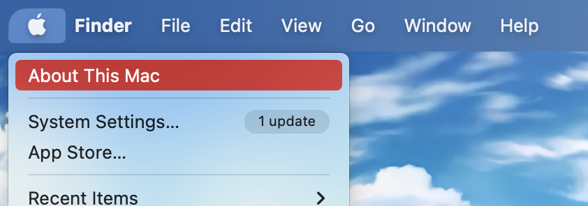
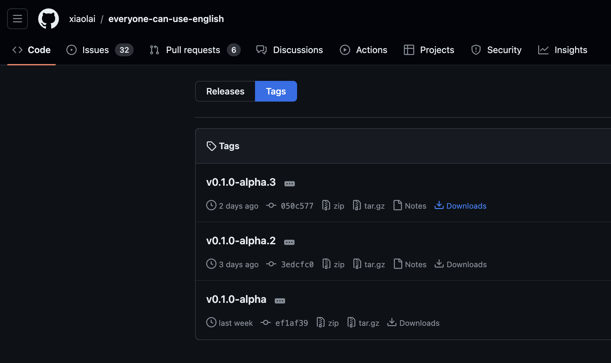
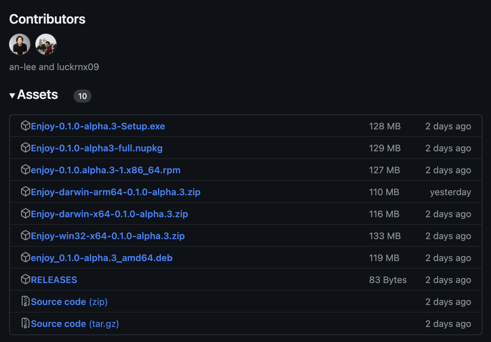
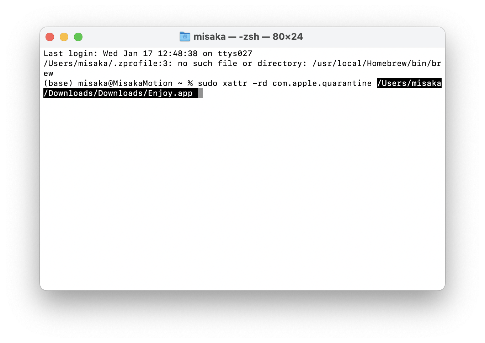

## 如何找到适配自己电脑的软件版本

看完这篇指南，你将学会如何在 GitHub 下载软件。

[Windows 用户点这里](#Windows用户下载以及安装)

### MacOS用户下载以及安装

点击屏幕左上方的  符号，在弹出来的菜单中，选择第一个选项 “关于本机（About This Mac）”



在弹出来的窗口中，就可以看到本机的硬软件配置：


如果你看到的画面和上面的图片类似，说明你的 Mac 是配置了 Apple M 系列（M1、M2、M3）的芯片，这是 **ARM64 架构**的处理器，我们一会要下载 **ARM64 版本**的软件。

如果看到的画面是下面这样的，有 **Intel 字样**：


说明你的 Mac 是 **x64 架构**，我们一会要下载 **x64 版本**的软件。

点击[这里](https://github.com/xiaolai/everyone-can-use-english/tags)跳转到 [releases 页面](https://github.com/xiaolai/everyone-can-use-english/tags)下载软件。



注意看发布的日期，**越靠前的版本越新**，我们点击 “Downloads” 跳转到下载页面


我们要下载的软件就在 Asset 里，如果 Assets 像这样，没有展开：


可以点击 “ ▶ Assets ” 旁边的 “ ▶ ” 符号展开



如果你是 **ARM 架构**的 Mac，点击包含 “**darwin-arm64**” 字样的链接下载 Enjoy 程序；

如果你是 **intel 架构**的 Mac，点击包含 “**darwin-x64**” 字样的链接下载 Enjoy 程序；

下载完成后，双击这个下载好的 ZIP 文件，系统会自动解压


打开 “终端” 输入

```bash
sudo xattr -rd com.apple.quarantine 
```


> [!IMPORTANT]
> 注意：`sudo xattr -rd com.apple.quarantine` 这行命令后面，**要加一个 “空格”**

> [!CAUTION]
> 执行此命令将跳过 macOS 的安全检查机制，请不要在**其他任何软件中使用此方**法绕过安全检查，这可能导致**未知的安全风险**。
> Executing this command bypasses macOS’s security checks. Do not use this method to circumvent security checks in any other software, as it may lead to unknown security risks.


然后把刚才解压出来的 Enjoy 程序拖到这行命令后面



按 “return ↩ ” 键，输入电脑**登陆密码**

> 输入密码的时候屏幕上**不会有任何反馈**，这是[类 Unix](https://zh.wikipedia.org/wiki/类_Unix) 操作系统的特性

输完密码后，按 “return ↩” 键，如果终端**没有抛出任何异常**，说明赋权成功，双击软件图标就可以打开软件。

自此，你就可以正常的使用 Enjoy 软件了！

### Windows用户下载以及安装

点击[这里](https://github.com/xiaolai/everyone-can-use-english/tags)跳转到 [releases 页面](https://github.com/xiaolai/everyone-can-use-english/tags)下载软件。


注意看发布的日期，**越靠前的版本越新**，我们点击 “Downloads” 跳转到下载页面


我们要下载的软件就在 Asset 里，如果 Assets 像这样，没有展开：


可以点击 “ ▶ Assets ” 旁边的 “ ▶ ” 符号展开


点击包含 “Setup.exe” 字样的链接下载 Enjoy 安装程序，下载完成后，按向导完成安装，即可使用。
