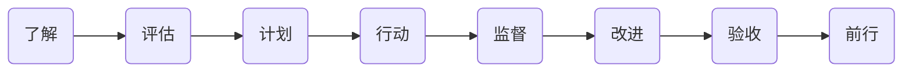

# 以教促学

我经常慨叹，“教是最好的学习方法” —— 这显然出自我的人生经验。机缘巧合，我在 28 岁那年去新东方应聘，在那里教书七年之后离开。随后的日子里，虽然我不再是一个传统意义上的 “老师”，但，教学与分享再也没有停止过，无论是写书、讲课，还是日常与家人或者亲戚朋友之间的沟通，对我来说，本质都一样，都是 “教育工作” —— 请注意，更多的应该是 “自我教育工作”。

“角色” 对一个人的行事方式有深刻且又难以捉摸的影响。天下的父母跟孩子争辩的时候，都说过一样的话，“等你当了爸妈就知道了” —— 这就是 “角色” 不同导致的思考方式不同，乃至于连正常沟通都无法进行的经典案例。创业者也经常有相同的慨叹，“自己当年打工的时候误会老板的地方太多了……” 只有等到有一天自己竟然当上了老板，才知道不被理解甚至被误解的痛苦和尴尬。

想象一下有人过来问你一个课本里出现过的单词究竟是什么意思，然后你竟然想不起来了…… 你是学生的话，你会有什么心理负担吗？“见过甚至背过但想不起来了” 这不是大多数学生的实际情况吗？可如果你是老师呢？无论是什么原因造成的，你都会因此脸红，尴尬，甚至恼羞成怒。不同的角色，感受不同，压力不同，责任不同，义务不同 —— 不同的地方实在是太多了。

回头看，如果我没有在新东方教书的经验，我不可能像今天这样在英文阅读方面如此自如，因为当年我一开始教的就是阅读…… 如果当年不是因为部门里缺写作老师，我硬着头皮背课救火，后来教了好多年的写作，连我今天的中文写作水平都可能会大打折扣，甚至干脆有可能在起点上就已经落败。

学生之中，优等生是那种记得住老师强调过的重点的学生，中等生是那种靠前频繁要求老师划重点的学生，差等生是那种老师平日里强调过、考前划过重点也没用的学生…… 所以，在我自己还当学生的时候，语法书是绝对不可能看完的，书架上不是没有过语法书，但，都是新的 —— 也许前 30 页还有过翻过的痕迹？

等我当了老师，而不再是学生，哪怕仅仅是为了背课，都要一遍一遍地翻语法书，一本里找不到合适的例句或者答案，就要再多翻几本，到最后，几本语法书都被翻烂了，脑子里装了很多当学生的时候断然不会保留的信息。不仅如此，平时闲着没事逛书店，只要看到有新的语法书出版，都会不由自主地拿起来翻翻，判断一下是否值得买回去作为参考。显然，我自己还当学生的时候，断然不会如此。

当好老师，最基础的要求就是 “系统全面”。为了追求极致，到最后就要一遍又一遍地尝试着 “扫清一切犄角旮旯”，任何遗漏都可能成为羞耻 —— 尴尬且又不幸的是，你越认真，你脸皮越薄，而那些不小心犯下的错误就会成为越大且越不可承受的羞耻。所以，对老师来说，“重点” 常常是反过来的，“越是犄角旮旯的，越是容易被忽视的，才是真正不可或缺的重点”，因为它们才是造成教师羞辱的重点。

我人生出版的第一本书是《TOEFL 核心词汇 21 天突破》。出版社送来样书的时候，我还挺高兴，翻了翻之后合上，扣在桌子上，然后就一眼扫到在封低的顶部有一串英文字母，没反应过来，再定睛一看，是 “TUO FU HE XIN CI HUI 21 TIAN TU PO” —— 竟然是汉语拼音！我当场脸就臊红了，再拿起来翻翻印数，首印 10,000 册！这就是我得丢 10,000 次脸！如果我不是老师，不是教英语的老师，我会因此脸红吗？我猜不会的。我更不会因此情绪激动。我在阳台上抽了好几颗烟才平复了情绪，然后拿起电话打给编辑，说，你们最好下一次印刷的时候，把这行拼音去掉吧，毕竟这是一本英文词汇书……

多年的教学经验，到最后产生的最大效果，实际发生在自己身上 —— 感觉 “重新上了一次学” —— 甚至，真真切切地觉得 “过去就是上了个假学”。甚至，连当年和很多人一样共同经历过的那么多年稀稀拉拉的所谓 “学英语”，回头看的话，就好像是 “学了个假的英语”，或者 “假学了个英语”。而那用 62 分换来的 “全国大学四级英语证书”（CET-4）就是自己当年的确 “傻乎乎” 的明确且又不容置疑的证据。

更为重要的是，整个学习方法发生了天翻地覆的变化，乃至于想到当年自己作为一名普通学生的时候那些所谓的 “学习”，就觉得实在是太不靠谱了，甚至，干脆是可笑，怪不得当时是一个事实上的学渣……

“自学” 的核心难点在于 “自主意识”。

至于学习的 “流程”，事实上相当固定且没有任何秘密，任何受过正常义务教育的人都经历了无数回，常见的环节无非如下：

只不过，这些环节中的大多数，学生要么不参与，要么被动参与，从未完整经历过。对一个科目或者某项技能的全面了解，被认为是专家才能做的事情，连学校里的老师都不配。所以，写教材的那些人才是全程参与 “了解”、“评估” 与 “计划” 的角色。学校里的老师，从 “实施” 开始参与，他们按 “计划”（即，教材里的章节安排，以及学校里的课程表）进行讲解，留作业，以此完成 “行动”、“监督” 与 “改进”，而后通过大大小小的 “考试” 完成所谓的 “验收”…… 然后并不是很严肃地画一条线，过了这个线就是小型考试的 “及格”，或者升学考试的 “录取” —— 至于到底怎样，事实上没人特别关心，然后，稀里糊涂地继续前行，剩下的，只能交给随后的生活再慢慢展露真相……

我在改造（或称为 “颠覆”）自己的 “**自学系统**” 的时候，最重要的一件事就是在每个我能想到的环节上 “**强加自主意识**”。哪怕是那些被认为 “自己肯定做不了” 的，也要强制自己做一做，哪怕做的不好也没关系，做得好不好都是经验，经验是可积累的，经验丰富从来都不是一蹴而就的。

所以，无论学什么，都会先花上相当长一段时间对那个科目、技能或者领域从各个方面去尝试着了解，明知道那只能是 “泛泛的了解”，也要硬着头皮做。“全面了解”、“细致评估” 而后 “详实计划”，这些都是教材编撰者应该做的事情，但，这并不意味着说我是学生，我就没责任、没义务、没能力、甚至不应该去了解或者思考。我的选择是，必须了解，必须思考 —— 这就是 “强加自主意识”。

“计划” 也一样，教材或老师给的，往往是一个 “通用计划”，可 “通用” 的意思就是 “不一定适用所有人”，所以，也需要 “添加自主意识”，或者干脆 “强加自主意识”，必须要主动思考，想一想是不是要增加一些任务？或者，是不是可以因为时间精力暂时忽略一些任务？又或者，我如何才能以更快的效率完成任务？没有人督促，就不 “行动”，没有人 “监督”，就做不出任何 “改进”，没有人 “验收” 就敷衍了事，没有人带着，就驻足不前 —— 这些都是缺乏自主意识的结果。

说来好笑，绝大多数人其实是一点一点丧失了 “自学能力” 的。刚出生的时候可不是这样。婴幼儿没有计划也要行动，没有监督也会重复，没有验收也会改进，没有人带着也会成长…… 从这个角度望过去，自学能力的一切基础，其实都是与生俱来的，或者与生俱来地带着相应的潜质，然后，在成年过程中一点一点丧失，直至消失殆尽 —— 学校的一个副作用就是，替学生做的太多，乃至于那部分能力学生在学校里用不着，于是，只能逐步用进废退 —— 小学六年、初中三年、高中三年，本科四年，这一口气十六年过去，自主意识竟然还在，天生的自学能力竟然还保持完好，那可真的是奇迹了吧？

“**重新定位自己的角色**”，是 “强加自主意识” 的最简便方法。把自己定位成 “自己的老师”，那么，所有老师应该干的事情，都是你自己就要干好的事情，毕竟，你的学生是你自己，那你可真得负责，也只能你自己负责。又由于其实是同一个人，所以，老师该干的都干好了，学生怎么可能干不好呢？—— 太难了吧！再说，这压根就不是难不难的问题，干脆是没可能的问题。

比较讽刺的是，越是成年人越是难以调整角色。越是成年人越是倾向于认为，“做老师可得有资格”，或者，“不是随便谁都可以当（我的）老师的”，等等等等，不一而足…… 可是，只要冷静看一下这世界的真实情况就知道了 —— 老师也是一点一点成长的吧？无论是谁，都不可能一上来就是高级教师、超级教师、明星教师、无敌教师…… 再说，要是 “给自己当老师” 没自信，那就先 “给自己当个助教” 吧，再不行给自己当个 “学校小组组长” 吧…… 反正总有可以起步的地方。

无论如何，只当学生这一个角色肯定不行，反正必须想办法 “**不断强加自主意识**”。另外，**有一个此生不离不弃的 “专属老师” 也是一种 “特权” 吧？**想要学 “好”，先认真 “教” 吧，这事儿无论如何都真的值得做一辈子。

与此同时，之前已经提到过，有了 “人工智能” 之后，又不一样了，“最好的老师是人工智能”，我们既是 “学生” 又是 “助教”。重新审视之后，发现其实没有什么变化，只不过是 **所有 “演示” 的环节全部交给 “人工智能” 了**，并且不用担心它不够权威不够全面 —— 尤其是在 “语言学习” 方面 —— 而后，自己要做的事情还是那一套：

所有这些环节，作为 “学生” 都是 “**被动**” 地做的，但，作为 “助教” 则必须 “**主动**” 做这些事情，不仅要 “主动” 做，还要做得 “**足够全面**” —— 这就是 “自学者” 和 “其它学习者” 最不一样的地方。从这个角度望过去，那些所谓的 “学渣”，其实也很努力，也没少干活，但，基于他们的认知，他们只是因为不知道所以才少做了很多其实其实值得做必须做的事情；或者换一种说法，他们只是 “缺一个自己的专属老师”（或者 “教练” 或者 “助教”）而已 —— 他们因为无知，所以都不知道自己放弃了 “特权”。

作为父母，最好对这样的差异有着深刻的了解，说实话，也没多复杂，也很容易讲清楚…… 于是，这就不再是什么 “智商” 问题，“天分” 问题，这完全是简单的 “复述” 问题 —— 把这个道理越早复述给自家孩子越好，不仅如此，还得逼着孩子反复复述，直至将这么简单却又那么重要的道理刻到脑子里。这一点点的差异，经过日积月累，会造成天壤之别，到最后，别人可能要用 “智商不够” 或者 “天分不足” 去解释他们比较之后的窘境。可你却清楚地知道，一切是从什么时候，从哪里开始的……（在《专注的真相》里，我们专门讲解过 “用 ‘复述’ 为自己 ‘洗脑’ 的有效方法”……）