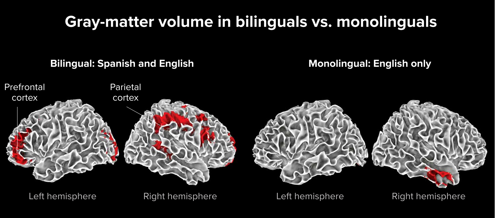

# 实在特权

正如长期持续 “健身” 早就是极少数人才有的习惯一样，长期持续 “**健脑**” 更为稀有 —— 学习也好自学也罢，都是 “健脑” 活动。今天的人们，“健身” 不再是为了种田打猎防强盗，只是为了自己的身体健康，这是一种需要自我满足自我激励的心理需求。同样的道理，今天的人们学习 —— “健脑” —— 其实早就不应该是为了上班打工换阶层，而应该是为了自己的大脑健康，这难道不同样应该是一种需要自我满足自我激励的心理需求吗？

长期持续健身，其实早就变成了一种 “**特权**”，因为它首先要建立在有足够的时间的基础之上。对谁来说都一样，时间是有限的。绝大多数人终生的 “个人商业模式” 是 “出售自己的时间”，所以，“金钱” 和 “时间” 这两个排他性资源对绝大多数人来说相互冲突，有钱的时候没时间，有时间的时候没有钱…… 其实，真的有很多人也的确知道锻炼的好处和必要性，也想坚持下去，但，条件真的不允许。

除了 “时间” 充裕之外，最好 “**金钱**” 也不是问题…… 可是，若是果真如此，就会自动长期持续锻炼了吗？显然并非如此。因为 “锻炼” 这个东西，还需要自主意识，乃至于就算时间金钱都不是问题，也依然少有人做到。同样的道理，别说 “自学” 或者 “学习” 了，连 “**阅读**” 这样的 “健脑” 活动，都同样是特权。其原因还是如出一辙：时间不够，自主意识缺失…… 于是，到最后，人群中连 “**长期持续阅读**” 这样最基础的健脑活动，真正做到的人都少之又少。

一般来说，“特权” 这个词即令人向往又令人厌恶。据其定义，“特权” 只能是极少数人拥有的权利，所以当然令人向往。与此同时，因为绝大多数人无法拥有，所以，那些极少数拥有特权的人，如果有 “额外收获” 的话，常常建立在其它绝大多数人损失的基础之上，所以，它又极其令人厌恶，至少，“令绝大多数人厌恶”。

然而，当我们审视 “自学”、“学习”、“锻炼”，或者 “阅读” 等等等等，这种 “特权” 的时候，只剩下了好的一面，而它那坏的一面不见了 —— 因为这种特权不仅不会伤害也无法伤害任何其他人的利益；而这种特权带来的任何收获，任何积累，都并非建立在他人的损失基础之上，因为这一切的一切，都发生在自己的身体之内，我们的皮肤竟然变成了天然且又确定的边界。

健身，实际上不仅效果格外明显，且反馈又远比想象的即时。我 32 岁去健身房之前，从未想过自己的身体会那么快地发生那么大的变化。之前我的体格是相对瘦弱的，上大学的时候，172 里面的身高，只有 52 公斤的体重。每周只不过是去三次健身房，三个月后，我的体重从 65 公斤涨到了 75 公斤，半年后，82 公斤，臂围、腿围、胸围、腰围都发生了肉眼可见的变化，原来所有的衣物都只能换掉……

那个时候，我还在新东方教书。每年的 “忙季” 就是寒暑假，要么连续二十多天，要么连续五十天，每天都要讲四节课，每节课 150 分钟。平日里呢？除了周六周日讲三四节课之外，周一到周五自由活动。这就形成了一种 “**时间上的特权**” —— 大多数别人要上班的时间里，我在休息。我去健身房，通常是上午 9:00 ～ 11:00，整个健身房里，只有我一个 “客户”，那个游泳池，感觉上就是 “专属”。现在回头看，关于 “特权” 的思考，就是从那个时候开始不知不觉启动的。

健身房里都有镜子，不止一面，甚至某一侧一整面墙都是镜子。在健身房里 “撸铁” 的人都会时不时照镜子，因为那变化的确肉眼可见。“健脑” 却不一样。因为 “大脑” 又没有长在外面，我们自己不仅看不到，甚至干脆就无法感觉得到。当我们的大脑发生变化的时候，我们的感觉也会随之发生变化，但，我们的大脑没办法像我们展示这种变化带来的变化，于是，我们不知道发生了任何变化。

据说伦敦是全世界路况最复杂的城市，它的道路多且密集，并且都歪歪扭扭弯弯曲曲，单行道比比皆是且毫无规律，到处都是环岛和死胡同，中间还有一条有十几座桥横跨着它的泰晤士河…… 最要命的是，伦敦的门牌号很少有人能搞清有什么规律，连门牌号的位置也同样神出鬼没。想象一下他们的工作日常，从这样一个城市的任意一个地点把乘客带到另外一个地点，要快速反应，还要随机应变。另外，伦敦的天气不仅突出地糟糕，还有个其它城市罕见的东西，那就是随即且又常见的雾霾。

伦敦大学的脑科学家埃莉诺·马奎尔（Eleanor Maguire）近水楼台先得月，对伦敦出租车司机进行了最深入的研究，其研究报告发表于 2011 年。研究表明，经过大量训练才能上岗，且又有多年工作经验的伦敦出租车司机的海马体的一个特殊部分 —— 后部或后方部分 —— 相对更大。而他们在上岗之前，后海马体可没那么大，原本与常人无异。与之相对的，伦敦公交车司机，因为走的是固定路线，无需随机应变，无需快速反应，于是，无论工作经验多久，后海马体也同样与常人无异。因为伦敦路况全球最复杂，全世界其它城市的出租车司机整体上来看，都没有伦敦出租车司机那么发达的后海马体。

经常跑步的人，下肢肌肉会相对更为发达，尤其是大腿后侧和小腿上的肌肉。相对不那么明显的，且又关联性感觉较少的是，他们的核心肌群（包括腹部和背部的肌肉）也同样相对更为发达，因为跑步虽然主要依赖下肢，可为了保持身体稳定和提高跑步效率，核心肌群起着相当重要的辅助作用。肉眼看不见的是，他们的心脏肌肉相对更为发达，因为跑步是有氧运动，所以，他们的心肺功能都相对更为强大。

伦敦的出租车司机，相当于因为特殊的地理位置而多了一项 “健脑” 活动，于是得到了一个 “锻炼后海马体” 的特殊机会，而后在不知不觉之中，那一部分的 “肌肉” 就变得更为发达。关键在于，2011 年之前的几十年里，所有的伦敦出租车司机都不知道自己的大脑发生了结构性变化…… 有什么办法可以自己主动体会得到呢？就是没有任何办法。只不过，现在的脑科学家们有新设备，比如 fMRI，我们才得以看到如此明显的变化和如此即时的反馈。

由此可以继续想像的是，那些通过学习获得了新本领，甚至超强能力的人，大脑的某些结构同样会因为长期持续 “健脑” 而发生巨大的结构性变化。比如，成年钢琴家大脑某些区域的白质通常比非音乐家多，而更多的白质会使神经信号传递更快。而数学家的工作时间越长，他们的下顶叶皮层右侧的灰质就会越多。跳水运动员的皮层厚度相对更大，皮层厚度与想象力和控制力之间存在正关联。再比如，越早学习第二语言的人，下顶叶皮层（inferior parietal cortex）中的灰质越多；相对于 “单语使用者”，[“多语使用者的” 大脑结构中，灰质更多，密度更高](https://knowablemagazine.org/article/mind/2018/how-second-language-can-boost-brain)，白质覆盖面积也更大。

反过来，正如缺乏锻炼会使人肌肉萎缩一样，“健脑” 活动的缺失同样会造成大脑的结构性性变化，只不过是负面的变化而已，而具体程度虽然难以衡量，但可以想像的是，应该比缺乏锻炼更为严重。在《专注的真相》里，我们就讨论过智能手机这类 “永远在线” 的设备，对多巴胺系统的劫持，到最后普遍导致的是极为严重的 “结构性损伤”，包括但不限于，白质组织不良、灰质提肌萎缩，皮层厚度减少，以及，认知功能区域受损，等等等等……

“健身” 是一种特权，更为重要的是，它是一种建立在自我意识上的，而不仅仅是出于某些现实条件的 “特权”。这种 “特权” 需要自我追求自我塑造，并且还要通过长期持续才能得以不断巩固。“健脑” 更是如此，它的相对难度在于，“健身” 毕竟有更多外在且又明显的效果，以及更容易感受到的即时反馈；而 “健脑” 的效果与反馈虽然早晚会感受得到，但在每时每刻，都发生在不知不觉之中，于是，“自主意识” 的启动极其随后的驱动都相对困难许多。

然而，“健脑” 相对于 “健身” 有另外一个虽然看不见但极为巨大的优势：

> **所有的健脑活动的效果都是相互叠加的……**

身体有很多事实上相对独立的部分，比如，无论你的二头肌练得多么好，它在你练股四头肌的时候什么作用都发挥不了…… 大脑不一样，大脑是一个整体，尤其那个存储你的知识构建你的世界的那个皮层；大脑内部就是由你的所有脑细胞相互关联构成的网络，无论你 “健脑” 的结果在哪一部分发生了好的变化，那变化对你的整个大脑都有用。

大脑里没有 “孤岛”…… 大脑里的一切都相互关联。哪怕是一个极其细微的 “思考” 都会在网络里迅速找到更多的关联，把那些原本毫无关联的东西用新的方式关联到一起，组织起来。比如，关于 “特权” 的思考。还有哪些 “不可能伤害第三方利益的特权呢？” 太多了，健身是特权，健脑是特权，学习、自学、阅读、创作、生产…… 能用来健脑的活动实在是太多了。

到最后，就只能自然而然地痴迷于这样的 “**特权**”。比如，我追剧的时候，都是整季看完。《24 小时》我就真的在 24 小时之内把它的一整季看完 —— 这是 “我的特权”，我有这样的时间，我不用早睡，如果晚睡了，我也不用早起，因为我这一辈子就没上过班，所以，**我的时间从来都是我可以自主支配的**，这样的 “特权” 我不用，不好好用，岂不可惜？同样的道理，“健身” 也好， “健脑” 也罢，这样的 “特权” 如何不令人着迷？

“自学” 之所以是更令人着迷的特权，还有另外一个原因。

我健身几年之后，老婆有一天慨叹说，真是不错，感觉 “不用离婚再嫁就直接换了个老公”…… 这是真实的感受，因为的确换了一个人，起码，至少可以算是 “把自己打造成了更好的另外一个版本”。

“长期持续健脑的效果” 显然比 “长期持续健身” 更为惊人。毕竟，臂围胸围不可能无限增长，腰围不可能无限减小，至于身高么，成年人只能越来越矮…… 也就是说，“健身” 的 “成长空间” 有限，但，“健脑” 却貌似 “没有尽头”。不断学会新东西，不断掌握新本事的人，相当于是把自己打造成了一个 “**永动机**”，自此再也不需要外界驱动，也不太容易被外界所变化，自己该干嘛就干嘛，自己充电，自我驱动，自寻方向，永不停歇，死而后已。

所以，“学外语”（或者 “学英语”）只是我们这一次实践的 “目标” 或者 “内容”，可实际上，我们真正关心的，真正用 “一年内至少投入一千小时的注意力” 打造的，是 “自学能力”；是对 “自学” 及其过程的全新认识、全面认知；何止是 “英语” 这一项技能，我们其实可以用同样的 “自学能力” 获得一切自己真正需要的能力；也不止是 “健脑”，还是全方位 “健脑”，甚至到最后感觉上是 “换脑”；更为重要的是，这也是在打造并获得天下最重要、人生最宝贵的一个 “特权” —— 真的不仅仅是 “获得尊重” 那么简单。