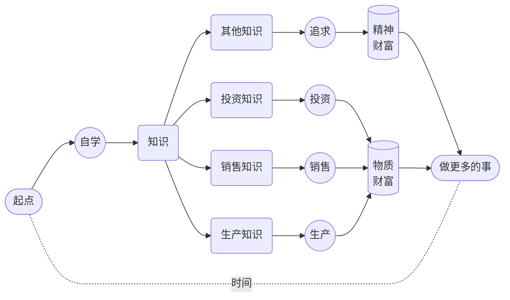

# 金钱至上

说来搞笑。尽管很多人不愿意承认，但，“金钱” 对每个人来说的确都是最强烈的 “动机” 来源或者外部 “刺激”，几乎没有例外…… 所以，我们也别回避了，直面这个问题好了。

《财富的真相》里我讲：

> 我们这一生的所有财富，不管是物质上的还是精神上的，都是从自己的时间里挖出来的……

既然，**时间就是生产资料**，那么，用它干什么最划算？

到最后，选来选去，只有 “自学”。虽然 “学英语”，好像与 “生产”、“销售”、“投资” 并未直接关联呢，“学它干嘛？” —— 先不说 “赚钱”，先说说 “省钱”。

之前提到过：

> 从比例上来讲，父母把绝大多数钱都花在孩子身上，尤其是 “学习” 上，这种现象在全世界都很普遍…… 所谓的 “绝大多数钱”，从比例上来看，超过父母总体收入的 60% 并不罕见，高达 80% 也不稀奇。

当我们说 “**一年内至少一千小时的注意力投入**” 去 “学英语” 的时候，核心不只是 “英语” 本身 —— 实际上，你用同样的方式学任何语言，或者学任何其他技能都一样的 —— 在这过程中，学得更多，练的更多，体会更深的，其实是 “自学”，是 “自学能力” 的养成与锻炼。

“自学能力” 原本并不高级，小朋友很小就具备自学能力，甚至相当天然，因为他们无论什么都肯 “生学硬练”。然后，这也是在正确的引导下，在恰当的实操过程中，可以不断锻炼增强这种能力 —— 可问题在于，基于这样那样的原因，所谓的 “教育” 竟然统一且又成功的作用是，“消灭掉了绝大多数人的自学能力”…… 呜呼哀哉。

当然，无论 “生学硬练” 多么厉害，仅靠它也不行，要在它的基础上搭建一个完整的 “自学系统” —— 这就是父母必须为孩子做的事情了，因为这件事情不应该也不可能 “外包”。学校、培训机构，以及各类教职人员，最不在意甚至也压根不想教的就是 “自学能力” —— 否则，大家都能自学了，他们怎么赚钱呢？这是一种 “有意无意的合谋”，正如全世界的医生们都一样，都故意用别人认不出的字体书写处方一样。

其实，只要有了一定的 “自学能力”，那么，父母在孩子身上花的钱，大部分都会省下来，不仅父母省钱，孩子也会恰恰因此长出更多的本事。

父母拼命赚钱花在孩子身上的一个 “副作用”（或者 “负作用”）是孩子不断 “降智” —— 天下一切的 “本事” 都是在 “遇到问题解决问题” 的过程中 “发展” 出来的，可是，绝大多数父母 “拼命赚钱花在孩子身上” 的结果就是 “遇到问题解决问题” 的从来都是父母而绝对不是孩子。那些孩子原本应该遇到的问题，都被父母 “花钱解决” 了…… 至于是 “真解决” 了还是 “假解决” 了，不知道，真相被掩盖了而已。

原本 “遇到问题” 的是孩子，那可原本是他们 “长本事” 的机会，结果，“机会” 被剥夺了，“问题” 却实际上并未解决，但又误以为已经解决了，问题的积累和误解甚至幻觉的积累不断扩大，到最后，神仙都没办法 —— 这绝对不是危言耸听，最终的恶果，在绝大多数人 15 岁左右的时候就会显现，就会爆发，并且只能 “一发不可收拾”。

让我们简单算一笔账。假设夫妻二人的年收入是 30 万元人民币…… 那么，小学、初中、高中，12 年下来，平均每年在孩子身上花的钱，按 60% 计算，大约应该是 18 万。这其中，大约 60% 是花在各种 “校外辅导” 上的 —— 基础教育费用，事实上并不太高，因为全世界都一样，高中毕业之前，毕竟绝大部分是 “义务教育” —— 那么，大约应该是 10.8 万元，12 年下来，总计是 129.6 万元…… 若是孩子有真正的自学能力，不说这些全都省下来吧，起码其中的 80% 能省下来，算一下，是 103.68 万。

“启动任务” 中的 “每天至少三小时”，一定拦住了很多人 —— 因为绝大多数人一辈子都没那么干过，没有过那样干的完整经验，当然也就从来都不可能知道那么干的效果是怎样的，只是 “凭直觉” 认为困难，以为不可能…… 殊不知，那恰恰就是 “学了个假习过了个假日子” 的根本原因。

“学英语” 固然是目标之一，更重要甚至最重要的是，你作为父母，“亲自展示一下效果” —— 学什么都是这样的。用同样的方式 —— **每天至少三小时，一年内至少一千小时的注意力投入** —— 乐器、歌舞、书法、棋艺，任何体育项目，无论是田径还是球类，自然语言，无论是母语还是外语，人工语言，无论是校内的数理化，还是校外的编程…… 都一样的，都能做到自然超越九成以上的人群。

而你的 “投资成本” 呢？主要根本不是 “钱”，也不仅仅是 “时间”，而是 “注意力”，只有时间成本没有金钱成本的 “注意力”。“**一年内至少一千小时的注意力投入**”，并且，还是你们夫妻二人中的某一个就可以。所以，在金钱上，几乎是零投入，而相对可能的收益呢？103.68 万，并且，还相当于是 “一年赚出来” 或者 “一年攒出来” 的 —— 那可是年收入 30 万的夫妻两人不吃不喝三年都赚不到更攒不下来的钱！打工也好、创业也罢，这样的 “投资收益” 很惊人吧？不算不知道，一算吓一跳。

到最后，“投资收益” 可不只是 “一年干出一百万” 那么简单。你变成了 “双语使用者”，你也好孩子也罢，甚至你的另一半，都 “长了见识”，亲眼目睹了 “真学习” 的真相和效果，你拥有了真正的 “自学能力”，他们也在不知不觉之中迈过了最大的门槛 —— 从不知道 “真学习” 到见证了 “真学习” —— 然后走在 “获得自学能力”、“养成自学习惯” 的路上……

其实，这个 “账” 还没算完。

如果你的孩子被你影响 —— 如果你真做了，他们必然全方位受到影响 —— 那么，他们也会成为 “多语使用者”，至少是 “双语使用者”。无数的研究表明，“多语使用者” 相对有更强的思考能力、学习能力、解决问题能力、组织能力管理能力，甚至连罹患老年痴呆的风险都会因此降低很多。从大脑结构上来看，也相对灰质相对更厚，白质覆盖面积更大。

更为重要的是，无数调查都表明，“多语使用者” 的收入比 “单语使用者” 高，终其一生，起码会高出 30%…… 你估算一下你的孩子会有多少终生收入罢，再乘以 30%，那就是 你用 “一年内至少一千小时的注意力投入” 可以换来的金额…… 如果你再多生几个，那你就再算算？

用金钱刺激自己，常常是最有效的。说来好笑，所谓的 “用金钱刺激自己”，常常只不过是 “算个假账” 而已。

当年我为了进新东方教书，就要考 TOEFL/GRE，当年的我还没有今天对教育或者考试这么清楚的认知，也傻呵呵地去背单词 —— 因为那时候大家都那么说么，说是怎么也得搞个 2 万的词汇量…… 搞呗。不就是 “每天至少三小时” 么？—— 当然，根本就没用上一年，三个月就搞定了。

我怎么刺激自己的？一样的，“算个假账” 而已。那时候谣传新东方老师年薪百万，我想着说，不用那么多，税后 50 万足够了。一算，乐了，搞定 2 万个单词，就有税后年薪 50 万的可能，那么，一个单词就值 25 块钱啊！还是 “每年至少 25 块”！换算到字母为单位，恨不得 “一个字母就好几块”。

我找来几个随手贴，在上面写上 “25 元/单词”，分别贴在家里我经常出现的地方，床头，镜子，桌子，面对马桶的墙上…… 确保自己时不时就能看到。这种 “自欺欺人” 真的很管用，从那一刻开始，真心觉得每个单词都长得很好看，短的觉得干练，长的觉得苗条，意义特殊的觉得精致，拼写困难的觉得别致 —— 真不是在夸张或者开玩笑，那是真实的感受。每天最后复习一遍的时候，感觉就是在 “数钱”，自己跟自己说话，今天搞定 200 个单词，不错，这下赚了 5,000 呢……

我们的大脑很神奇，但，它也很傻的，怎么骗它都行 —— 只要是它最关注的东西，你往上靠得无论多么牵强，它都信。有时候我觉得，它之所以那么神奇，就是因为它那么傻。

更重要的是，不要小瞧 “**一年内至少一千小时的注意力投入**” 这种用一句话就能说完的方式进行的 “真学习”。它会让你赢得真正的尊重 —— 人就是这样，自己做不到的事情，别人做到了，只能选择尊重。外人就算了，赢得另一半的尊重很重要，会使夫妻关系更为亲密；赢得孩子的尊重更重要，父母的 “尊重” 若是通过行动赢来的，孩子就不存在什么 “叛逆” —— 天下一切的所谓 “叛逆”，其实是 “父母不值得孩子尊重” 作为底色展现出来的光怪陆离而已，难道不是吗？

**“干上一年” 就能换来子女对自己终生的 “尊重”** —— 值不值？

如果你真的有什么技能，能做到 “轻松超越九成以上的人群” —— 诀窍很简单啊，就是那句话，“一年内至少一千小时的注意力投入” —— 你整个人的气质都会变的。首先来自于别人对待你的态度，而后来自于你的 “自信” —— 关键在于，你的 “自信” 不可能是 “自负”，因为它是有成绩支撑的。没有实际支撑的时候，“自信” 很可笑，但，众技傍身的你，由里至外地自信，为什么不呢？弄不好，你还得刻意低调呢 —— 为了让别人更舒服一点。淡定的表情，聚焦的眼神，舒展的动作，从容的态度，这样的神态其实都是自然发生的，装是装不出来的。外界越来越不重要，建设大脑皮层是你最喜欢干的事情……

我经历过很多次 “一年内至少一千小时的注意力投入”。其中最搞笑的是 “健身”。普通人健身，金钱投入相对多一些，毕竟健身房的年费和教练的辅导费都挺贵，时间投入真的相对很少，每周 3 次，一年下来也就 160 次左右，每次连路上的时间都算上也不过 2.5 个小时，一年下来其实只投入了 400 个小时…… “注意力” 投入更少，我的方法是 “花钱请教练”，所以，其中一般的时间其实是 “心不在焉”，脑子里 “胡思乱想”，全靠教练站在边上帮自己数数、打气、看护……

健身，只要持续两个月以上，就可以见到效果，半年就效果惊人 —— 所有人都看得到，原来的衣服全都得扔，胸围、臂围、腿围都变大了，腰围变细了，体态笔挺了，穿衣服的效果都不一样。就算原本长得丑，也因为体态变了所以更精神了。若是竟然跟同事去海边，或者去泡个温泉，那就完全是 “鹤立鸡群”。周遭的人对你的态度所发生的变化，难以用语言描述。我老婆的玩笑话就是，“真是不错呢，感觉不用离婚就换了个老公……” 这当然不是用钱就可以换来的东西 —— 尊重这个东西，用钱买不到。

不仅要 “算算账”，哪怕是 “假账”，还要换一下 “方向”。过去，当年你上学的时候，总感觉自己其实 “为了父母” 学习，后来懂事了，即便是 “假学习” 也知道是 “为了自己” —— 现在，给你换个 “方向”，“为了孩子” 学习，“为了家庭” 学习。作为父母，你可能会突然发现，这一次真心 “不敢做假” 了，是吧？

李笑来一脸坏笑 —— 李笑来这是在对着自己坏笑。我用英语很多很多年了，甚至到最后，英文阅读速度比中文还快 —— 没办法，每年下来，读的所有的书，都是英文的，文章也一样，绝大多数是英文的…… 可是口语呢？很差，为啥？潜意识里觉得没啥用，反正生活里也没啥跟人说英语的需求。那现在都五十多了，为什么 “突然” 打起精神练了呢？为了孩子，只为了孩子。

-----

请不断罗列你自己的动机来源……

|      | 正面 | 负面 |
| ---- | ---- | ---- |
| 物质 |      |      |
| 精神 |      |      |

