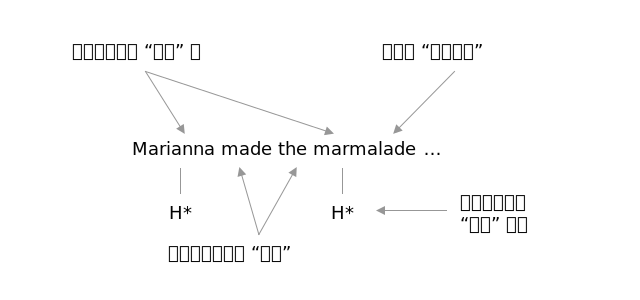

# 轻重强弱

音高（pitch）与停顿（break）不仅体现在句子之中，实际上也常常体现在很多 “多音节词汇” 之中。

地球上的所有语言都差不多，从语音上来看，都是以 “**音节**” 作为最基础构成单位，而 “音节” 的构成也都一样，**每个音节有且只有一个 “元音”**。

在中文的普通话里，文字的最基础构成单位是 “字”，其实还是一样的，因为本质上来看，每个字都是 “有且只有一个音节”，用中文语文的术语，就是 “每个字都有且只有一个韵母”。比如，“啊” `a`，“妈” `mā`，“慢” `màn`，“忙” `máng`…… 实际上，绝大多数亚洲文字都是以 “字” 为最基础构成单位的…… 起码，中日韩都是如此。

英文的最基础构成单位是 “单词”，但从语音上来看，最基础构成单位还是 “音节”。比如，*ichthyosaur* `ˈɪkθiəˌsɔr` 这个 “单词” 里，就有 `ɪk`、`θiə`、`sɔr` 总计 3 个音节。*serendipity* `ˌsɛrənˈdɪpədi` 这个 “单词” 里，就有 `sɛ`、`rən`、`dɪ`、`pə`、`di` 总计 5 个音节。

对比来看的话，

> * 中文的 “词” 可能由一个以上的 “字” 构成，比如，“意料之外”，`yì liào zhī wài`，这 4 个 “字” 的词读出来当然起码是 4 个 “韵母” 的长度；
> * 如果一个英文单词里有几个 “音节”，那么它读出来的长度就大约相当于中文几个 “字” 的长度…… 所以，*ichthyosaur* `ˈɪkθiəˌsɔr` 这个 “单词” 读出来的长度大约是 “3 个中文字的长度”；而 *serendipity* `ˌsɛrənˈdɪpədi` 这个 “单词”  读出来的长度大约是 “5 个中文字的长度”
> * 中文的 “字” 在发音上是 “等长” 的，英文的音节 “长度不一”：
>   * “单元音” 有长有短，且还有从一个元音滑向另外一个元音的 “双元音”。
>   * 一个音节里可能有若干个辅音，最夸张的比如 “strengths”，虽然作为音节核心的元音只有一个 `ɛ`，前面有两个辅音 `s` 和 `tr`，后面有三个辅音，`ŋ`、`θ`，和 `s`…… 总计 5 个辅音，而每个辅音都被清楚地读出来，于是，英文的 “一个音节” 有可能从 “长度” 上来看，比中文里的一个 “字” 长很多。

其实中文和其它亚洲语系，包括日文和韩文，都是一致的，在这方面都与英文有同样的差异，因为它们都是以 “字” 为单位的。

在习得第二语言的时候，人们很难不把自己的母语习惯带入另外一种语言，这也是所谓 “口音” 或者 “外国腔” 的根源。习惯了讲中文的人，常常会不由自主地将英文单词读得相对很快，可能是因为脑子里把 “英文单词” 和 “中文单字” 对应在一起，而不是原本应该的对应：

> 不当对应
>
> * 英文单词 vs. 中文单字
>
> 正确对应
>
> * 英文音节 vs. 中文单字
> * 英文单词 vs. 中文词汇

人类说话的时候都有插入脏话的可能。你在天津，经常会听到有人说，“`jiè ní mǎ mà`” —— 按照天津人的口音去说的重点是：

> * 第一个字因为是四声所以说出来只能是降调，说完之后要略顿一下；
> * 第二个字和第三个字连在一起快速说完；
> * 为了讲最后一个字读得很重，第三个字得拉长一点，略作停顿之后，再重重地说出第四个字……

第一个字 `jiè` 就是 “这”，最后一个字 `mà` 是 “嘛”，这是一个问句，天津人以 “嘛” 结尾的问句不可能用升调。`jiè mà` 的意思相当于普通话的 “这是啥？”，而 `ní mǎ` 是个 “插入语”，相当于普通话的 “你妈”。所以，天津人说的这句话翻译成普通话，就是，“这他妈啥啊？！”

你可能也在美国电影里看过，西部牛仔眯着眼叼半截烟卷，说 *absolutely* `ˌæbsəˈlutli` 的时候，说的是 `ˌæb fə kɪŋ sə ˈlut li` 或者 `ˌæb sə fə kɪŋ ˈlut li`。*fucking* 这个插入语，被插在了第一个音节或第二个音节之后…… 这个例子虽然略微不雅，但，的确很容易让你一下子理解各种语言的语音处理方式的相似之处和细微差异。

所以，中国人读英文单词的时候 —— 其实，亚洲人都差不多如此，包括中国、日本、韩国，都一样，都是以 “字” 为单位的 “等长音节” 语言 —— 就是要 “刻意放松” 才行，且 “刻意慢一点”。急什么呢？刚开始为了读清楚，每个音节之间故意停顿一下也无所谓，那是一个词，不是一个字，加起来那么多 “字” 呢…… 多试几次：*ichthyosaur* `ˈɪkθiəˌsɔr`，*serendipity* `ˌsɛrənˈdɪpədi`。

还有个重要区别。中文每个字（相当于每个音节）可以有 “声调”，一二三四声，以及轻声。英文呢，每个音节没有特定的 “声调”，但，在 “多音节词汇” 中，往往可能会有某个 “音节” 被重读，被称为 “重音”，还有的时候，会有另外一个 “次重音”，刚刚提到的 *ichthyosaur* `ˈɪkθiəˌsɔr`  和 *serendipity* `ˌsɛrənˈdɪpədi` 里，就分别都有 “重音” 和 “次重音”。

如果 “重音” 并非第一个音节，那么，读清楚整个单词，可以试试这个小技巧，在 “重音音节” 前略加个 “停顿”，而后，用更高的 “音高” 读出那个 “重音音节”，而在读随后音节的时候，“音高” 可以逐步降下来。比如，expect，`iks...pɛkt`（`s` 故意拉长一点，保持气流输出，然后提高 “音高” 说出 `ˈpɛkt`）；serendipity，`ˌsɛrən...ˈdɪpədi`（`n` 故意拉长一点，保持口腔内震动，然后提高 “音高” 说出 `ˈdɪpədi`）。

“音节” 在单词里有 “重音”、“次重音” 以及 “非重音”。与之类似地，在整个句子里，众多的单词，也一样，有 “强读” 与 “弱读” 以及 “其它” 之分。

一个句子里，总是有一两个词是 “重点”，所以，在被说出来的时候，它们会被被说话者 “强调”，即，所谓的 “强读”，其特点是，“整个单词” 或者 “单词中的重音音节” 的 “音高” 会被拔高，并配有明显的升调或者降调，与此同时，整个单词语速较慢。有时候，同样的句子，仅仅因为不同的词被 “强读”，所表达的含义都可能会发生微妙的变化。

不妨体会一下 “同一个句子” 的 “四个版本”（例子来自于 [Macquarie University](https://www.mq.edu.au/about/about-the-university/our-faculties/medicine-and-health-sciences/departments-and-centres/department-of-linguistics/our-research/phonetics-and-phonology/speech/phonetics-and-phonology/Intonation-tobi-introduction) 的网页）：

> Marianna made the marmalade...
> 1. <audio src="../audios/marm1.wav" />
> 2. <audio src="../audios/marm2.wav" />
> 3. <audio src="../audios/marm3.wav" />
> 4. <audio src="../audios/marm4.wav" />

拿第一个版本为例，请参照以下图示：

除了少数词汇会被 “强读” 之外，还会有大量的 “常见词汇” 会被 “弱读”。

各种语言都有这种现象，主要原因可能是因为 “太常见”、“太容易理解”、“相对于不那么重要” 等等的原因，乃至于说话者在说那些词汇（或者 “音节”）的时候会 “更快” 或者 “更轻”，甚至 “省略” 或者 “合并”…… 北京人在说 “不知道” 这三个字的时候，有可能说出来的是用拼音都很难标记的 `bù r dào`，其中原本应该的 `zhī` 被糊弄成了甚至好像没有韵母的 `r`…… 但，谁都听得懂，不习惯的，听两次也就适应了。

说英文的时候，“小词弱读” 的现象非常普遍。

以下是 TOEFL 听力录音中第一篇中的前两个句子，请注意同一个单词 “**community**” 第一次出现和第二次出现时的具体不同：

> Community service is an important component of education here at our university. We encourage all students to volunteer for at least one community activity before they graduate.

<audio src="../audios/toefl-sampe-01.mp3" />

这段录音中所有被强读的词汇在以下的文本中被加重标记（而没有标记的，就是被弱读的）：

> **Community** **service** is an **important** **component** of **education** **here** at our **university**. We **encourage** **all** **students** to **volunteer** for at **least** **one** community **activity** **before** they **graduate**.

某个单词被强读或者被弱读的时候，该单词的元音长短和重音所在（如果是多音节单词的话）都会相应发生变化，具体常见变化如下：

如果一个单词被强读，那么这个单词中的：

- 长元音会被读的很清楚，并且足够长，甚至显得更长一些；
- 双元音会被读的很饱满，并且显得很有弹性；
- 落在重音上的短元音都会显得更长一些；
- 重音所在的音节可能带着不同的声调（平调、升调、降调）……
- 重音所在的音节可能带着不同的音高（往往是 “高”、“中”、“低” 中的 “高”）……

如果一个单词被弱读，那么这个单词中的：

- 长元音会变得短一些（几乎与短元音的长度相当）；
- 重音音节会变得与非重音音节一样轻；
- 很多元音都会发生变化，向/ə/靠拢；
- 轻辅音/s/、/t/、/k/、/f/之后的元音/ə/可能会直接被省略掉；
- 整个单词所处的音高往往是 “高”、“中”、“低” 之中的 “低”，最多是 “中”……

其实，哪怕在单独读某一个单词的时候，其中元音的长短都会受到重音重读的影响。比如，“city” 这个单词，重音在第一个音节上，而两处的元音是一样的：/ˈsi-ti/；但是只要你把第一个音节读得足够重，自然而然就能感觉到第一个/i/要比第二个/i/长。

大多数助动词、系动词、介词、连词、冠词、代词，都有两种发音形式：“强读式”、“弱读式”。这些单词往往都是单音节单词。在自然语流中，它们更多的情况下是以弱读式读出的。以下是其中最常见最普及的强读式、弱读式对照列表。注意，以下的列表不能当作规则使用，不是所有的虚词在任何情况下都必须弱读；也不是所有的实词都必须被强读。下面的列表只是在描述现象。

- a: /eɪ/→/ə/
- am: /æm/→/əm, m/
- an: /æn/→/ən, n/
- and: /ænd/→/ənd, nd, ən, n/
- any: /'eni/→/ni/
- are: /a:/→/ə/
- as: /æs/→/əz/
- at: /æt/→/ət/
- but: /bʌt/→/bət/
- can: /kæn/→/kən, kn, kŋ/
- could: /kud/→/kəd, kd/
- do: /duː/→/du, də, d/
- does: /dʌz/→/dəz, z, s/
- for: /fɔː/→/fə/
- from: /frɔm/→/frəm, frm/
- had: /hæd/→/həd, əd, d/
- has: /hæz/→/həz, əz, z, s/
- have: /hæv/→/həv, əv, v/
- he: /hiː/→/hi, iː, i/
- her: /həː/→/hə, əː, ə/
- him: /him/→/im/
- his: /hiz/→/iz/
- I: /ai/→/aː, ə/
- is: /iz/→/s, z/
- many: /'meni/→/mni/
- me: /miː/→/mi/
- must: /mʌst/→/məst, məs/
- my: /mai/→/mi/
- of: /əv/→/əv, v, ə/
- our: /ɑʊɚ/→/ar/
- shall: /ʃæl/→/ʃəl, ʃl/
- she: /ʃiː/→/ʃi/
- should: /ʃud/→/ʃəd, ʃd, ʃt/
- so: /səʊ/→/sə/
- some: /sʌm/→/səm, sm/
- such: /sʌʧ/→/səʧ/
- than: /ðæn/→/ðən, ðn/
- that: /ðæt/→/ðət/
- the: /ði:/→/ði, ðə/
- them: /ðem/→/ðəm, ðm, əm, m/
- then: /ðen/→/ðən/
- to: /tuː/→/tu, tə/
- us: /us/→/əs/
- was: /wɔz/→/wəz, wə/
- we: /wiː/→/wi/
- were: /wəː/→/wə/
- when: /wen/→/wən/
- will: /wil/→/əl, l/
- would: /wud/→/wəd, əd, d/
- you: /juː/→/ju/

到了这一节，我们开始逐步深入关注越来越多的 “细节” 了，尽管，我们尚未对被认为是 “最基础” 的 “音素” 进行研究。但，“能注意到这些细节” 的前提，需要 “重复强调”：

> 已经有一段时间的 “生学硬练” 作为基础……
