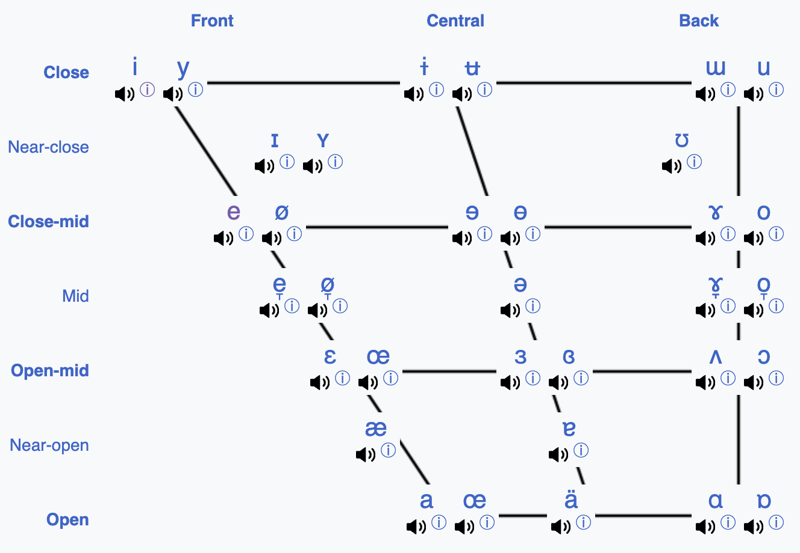
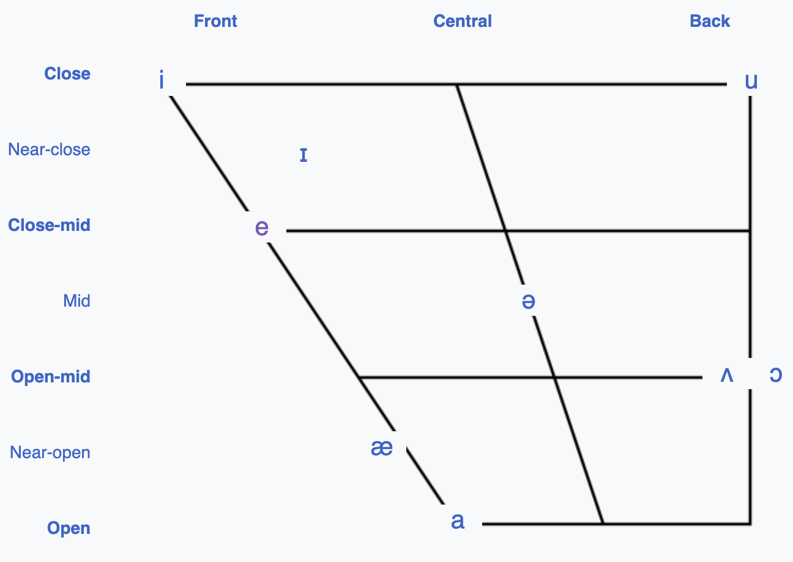
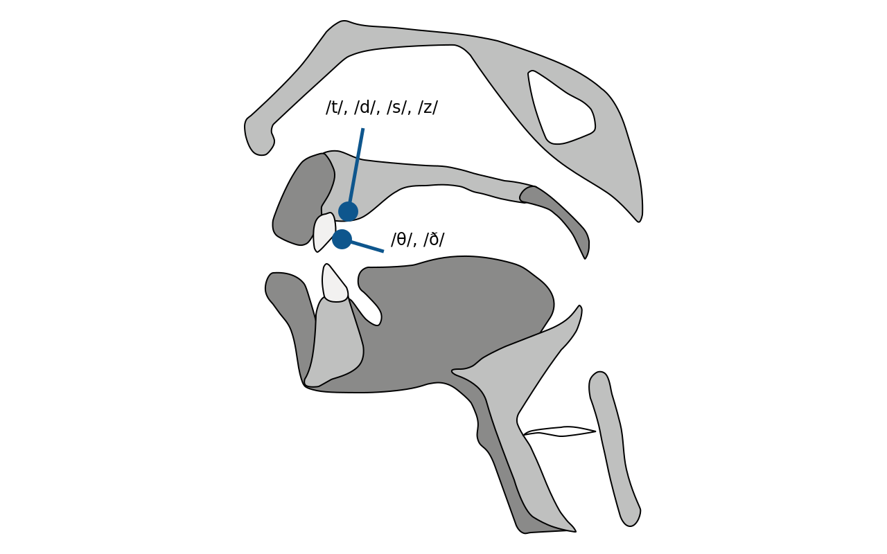

# 元音辅音

…… 我们终于要讲到 “普遍以为的基础” 了。一直以来，我们的讲解顺序与 “学校里的外语教育” 不一样，甚至有些部分干脆是 “截然相反” 的。学校里的 “顺序” 大抵上是：

> 字母 ⭢ 音标 ⭢ 音素 ⭢ 音节 ⭢ 词汇 ⭢ 句子 ⭢ 阅读

而我们的讲解顺序是：

> 开口 ⭢ 句子 ⭢ 停顿/音高 ⭢ 轻重强弱 ⭢ 音节 ⭢ 音素 ⭢ ……

我们之所以采用了 “不同的顺序”，是因为 “**顺序很重要**” —— 这是一个放之四海而皆准的原则。下象棋的时候，双方用的是对称的棋盘；拥有的是同样数量的棋子；并且还是同样的配置 —— 你一个 “将” 两个 “仕”，我也一个 “帅” 两个 “士”；“俥”、“傌”、“砲” 你各自有两个，“車”、“馬”、“炮” 我也各自有两个；而后大家用同样的规则移动棋子 —— 你的 “卒” 和我的 “兵” 都只能前进不能后退且每次只能移动一个格子，你的 “像” 走田 “傌” 走日，我的 “相” 也走 “田”，我的 “馬” 也走 “日”，无论是你的 “砲” 还是我的 “炮” 都只能 “隔山打牛”…… 可到最后，竟然有输赢 —— 究竟是什么决定胜负呢？“顺序” 决定 “胜负”，因为 “先走什么后走什么” 才是根本；至于每一步 “怎么走”，是建立在 “顺序” 基础之上的。同样的道理，无论干什么都一样，“顺序” 决定成败，只有在 “遵循更优顺序” 的基础上，方法、效率、策略等等才可能进一步施展的余地或者机会。

当然，若是我们仔细想想就会明白，很多的时候，**所谓的 “策略” 无非是 “顺序”**，因为 “时间是单向的”，与此同时，我们的 “注意力” 也是有限的排他性资源，所以，做事总有个先后，总得先做什么再做什么，总得先关注什么再关注什么…… 结果呢，“顺序” 不同，往往结果不同，效果不同。虽然 “**顺序**” 听起来稀松平常，“**策略**” 就不一样了，我们知道 “策略” 可能决定胜负。在《专注的真相》里，我们也反复见到过若干次 “仅因调整了关注顺序就改变了结果” 的重要例子。

在一切 “学习” 过程中 —— “自学” 当然也是如此 —— 我们作为人类逃脱不了一个基础的事实和限制，我们的 “专注” 是 “单任务”、“单线程” 的，也就是说，一旦我们真的 “专注”，那么，我们所能 “专注” 的就只能是一个任务，只能是一件事…… 我们的大脑就是这样的，永远改不了，永远变不了，它就是这样。

既然如此，我们一次只能完成一个任务，一次只能专注一件事情 —— 这也是凡事常常只能 “循序渐进” 的最根本原因。但，想要通过 “循序渐进” 成功，关键在于那个 “序” 得是合理的，否则，耽误事儿。

既然如此，我们必须认真研究 “顺序”，通过 “试错” 与 “比较” 找到更好的顺序，通过 “研究” 找到原本可能并不知道的 “重点” —— 比如，“音高与停顿” 竟然如此重要，就是计算机科学家们的研究成果。ToBI（Tone and Break Index）是不懂计算机的语言学家们搞不出来的东西 —— ToBI 是计算机科学家们为了实现 “将文本转换为自然语音” 而研究设计出来的 “模型”（或称 “算法”），这个领域的研究很新（[最初的一篇论文](https://www.researchgate.net/publication/221492301_ToBI_A_standard_for_labeling_English_prosody)发表于 1992 年）—— 不要误以为 30 年前是很久远的年代 —— 乃至于全球的 “外语教学” 领域尚未来得及把这个研究成果吸纳到教学体系之中。

即便是研究 “音素”，“辅音” 和 “元音”，它们之间也有优先顺序，我们要先研究 “元音” 再研究 “辅音” —— 首先是因为 “音节” 若是 “细胞” 的话，那么，“元音” 就是 “细胞核”。其次是因为虽然 “辅音” 常常被认为是 “地方口音” 的根源，但实际上，最影响 “信息交流顺畅” 的，其实是 “元音错误”，而 “辅音错误” 常常除了显得有明显的 “口音” 之外，并不影响交流。

比如，好莱坞动作明星阿诺德·施瓦辛格，母语是德语，哪怕已经在美国生活多年，期间还当过州长，不仅一直拍片，还四处演讲，可迄今都有严重的 “口音”，他常常自嘲，说 “自己的口音和自己的胸肌一样厚重”（*[Be Useful: Seven Tools for Life](https://www.amazon.com/Be-Useful-Seven-Tools-Life/dp/B0C1HR5D9S/)*, 2023）…… 但是，如果仔细对照一下的话就会发现，他的元音都对，他的 “口音” 主要是辅音造成的，而那 “口音” 其实完全没有影响他的表达和听众的理解。

让我们先仔细看看 “元音”。

经过多年的研究，人们对 “语音” 甚至 “音素” 的理解是非常完善的。地球上所有的 “元音” 都被 “详尽地标注”，以下是地球上所有语言中出现过的 “元音” 的 “国际音标”（IPA，[wikipedia](https://en.wikipedia.org/wiki/IPA_vowel_chart_with_audio)）

这张图里，“**前后**” 和 “**上下**” 的 “位置” —— 从普遍 “感知” 上来看，最为最直观的 “位置”，主要是 “**口腔内气流共振的位置**”，是学者们通过反复对比人类在说话发声的时候拍摄的 X 光片才最终确认的。至于其它的，很多 “专家” 腔调的所谓 “关键”，比如，“嘴唇的形状” 什么，其实大可不必操心，因为嘴唇的动作我们的眼睛能看到，所以，大脑会在 “不知不觉” 之间就搞定它们的影响。要命的是 “舌头”，因为看不见，所以，大脑经常 “不知所措”。

以下是 “英语” 的 “元音” 在发声的时候 “**口腔内气流共振的位置**”（即，把其它语言的元音都给去掉）：

不过这两张图基本上只能作为 “参考依据”，不能当作 “金科玉律”。因为无论是哪种语言，“地方口音” 都千奇百怪。而 “英语”，很可能是地球上 “地方口音” 最多的语言。所以，即便是同样的一个 “元音”，全球各地都有各种不尽完全相同的 “口腔内气流共振位置”。然而，有所参考毕竟要比没有参考好一万倍。

“成年人” 在 “学外语” 的时候 —— 我们说过，“6 岁以上，在学外语这个领域里，就是成年人了……” —— 所面临的最大问题在于，这时候已经彻底习惯了 “母语中的音素发声方式”，至于 “母语中没有的”，不仅 “口腔” 动作不知道该怎么做，甚至开始出现 “听都听不出区别” 的现象。于是，所谓的 “外国腔”，其实无非就是 “用母语的发声方式去 ‘近似’ 地发出外语的声音，无论是元音，还是辅音，甚至腔调……”

既然是不同的 “元音” 就应该用不同的发声方式，“母语” 中没有的音素，就应该重新学，而不是 “把原有的发声方式修改为新的发声方式” —— 毕竟，“原有的方式” 无法去除，因为无论如何 “母语” 还是要说要用的……

所以，一直以来，“纠正语音” 这个说法有很大的误导性。就好像原来的是 “错的”，要改掉，要删掉，要改成 “对的” 似的，其实不然。让我们来澄清一下。首先，**你原来的发声方式没有任何错**。而后，更为重要的是，**你现在在学外语，所以只能学一些新的 “发声方式”，哪怕某个 “音素” 与你原本的母语当中的某个音素是否接近**…… 一样的就一样，不一样的就是不一样；不一样的就应该新学。

再换个说法，成年人在学外语的时候，“去除口音” 的过程，其实是 “在大脑里新建神经元连接的过程” —— 不仅要 “新建” 一些连接，还要不断 “强化” 那些连接。如果这些新建的连接不足够强，那么，在说话的过程中就会不由自主地 “重新启用原本已有的那些近似连接”…… 所以，成年人学外语的时候，所谓的 “更难”，某种意义上只不过是因为 “原有近似连接” 暗中形成的竞争作祟罢了。并不是很多人以为的那样，说得好像是 “过了某个年纪之后某扇门就彻底关上了” 似的。

大脑可塑性极强，所以，大脑内的神经元之间终生都有 “新建连接” 的可能性。当然，随着年龄的增加，“原有近似连接” 会越来越强，所以，与它竞争的 “难度” 会有所提升…… 不过，说实话，这点难度，在 “短时间内足量重复” 面前，事实上不堪一击。只要 “高密度低主动刻意练习一小段时间”，没有什么解决不了的东西 —— 毕竟，“说话” 是人类一直以来从基因上就具备的 “特长”。

中文当中，没有 `e` 这个元音，所以，学它的时候，没有 “旧势力” 的干扰，“新建神经元间连接” 极容易又迅速。而 `ə` 和 `u` 这个两个音，在中英文里几乎没什么区别。

中文当中，有 `a、á、ǎ、à`，与英文的 `ɑː` 这个长元音发声方式几乎相同，所以，这个音素也无需操心。

但，与之相关的 `æ` 就需要注意一下，因为它虽然没有长元音符号（`ː`），也常常被列做短元音，可它就是相对更长，我们甚至可以为他专门起个名字，“半长元音”，没那么长，也没那么短。`apple`，`banana`，这两个词都试试，把那个 `æ` 拉长一点。

而短的 `ʌ` 要格外注意，中文使用者得为它 “新建神经元连接”，并通过 “短时间内足量重复” 去 “强化” 它。试试这个单词，encourage，`ɪnˈkʌreɪʤ`。`ʌ` 的 “口腔内气流共鸣位置” 非常靠后，所以，听起来甚至接近于 `ə`，它跟中文里的 `a、á、ǎ、à` 不一样，中文的 `a、á、ǎ、à` 的 “口腔内气流共鸣位置” 相对靠前。（甚至，在美国人的口音里，`ʌ` 和 `ə` 干脆几乎是一回事……）同样，`ɔ` 也要注意，它和 `ʌ` 一样，“口腔内气流共鸣位置” 很靠后。

现在就剩下短元音 `ɪ` 和长元音 `iː`。中文里有与长元音 `iː` 几乎一模一样的 `īíǐì`，但，`ɪ` 就是我们必须为其 “新建神经元间连接” 的 “音素” 了。它不是长元音 `iː` 的短版本，它是 `e` 和 `i` 之间的一个音，“口腔内气流共鸣” 相对于 `iː` 略微靠后。

除了 `ɪ` 和 `iː` 之外，其它的几对长短元音，比如 `ə`/`əː`、`u`/`uː`、`ɔ`/`ɔː`，对中文使用者来说都没什么可额外操心的，因为它们的长短两个版本都没什么区别。

接下来再说说 “**双元音**”。中文里也不是完全没有 “双元音”，比如，当中国人说 “太累了” 的时候，“太”（`tài`）这个字的 “韵母” 就很接近英文的双元音 `aɪ`；“累”（lèi）这个字的韵母就很接近英文的双元音 `eɪ`…… 但，他们很不一样，对于英语里的 “双元音”，中文使用者都需要为它们 “新建神经元间连接”。

首先，“双元音” 都是从第一个元音滑向第二个双元音，所以，它们从 “长度” 上来看，相当于是 “长元音”，节奏在感觉上大抵是乐谱里的 “一拍里均放着三个音符的三连音”，`1-2`，前一个 “元音” 占两拍，后一个 “元音” 占一拍。而后，也是重点，所有 “双元音” 的 “口腔内气流共鸣” 都相对靠后。

概括说来，“元音” 的 “微调” 很简单，就是仔细体会自己说话的时候，“口腔内气流共鸣” 的位置，为它们 “新建神经元间连接”，然后在通过 “短时间内足量重复” 去强化那些连接。

让我们再看看 “辅音”。

其实，大多数英文里的 “辅音” 对中文使用者来说，都不是问题。比如，`b`、`p`、`k`、`g`、`m`、`n`、`ŋ`、`ʃ`、`ʧ`、`ʤ`、`r`、`l`、`f`、`v`、`w`、`h`、`j`…… 只有少数几个 “辅音”，需要额外注意一下。

先说 “**关键**”：对中文使用者来说，少数 “难学” 或者 “难练” 的英文 “辅音” 练习关键在于 “**关注舌尖起始位置**”。

`θ`, `ð` 这两个音，常见的 “教材” 里都强调说 “要把舌尖夹在齿间”。其实不一定要那么严格，实际上，舌尖即便没有伸出到齿外也可以，只要 “舌尖贴到上齿之后开始发音” 就可以了。

需要 “新建神经元间连接” 的是 `t`、`d`、`s`、`z` 这几个 “辅音”。这几个英文里 “辅音” 与它们在中文对应的 “声母” 之间的区别，相对细微，需要仔细分辨才能注意到。中文里对应着它们的 “声母”，发音的时候，“舌尖起始位置” 都是在 “上排牙齿” 上。但，英文的这几个辅音，“舌尖起始位置” 都 “略高”（如上图所示），`t` 和 `d` 的 “舌尖起始位置” 贴着牙龈，而 `s` 和 `z` 的 “舌尖起始位置” 距离牙龈有一点点的距离。不妨试一下，试着把 “舌尖的起始位置” 调整好，说几遍 student `ˈstudənt` 和 students `ˈstudənts`……

还有一个英文 “辅音” 没有中文对应的 “声母”， `ʒ`，比如，vision `ˈvɪʒən`。不过，这个音实际上用得非常少，实在是太少了，所以哪怕就直接用中文的 “声母” `zh` 替代它也没什么大不了。

网上可以找到的最好的 “英语音素教学”，是美国爱荷华大学制作的 [the Sounds of Speech™](https://soundsofspeech.uiowa.edu/) App，iOS/Android 都有（[点击这里查看 DEMO](https://soundsofspeech.uiowa.edu/assets/../images/sos-video.mp4)）。在我最初写《人人都能用英语》的年代（2010），这个教程是免费的网页版，所以可以直接截图引用，但，现在它变成了收费 App（几美元而已，非常便宜），因此不再能像以前那样全面引用。

在这里放两张截图，让大家看看 `θ`, `ð` 这两个音在这个 App 里的舌尖起始位置展示：

总结一下，“元音” 的关键在于 “**口腔内气流共鸣的位置**”；而 “辅音” 的关键在于 “**舌尖起始位置**”。记住这两点，时时刻刻观察自己，不停地重复。

对于 “音素” 级别的微调，要保持超级耐心，就是需要很久很久的时间，就是需要很多很多的练习。于是同时，要明白的是，不能因为 “音素” 级别的 “不足” 或者 “失误” 而滞留。一方面要时时刻刻留意它们，另外一方面要 “持续前行”。不能再重复我们曾经在传统学校里的外语教学中犯的错误，因为所谓 “基础不佳” 或者 “底子太差”（其实无非是发音在音素级别不够好而已）就 “停滞”，甚至 “放弃”。

该扩大 “说己所说” 的篇幅就继续扩大，该增加阅读量就继续增加，该干嘛干嘛，从来就不可能有人竟然因为某个或某些 “元音” 或者 “辅音” 说的不好或者说错了就丢了性命。“音素” 级别的微调，就是需要半年以上的时间持续改良才可以，但是，这个过程，不能浪费，不是只有这一点事情需要我们做，也不是只有这一点事情需要我们操心。

在这里需要格外提醒一点，“**不要在音素的层面指出他人的所谓发音错误**”。首先这很容易令人不悦，但，更为重要的是，你自己练多了就知道了，那还真不是 “知道就能做到” 的事情；并且，你将来听多了就知道了，全世界说英语的人很多，“地方口音” 也很多，“外国英语口音” 更多，并且，到了极致细微，大家都不太一样。

最后，补充一点，有一个中文使用者需要格外注意地方。

—— 中文使用者在说英文的时候，实际上都会出现 “**语速过快**” 的现象。其实，中日韩三种语言的使用者都有这个问题，背后的原因都是一致的。

首先，如果不经提醒的话，中文使用者都会忽略一点，他们会不知不觉地把中文的 “等长元音” 习惯带到英文里。在中文里，每个 “韵母”（即，相当于英语里的 “元音”）都是等长的，了不起有一二三四声的差异。于是，中文使用者在说英语的时候，常常把每个 “元音” 都读成一样的长度，不管那是长元音还是双元音 —— 这就相当于是不由自主地 “快了一拍”

然后呢，中文的 “声母” 都是 “单辅音”，中文的韵母末尾都没有额外的 “辅音”…… 可英文不一样，比如，strict `strɪkt`，开头有两个辅音，`s` 和 `tr`，末尾有两个辅音 `kt`，它们要被说清楚，再短都还是要占用 “时长” 的。可是，还是同样的原因，中文使用者习惯了 “等长音节”，“一字一音长度均匀”，进而不由自主地 “读得过快” —— “元音” 上快了一拍，“辅音” 上又快了半拍。

最后呢，还有个 “幻觉” 在起作用。地球上所有人都觉得 “外国人说话特别快” —— 这是全球统一的幻觉。之所以 “觉得快” 是因为 “听不懂” 以及 “记不住”，而不是人家 “真的快”。全世界的人在说话的时候，不管使用任何语言都一样，都会不由自主地 “划分意群”，下意识地 “选择轻重”，并且都会有意无意地 “适当停顿”，不仅是在 “句子之间”，“句子之内” 也有 “停顿”，甚至连单词之内也都有可能存在 “停顿”。但，就是因为哪 “因为听不懂或者记不住而产生快的幻觉”，乃至于都会在 “慌乱” 之中感受不到那些 “停顿”…… 乃至于自己在说的时候，又不由自主地快了好几拍。

所以，刚开始 “练” 的时候，应该有意识地，刻意地，放慢自己的语速，夸张地停顿。

最后，总结一下，反复练习的过程中要争取做到的无非是：

* 该 “停顿” 就 “停顿”；
* 有些 “音节” 的 “音高” 该拉高就拉高；
* 句子中被 “强读” 的词汇
  * 长元音够长，双元音够饱满，每个元音口腔内气流共鸣位置正确；
  * 辅音的舌尖起始位置正确；
* 句子中被 “弱读” 的词汇按正确的方式去读……

这就足够了，该干什么就干什么，还有很多事要做。“音素” 看起来最重要，但，虽然它的确挺重要，有很多事情远比它重要很多倍。
