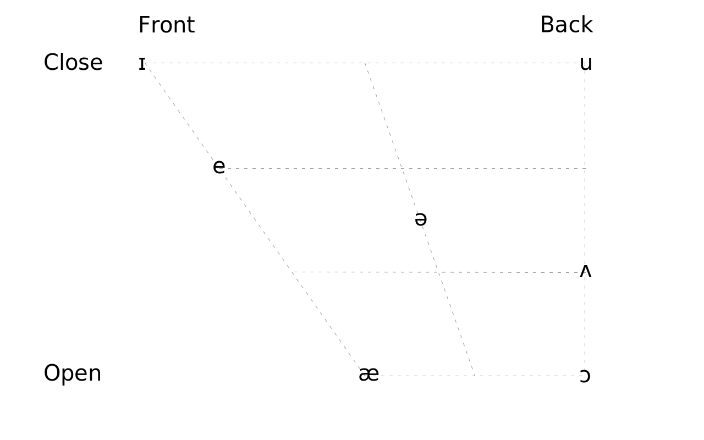
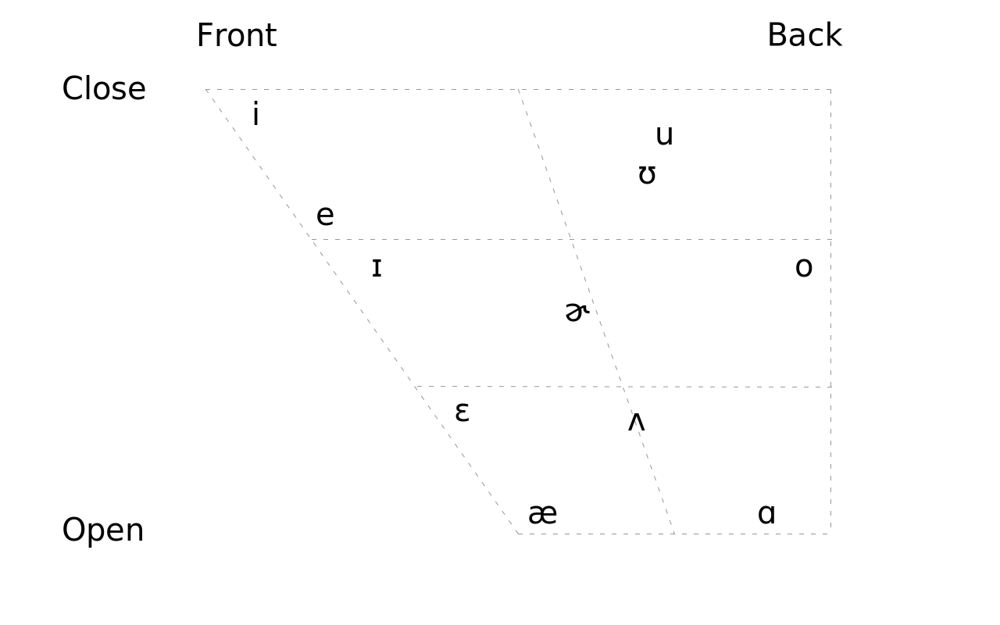
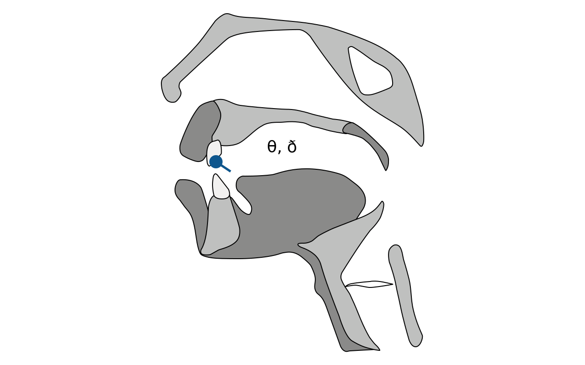
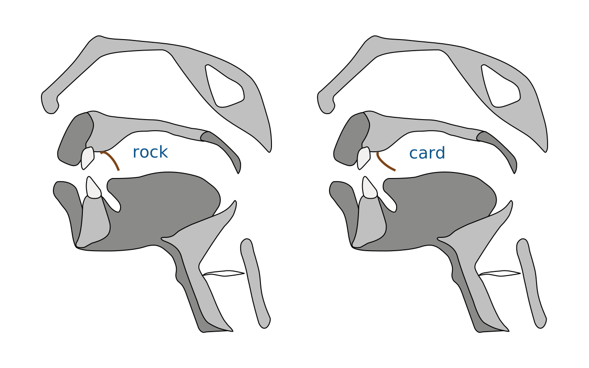
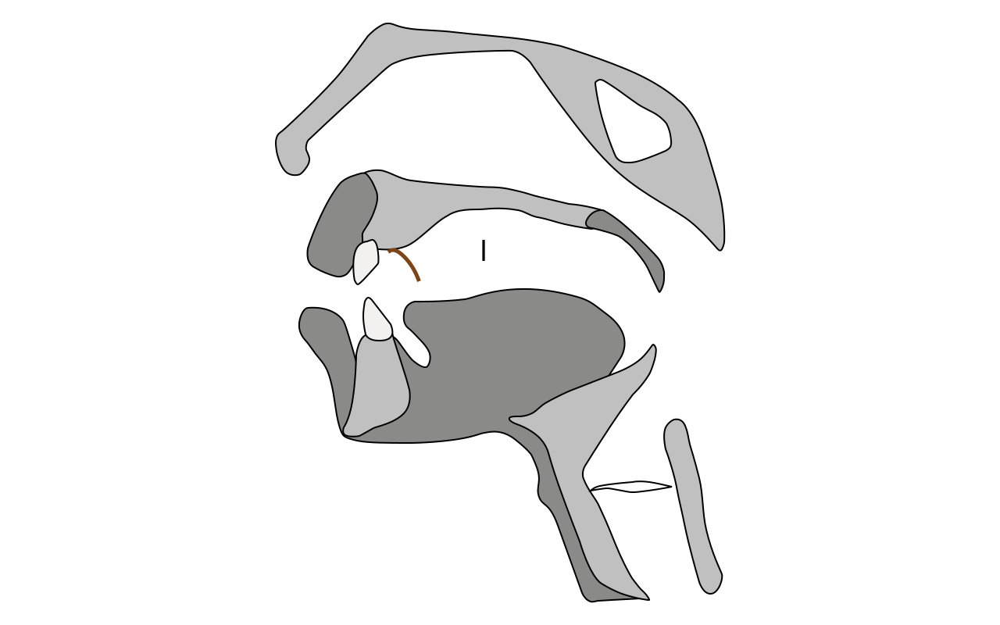
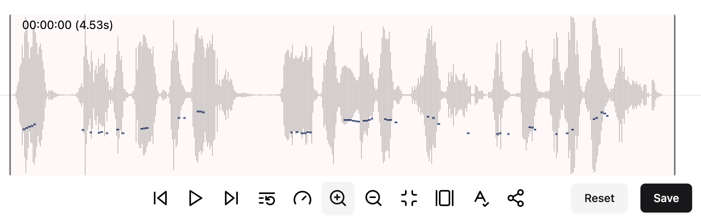

# 英文语音简明教程

李笑来 &copy; 2024

> [!Important]
>
> 注意：当前这篇并非**终稿**。它只是经过若干次修改之后，于 2024 年 2 月 4 日完成的**初稿**。在接下来的一年左右时间里，我可能随时会更改这篇文档的内容，虽然可能并非大幅度修改，但，每个看似微小的细节，都可能是因为极其重要所以才需要修改。最终，这篇及其相关文字，李笑来必然会对其 “开源”。但，在最终稿完成之前，相关的文字、图片、声音文件、视频文件，都要暂时保留版权，拒绝引用。
>
> 这篇文章里有很多 “不一样” 的观点。大致罗列如下：
>
> > - 6 个基础元音
> > - æ 其实是长元音
> > - 特定辅音发声时舌尖的起始位置和姿势
> > - 一个定制的 English Phonetic Pangram
> > - 自然语音事实上是以音节为最基础单位
> > - 决定韵律节拍的八个字：高低起伏轻重缓急
> > - 一个长期被忽略的关键：停顿
> > - ……
>
> 虽然这些都很难对其做出什么 “版权声明”，但有必要罗列在这里以防有人洗稿。
>
> 另外，这个文档用 [Typora](https://typora.io/) 书写，在不得已的情况下，这篇文档的 Markdown 里掺杂着一些 HTML 代码，比如某些表格，audio/video tag 等等。
>
> 在 Github 上，audio/video tag 无法正常显示 —— 会有 `Your browser does not support the audio element.` 作为提示。另外，Github 上也不支持这篇文档内的链接跳转。
>
> 为了阅读方便，你可能需要将文档下载到本地，用 Typora 打开，或者用 [pandoc](https://pandoc.org/) 转换成 HTML 文件之后用浏览器打开。
>
> 这个文档需要大家帮忙修订，比如，错别字、格式错误等等，可以直接提交 issue 或者 pull request —— 谢谢！
>
> 2024.02.06

---

音素（Phonemes）是语音中不可再分割的片段，英文的音素被分为元音辅音两大类。

## 1. 基础

> [!Note]
>
> 1.1 与 1.2 的内容采用的是 D.J. 音标通用版本。关于美式发音的标注方法，参见 [2.4](#2.4.-D.J.，K.K，和-IPA)。D.J. 音标广泛用于各大英语权威词典，包括[剑桥英语发音词典](https://dictionary.cambridge.org/pronunciation/english/dictionary)、[牛津词典](https://www.oed.com/)、[朗文当代英语词典](https://www.ldoceonline.com/)、[柯林斯 COBUILD](https://www.collinsdictionary.com/dictionary/english)，等等。

### 1.1. 元音

英文总计 20 个元音。

<table>
<tbody>
 <tr>
  <td colspan="2">单元音</td>
  <td>双元音</td>
 </tr>
 <tr>
  <td>短元音</td>
  <td>ʌ, e, ə, ɪ, ʊ, ɒ</td>
  <td rowspan="2">aɪ, eɪ, ɔɪ, aʊ, əʊ, eə, ɪə, ʊə</td>
 </tr>
 <tr>
  <td>长元音</td>
  <td>ɑː, æ, əː, iː, uː, ɔː</td>
 </tr>
</tbody>
</table>

### 1.2. 辅音

英文总计 28 个辅音。

<table>
<tbody>
 <tr>
  <td rowspan="2">爆破音</td>
  <td>清辅音</td>
  <td>p, t, k</td>
 </tr>
 <tr>
  <td>浊辅音</td>
  <td>b, d, g</td>
 </tr>
 <tr>
  <td rowspan="2">摩擦音</td>
  <td>清辅音</td>
  <td colspan="2">f, s, θ, ʃ, h</td>
 </tr>
 <tr>
  <td>浊辅音</td>
  <td colspan="2">v, z, ð, ʒ, r</td>
 </tr>
 <tr>
  <td rowspan="2">破擦音</td>
  <td>清辅音</td>
  <td>tʃ, tr, ts</td>
 </tr>
 <tr>
  <td>浊辅音</td>
  <td>dʒ, dr, dz</td>
 </tr>
 <tr>
  <td>鼻音</td>
  <td>浊辅音</td>
  <td>m, n, ŋ</td>
 </tr>
 <tr>
  <td>边辅音</td>
  <td>浊辅音</td>
  <td>l</td>
 </tr>
 <tr>
  <td>半元音</td>
  <td>浊辅音</td>
  <td>j, w</td>
 </tr>
</tbody>
</table>

### 1.3. 音节

也许主要是因为人类大脑结构基本相同，虽然人类各自说着不同的语言，但到了最基础层面，所有的语言竟然都有很多完全相同的特征，比如，**每个音节都有且只有一个元音**。

英文的词汇由至少一个音节构成，比如英文中出现频率最高的几个词，_a/an_, _the_, _of_, _to_, _for_... 都是单音节词汇。有的词汇可能很长，由很多很多音节构成。在英文词典中能找到的最长词汇总计由 19 个音节，45 个字母构成：

> _[Pneumonoultramicroscopicsilicovolcanoconiosis](https://en.wikipedia.org/wiki/Pneumonoultramicroscopicsilicovolcanoconiosis)_
>
> ` ˌnumənəʊˌəltrəˌmaɪkrəˌskɑpɪkˌsɪləkəʊvɑlˌkeɪnəʊˌkəʊniˈəʊsəs`
>
> <audio controls><source src="audios/En-us-pneumonoultramicroscopicsilicovolcanoconiosis.ogg.mp3">Your browser does not support the audio element.</source></audio>

英文的音节构成大抵上有以下几种形式（其中，c 代表 “辅音”，v 代表 “元音”）：

| Syllable Structure | examples           |
| ------------------ | ------------------ |
| `v`                | _a_, `ə`           |
| `vc`               | _add_, `æd`        |
| `cv`               | _the_, `ðə`        |
| `cvc`              | _dog_, `dɔg`       |
| `ccv`              | _flee_, `fliː`     |
| `vcc`              | _east_, `iːst`     |
| `cvcc`             | _task_, `tæsk`     |
| `ccvc`             | _speed_, `spiːd`   |
| `ccvcc`            | _thrust_, `θrʌst`  |
| `cvccc`            | _text_, `tekst`    |
| `ccvccc`           | _flexed_, `flekst` |

如果一个单词由多个音节构成的话，那么为了能够读得顺畅、清晰且易于识别，那么其中可能会有某个音节是**重音**；如果音节数量更多，可能还会有某个或某些音节是**次重音**。一般一个词汇只有一个重音，但有可能存在多个次重音。比如 _serendipity_ `ˌserənˈdɪpɪtɪ`。之前的那个 19 个音节构成的词汇，其中有 7 个**次重音**，1 个**重音**。

从音节长度上来看，与大多数亚洲语言相比：

> **英语的音节几乎总是相对更长。**

首先，英文音节中的元音，可能是长元音和双元音，而亚洲语言音节中的元音 —— 中文里 的 “韵母”，日文韩文里的 “母音” —— 都是等长的。

这是元音之间的比较，我们再看看辅音之间的比较。

亚洲语言的音节几乎没有两个辅音作为开头的情况，在英文中这种情况却非常普遍。亚洲语言的音节同样没有两三个辅音作为结尾并且还要发声清晰的情况，在英文中这种情况同样非常普遍。每个辅音都要发声清晰的话，就会占用一定的时长。比如，上面表格中的最后一个例子，_flexed_, `flekst`，整体只是一个音节，可即便这一个音节中的元音 `e` 是短元音，整体发声时它也比任何一个亚洲语言中的 “字”（同样是一个音节）都长。

## 2. 基础讲解

### 2.1. 元音

英文元音总计 20 个。

流行的教科书里通常不会把 `æ` 列为长元音，可能是因为 D.J. 音标在 1917 年最初发表的时候，[Daniel Jones](<https://en.wikipedia.org/wiki/Daniel_Jones_(phonetician)>) 并没有为它加上一个长元音符号，不是 `æː`, 而是 `æ`，这也很容易理解，毕竟 `æ` 已经和 `e` 看起来已经并不相同…… 但，无论如何，`æ` 的确是短元音 `e` 的更长版本。

`ʌ, e, ə, ɪ, ʊ, ɒ` 这 6 个短元音，就是英文元音基础元音，它们就好像是 “根” 一样，因为剩下 16 个元音要么是它们略有变化的更长版本，即，长元音 —— `ɑː, æ, əː, iː, uː, ɔː`，要么是它们的组合版本，即，双元音 —— `aɪ, eɪ, ɔɪ, aʊ, əʊ, eə, ɪə, ʊə`。

> [!Important]
>
> 所谓的 “略有变化”，指的是，`ʌ/ɑː`、`e/æ`、`ɪ/iː`、`ə/əː`、`ʊ/uː`、`ɒ/ɔː` 这六组对应的短元音和长元音，从细节上来看，其实都不是同一个音的长短不同的两个版本 —— 它们在发声时口腔内气流共鸣位置都各不相同（[2.1.1](#2.1.1.-口腔内气流共鸣位置)）。

#### 2.1.1. 口腔内气流共鸣位置

不同的元音在发声时，“口腔内气流共鸣位置” 不同（未收录双元音）—— 这也是 D.J. 音标的作者 Daniel Jones 的研究成果（插图参考 [Wikipedia](https://en.wikipedia.org/wiki/Vowel_diagram) 重新绘制）：

请注意，虽然 Daniel Jones 的工作非常伟大，但最终，那只是一种 “近似描述的尝试”，而不是一个 “标准”。而英文的地方口音又多，各个地方都不太一样。以下是[美国加利福尼亚地区的人说英语](https://en.wikipedia.org/wiki/California_English)时的元音口腔内气流共振位置：

首先，每个人的发声习惯都各不相同，并非全世界所有的人都用完全相同的 “口腔内气流共鸣位置” 说出同样的元音。与此同时，人们在识别他人语音的时候，我们的大脑并不是对每个音素不同层面的各个参数进行对比分析而后才能识别，而是通过几个粗略的模式对比去完成识别，并且，还会参照一些音素之外的东西，比如，上下文（[4.1](#4.1-流利)）。

> [!note]
>
> 2022 年 OpenAI 发布的语音识别转换文字模型 [Whisper](https://github.com/openai/whisper) 语音识别之所以前所未有地速度更快，准确率更高，更多基于它的算法对语音内每个词对应的上下文分析（主要通过各种类型的 “模式识别”），而不仅仅是对各个的音素识别。在此之前，大多数语音识别模型更多只是基于对音素的分析，所以速度慢，准确率也不高。

在练习的时候，把所有英文元音的 **“口腔内气流共鸣位置” 尽量靠后就对了** —— 尽量往后移，感觉上移到接近喉咙的位置 —— 这是因为，亚洲语系的元音在发声的时候，“口腔内气流共鸣位置” 每一个都相对更为靠前。

> **凡是和母语发声方式不一样的地方，就是语音塑造的重点。**

怎么做呢？仔细听以下 3 个 `ɑ` 音的不同变体，随后多揣摩多尝试（音频来自 [Wikipedia](https://en.wikipedia.org/wiki/Vowel)）就会了：

- 气流共鸣位置靠前：
  <audio controls><source src="audios/ɑ-01-PR-open_front_unrounded_vowel.ogg.mp3" type="audio/mpeg"> Your browser does not support the audio element.</source></audio>
- 气流共鸣位置居中：
  <audio controls> <source src="audios/ɑ-02-Open_central_unrounded_vowel.ogg.mp3" type="audio/mpeg">Your browser does not support the audio element.</source></audio>
- 气流共鸣位置靠后：
  <audio controls> <source src="audios/ɑ-03-Open_back_unrounded_vowel.ogg.mp3" type="audio/mpeg">Your browser does not support the audio element.</source></audio>

#### 2.1.2. `ʌ`/`ɑː`

美国人在发这个音的时候，干脆完全是 `ə`。也就是说，对美国人来说，短元音只剩下了 5 个，而不是英国人习惯的 6 个。比如，_encourage_ 这个词，英国人读作 ` ɪnˈkʌrɪdʒ`，美国人读作 `ənˈkərɪdʒ` —— 他们倾向于把一些非重音音节里的 `ɪ` 读作 `ə`。

美国人在读这个长元音 `ɑː` 的时候，常常会在末尾加上一个 `r`，所以，在专门为美式发音设计的 K.K. 音标里，常常直接用 `ɑr` 标注。

#### 2.1.3. `e`/`æ`

有些词典，针对美式发音，常常会用 `ɛ` 标注 `e` 这个音。

`æ` 相当于是 `e` 的更长版本。虽然 `æ` 后面没有长元音符号 `ː`。但，它其实应该算作 “长元音”。亚洲人在读这个音的时候，都能做到把嘴巴张得更大一点，但，都会不由自主地将它读成更短的版本。这里有两个要点:

> 1. 音拉长一点
> 2. 嘴张大一点

其中，第一个要点相对更为重要。你可以多试试这两个词，_apple_ `ˈæpəl`，_banana_ `bəˈnænə`，并刻意把其中的 `æ` 拉得更长一点。

#### 2.1.4. ` ə`/`əː`

美国人在读这两个音的时候，常常会在末尾加上一个 `ʳ`，但，也不是每一次都会加上 `ʳ`。比如，_worker_ 读作 `wəːkəʳ`，而不会被读成 `wəːʳkəʳ`。

初学者容易矫枉过正，遇到这两个音就加上 `ʳ`，比如，可能会把 _focus_ 读成 `fəʊkəʳs`。

有些词典，常常会用 `ɜ` 标注 `ə` 这个音。另外，针对美式发音，`əʳ` 会被写成 `ɚ`，`əːʳ` 会被写成 `ɜː` 或者 `ɝ`。

注意，在连贯的自然语音中，很多非重音音节的元音，都有被简化成 ` ə` 的倾向，尤其是 `ɪ`。比如，_individual_, `ˌɪndɪˈvɪdʒjʊəl`，实际上会被读作 `ˌɪndəˈvɪdʒəwəl` —— `jʊ` 也变成了 `ə`，而后 `ʊ` 和 `ə` 之间有个加音 `w`（[2.2.12](#2.2.13.-`j,-w`)）…… 事实上，现在已经有很多词典干脆直接标注成了后者。

#### 2.1.5. `ɪ`/`iː`

这一对元音，不只是长短的区别。 `ɪ` 常常被认为实际上并不完全是长元音 `iː` 的更短版本，它更像是 `e` 和 `i` 之间的一个音，发声时 “口腔内气流共鸣位置” 相对于 `iː` 略微靠后。听起来很像是更短版本的 `eɪ`……

但，有个细节，`ɪ` 在词汇末尾的时候，更倾向于像是 `iː` 这个长元音的更短版本，`i`。

Daniel Jones 去世之后，Alfred C. Gimson 接受了他的工作，于 1977 年发布了 D.J. 音标第 14 版。引入 `ɪ ʊ ɒ ɜː` 等符号取代之前使用的 `i u ɔ əː`。

1997 年，Peter Roach 再次接手，_English Pronouncing Dictionary_ (_EPD_) 更名为 _Cambridge English Pronouncing Dictionary_ (_CEPD_)，并发布 D.J. 音标第 15 版。除了引入能够标注美式发音的 `ɝ, ɚ, t̬` 之外， 还特意修改了词汇末尾的 `ɪ`，将其统一改成了 `i`。也就是说，_happy_ 不再被标注为 `ˈhæpɪ`，而是 `ˈhæpi`。与此同时，大多数词典所配的真人发音示范，都相应地做了修订。

反复听一下剑桥词典为 _responsibility_ 这个词录制的真人发音示范：

> UK
>
> <audio controls><source src="audios/ukresou030.mp3" type="audio/mpeg">Your browser does not support the audio element.</source></audio>
>
> US
>
> <audio controls><source src="audios/eus73963.mp3" type="audio/mpeg">Your browser does not support the audio element.</source></audio>

#### 2.1.6. `ʊ`/`uː`

这一对元音，地球上的任何语言都用，并且还几乎是一模一样地用，所以，大家读起来都不费劲。只有一个细节值得注意，英文里长元音 `uː` 相对于短元音`ʊ` 嘴形缩得更小，嘴唇相对更加略微凸出。

#### 2.1.7. `ɔ`/`ɔː`

这一对元音在发声的时候，嘴唇动作非常明显，嘴唇得形成一个小的圆形之后开始发音。另外，`ɔː` 可能会被美国人读成 `ɔʳ` ，更像是双元音 `ɔᵊʳ` —— 但，再一次，还是不一定都如此，需要逐个核对。

另外，D.J. 音标最初的时候短元音用 `ɔ`，长元音用 `ɔː`。但，后来短元音 `ɔ` 开始使用笔划上闭口的 `ɒ`。

#### 2.1.8. `aɪ, eɪ, ɔɪ, aʊ, əʊ, eə, ɪə, ʊə`

亚洲语系基本上都没有和英文一样的双元音。韩文日文的母音和中文的韵母虽然都有少数由两个基础音素构成的组合音，但，它们和英文的双元音不同的地方在于，它们都是和其它韵母或者母音等长的，而不是像英文双元音的长度那样几乎是短元音的两倍。

比如，当中国人说 “太累了” 的时候，“太”（`tài`）这个字的 “韵母” 就很接近英文的双元音 `aɪ`；“累”（`lèi`）这个字的韵母就很接近英文的双元音 `eɪ`…… 但，它们很不一样，英文的双元音就是更长。

英文的双元音，都是两个元音的组合。它们都是从第一个元音滑向第二个元音，所以，它们从长度上来看，相当于是长元音；节奏在感觉上大抵是乐谱里的 “一拍里均放着三个等长音符的三连音”，前一个基础音素更长一些，后一个基础音素相对较短。

在读它们的时候，同样要注意 **“口腔内气流共鸣位置” **，要尽量靠后，但更为重要的是，**要把它们读得足够长** —— 要占用两个元音的发声时长，并且足够饱满。

亚洲人常常会把所有双元音都读成单元音的长度。不仅如此，他们也常常会不由自主地把很多长元音也读成相应更短的版本。这是因为在亚洲语系往往以字（而不是词）为最小单位，而后，每个字都是单音节，每个音节里的元音（比如，中文中的 “韵母”）都是等长的。

另外，有 3 个双元音里有 `ʊ` 这个音，`aʊ, əʊ, ʊə` —— 若是不配合着嘴唇的动作，就读不准它们。而剩下的 5 个双元音，`aɪ, eɪ, ɔɪ, eə, ɪə` 都是在嘴唇几乎不动的情况下完成的，全靠喉咙部位的动作。

> [!Note]
>
> 在 D.J. 的某些版本里， `əʊ`，也被写作`oʊ` —— 所以现在也有一些词典用的是 `oʊ`。我的个人看法是，写作 `əʊ` 相对更合理，因为 `o` 并没有在 6 个基础音素里出现过。

### 2.2. 辅音

相对来看，影响理解的不正确发音，更多来自元音而不是辅音。每个音节都有且只有一个元音。如果一个音节是一个细胞的话，那么，其中唯一的元音，就相当于是它的细胞核。虽然 “辅音” 常常被认为是 “地方口音” 的主要根源，但实际上，最影响 “信息交流顺畅” 的，其实是 “元音错误”。相对来看，“辅音错误” 常常除了会显得有明显的 “口音” 之外，并不影响交流。

好莱坞动作明星阿诺德·施瓦辛格的母语是德语。哪怕他已经在美国生活多年，期间还当过州长，一直拍片并四处演讲，可迄今还有严重的口音。他常常自嘲，说 “自己的口音和自己的胸肌一样厚重”（_[Be Useful: Seven Tools for Life](https://www.amazon.com/Be-Useful-Seven-Tools-Life/dp/B0C1HR5D9S/)_ 2023）…… 但是，如果仔细对照一下的话就会发现，他的元音大多都相当正确，他的口音其实主要是辅音造成的，但那口音完全不影响他的表达和听众的理解。

也正因如此，辅音反过来也成了一个重点。每个语言都有自己相对独特的**辅音发声方式**，以及独特的**辅音与元音的组合方式**。即便是母语和英语看似共有的辅音，也可能有细微的差异 —— 而那些差异就是 “地方口音” 的来源。想要去除地方口音，想要重塑我们自己的语音，我们的确需要在辅音上下狠功夫。

我们没办法分析所有语言与英语的不同。以下更多以中文普通话与英文的不同为例作为讲解。但原理都是一样的，让我们重复一遍：

> **凡是和母语发声方式不一样的地方，就是语音塑造的重点。**

> [!Important]
>
> 其实，这个文档中的每一个小节，你都有可能需要自己补充。因为即便是中文普通话，也有很多地方口音。根据你原本的口音不同，你需要仔细分析自己每一个音的发声方式，找到需要修正或者调整的地方。如果你是日本人，就需要认真分析每个音素与日文相似发音的具体不同；如果你是韩国人，就需要认真分析每个音素与朝鲜语相似发音的具体不同…… 总之，**一定要把这个文档变成针对自己的个性化文档**。

#### 2.2.1. `p, b, m, n, f, k, g, h`

这几个辅音，中国人读得都很正确，因为它们在两种语言里的发声方式都差不多。

但中国大陆地区的人也有个小问题。因为小时候学过中文拼音，习惯了这么读这些声母的：`bo, po, mo, fo, ge, ke, he, ne`，写作 D.J. 音标的话，就是，`bə, pə, mə, fə, gə, kə, hə，nə`……

于是，老的习惯一不小心就会冲进新学的语言，总是不由自主地在这些音后面加上一个 `ə`…… 比如，很多人总是把 _please_ 读成 _police_。

#### 2.2.2. `f`, `v`

`f` 这个辅音，对中文普通话的使用者来说毫不费力，因为中文普通话里有这个声母。韩国人在说 `f` 的时候就很吃力，因为朝鲜语中没有这个音，他们会一不小心就用 `p` 去替代 `f`，把 _photo_ 读成 `pəʊtəʊ`。

但是，这个清辅音 `f` 的浊辅音版本，`v`，就是中文普通话里没有的了。所以需要 “新学” 并且还得 “专门练习”，不能用近似的 `w` 替代。比如，不能把 _every_ 读成 `ˈewərɪ`。朝鲜语也没有这个音，所以韩国人常常会用 `b` 替代，把 _video_ 读成 `ˈbɪdioʊ`。

`f` 和 `v` 可能对中国南部地区的一些人会造成困难。需要反复练习一个原本生活里没用过的发声方式： “上牙齿接触下嘴唇之后再开始发音”。

事实上，有研究表明，“母语中不存在的音” 和 “母语中存在类似音” 相比，学习前者更加容易。这和人们的感觉相反。因为前者生学只要靠硬练就可以了，但遇到后者，人们常常会神不知鬼不觉地借用自己母语中存在的类似音。所以，千万不要误以为自己永远发不出某个音，只要不断尝试，早晚可以做到。但，绝不能养成用近似音替代的习惯。

> Flege, J. (1995). "Second language speech learning: Theory, findings and problems". In Winifred Strange (ed.). _Speech perception and linguistic experience: Theoretical and methodological issues_. Baltimore: York Press. pp. 233–277

#### 2.2.3. `m, n, ŋ`

`m` 在音节末尾的情况，对中文普通话使用者来说，没有任何难度。能准确说中文普通话的人，也都可以分清楚音节末尾的前鼻音 `n` 和后鼻音 `ŋ` 之间的区别。对中国南部地区的一些人就困难了，他们说普通话的时候就分不清楚前鼻音和后鼻音，比如，“英雄”，会被说成 `yīn xión`，而不是 `yīng xióng`。这没什么别的办法，只能硬逼着自己生学硬练后鼻音的发声方式。

前鼻音 `n` 随后跟着软腭音 `k` 的时候，会自然变成后鼻音，读作 `ŋ`，比如 _tank_，词典里的音标通常也直接标注成 `tæŋk`。

`ŋ` 在词汇末尾的时候，若是后面跟着个元音开头的音节，经常会被读成 `n`，与后面的音节连读，比如：

> - _going out_ ⭢ `goʊɪn aʊt`
> - _sing a song_ ⭢ `sɪn ə sɔŋ`
> - _wrong idea_ ⭢ `rɔn aɪˈdiə`
> - _thinking of_ ⭢ `ˈθɪŋkɪn əv`

#### 2.2.4. `t, d, s, z; ʃ, tʃ, dʒ`

`t, d, s, z` 这 4 个辅音，是中文普通话使用者必须调整的重点。它们在中文普通话里都有近似版本，所以，它们在两种语言中那微妙的发声方式区别会很容易被忽视。但，那一点点的差别却极大地影响整个 “音质” —— 因为这 4 个辅音以及直接受它们所影响的 `ʃ, tʃ, dʒ`，总计 7 个辅音， 在英文语音中所占的比例实在太高。

`t, d, s, z` 这四个辅音的发声关键，在于它们发声时起始的 “舌尖位置”。

在中文普通话里，`t, d` 这两个声母发声时起始的 “舌尖位置” 贴在牙齿上；`s, z` 这两个声母发声时起始的 “舌尖位置” 接近牙齿，但留了个空隙以便气流通过。你可以试着用中文普通话说一遍 “我踢死你” `wǒ tī sǐ nǐ`。

在英文里，`t, d,` 这两个辅音发声时起始的 “舌尖位置” 贴在牙齿和牙龈分界再往后一点点（如上图所示），而不是在牙齿上。而 `s, z` 这两个辅音，发声时起始的 “舌尖位置” 是同样的，但留了个空隙以便气流通过。

而 `t, d, s, z` 这四个辅音发声时起始的 “舌尖位置”，同样影响基于它们的另外三个辅音，`ʃ, tʃ, dʒ`…… 比较有趣的是，中文的普通话里恰好有对应的 “卷舌音”，`sh, ch, zh`。找对发这三个声母发声时起始的舌尖位置，从那里开始读英文的 `t, d, s, z` 就对了。只不过，有一点点的区别，中文的 `sh, zh` 舌尖顶着上颚，同样的方式读出来的是英文的 `ʃ, dʒ`。而英文的 `s, z` 离上颚还有一点距离，但，不像中文的 `s, z` 那样靠近牙齿。

对中文普通话使用者来说，必须为这几个辅音学习新的发声方式。可以用 _students_ `ˈstudənts` 这个词作为起步反复练习。以后随时注意这些辅音发声时起始的 “舌尖位置”。

#### 2.2.5. `t, d`

`t` 和 `d` 在英文语音中出现频率实在太高，乃至于我们不得不格外注意有关它的细节。

##### 2.2.5.1. 省音

`t` 和 `d` 之后直接跟着辅音的时候，它的舌尖动作完整，但，不送气流，所以我们听不到它。有人把这种现象叫做 **省音**（_elision_）；但，这种说法容易产生误导 —— 听不到不意味着说没有，它是一个 **“看不见” 甚至 “听不到”，但 “的确存在” 的停顿**。`t, d` 的那个位置会有个**细微的停顿** —— 有时，即便舌尖动作并不完整，但那个停顿依然在 —— 通常会被非母语使用者直接忽视。

_postcart_, 不是 `poʊsˌkɑrd`，而是 `ˈpoʊs·ˌkɑrd` —— 这里的 `·` 代表那个极短的停顿。同样，_hotdog_, 不是`ˈhɑˌdɔg`，而是 `ˈhɑ·ˌdɔg`；_partner_，不是 `ˈpɑrnər` 而是 `ˈpɑr·nər`；_hard-nosed_, 不是 `ˌhɑːˈnoʊzd`，而是 `ˌhɑːr·ˈnoʊzd`。

##### 2.2.5.2. 叠音

这不是 `t, d` 才有的现象。

上一个音节末尾的辅音和下一个音节开头的辅音相同的时候，叫做**叠音**（_geminates_）。在连贯的自然语音中，这两个辅音就只发声一次 —— 但听起来的时候，有可能感受到前一个辅音存在造成细微停顿。它从机制上来看，其实和**省音**（[2.2.5.1](#2.2.5.1.-省音)）一样。其实哪怕相邻的两个辅音相似的时候，也会发生同样的现象。

比如，_at that time_, 不是 `ət ðæt taɪm`，而是 `ə·ðætaɪm` —— 第一个 `t` 由于后面跟着一个辅音，于是产生了**省音**（[2.2.5.1](#2.2.5.1.-省音)），听不到了，但，该有的停顿却依然在，在这里我们用 `·` 代表那个停顿 ；而后，第二个 `t` 与 第三个 `t` 是**叠音**，这两个 `t` 只发声一次。再比如，_a bad day_, 不是 `ə bæd deɪ`，而是 `ə bæ deɪ`。

##### 2.2.5.3. 同化

`t` 为末尾的单词，遇到 `ju` 开头的单词，连起来读的时候，`t` 往往会变成 `tʃ`；而 `d` 遇到 `ju` 的话，`d` 会变成 `dʒ`。这种现象被称为**同化**（_assimilation_）。最常见的比如，_Don't you?_ `dəʊn tʃju?`；以及，_Would you?_ `wʊ dʒju?` 这里的关键在于，`t, d` 发声时起始的舌尖位置如果放对了（[2.2.4](#2.2.4.-`t,-d,-s,-z;-ʃ,-tʃ,-dʒ`)），它与后面的 `ju` 连起来的发声就只能如此。

##### 2.2.5.4. 弹舌音

`t` 被夹在两个元音之间的时候，可能是单词之内，也可能是单词之间，它会变成所谓的弹舌音，往往被标注为 `t̬`，被称为**弹舌音** （_alveolar flapping t_） —— 听起来非常接近 `d`。这种情况在英文语音中出现的情况实在太多，比如，_bea**t**en, bo**tt**om, bu**tt**er, daugh**t**er, wa**t**er, wri**tt**en, how abou**t** it, here a**t** our universi**t**y, no**t** a**t** all, set i**t** up_...

##### 2.2.5.5. 击穿

很多美国人在 `t` 这个音上还有另外一个特殊的习惯，`t` 跟在 `n` 之后的时候，美国人说话的方式会让我们听不到那个 `t`，即所谓的击穿（_dropping_）。比如，他们说 _interview_ 的时候你听到的可能是 `ˈɪnəˌvju` , 他们说 _international_ 的时候，你听到的可能是 `ˌɪnəˈnæʃənəl`。另外一个更常见被击穿的音是 `h`（[2.2.8](#2.2.8-`h`)）

#### 2.2.6. `tr, dr, ts, dz`

`tr/tʃ` 声音上很接近，它们发声时起始的舌尖位置相同，但舌尖姿势略有不同。`tr` 是舌尖顶着上颚（贴在牙齿和牙龈分界再往后一点点 [2.2.4](#2.2.4.-`t,-d,-s,-z;-ʃ,-tʃ,-dʒ`)），`tʃ` 是紧挨着舌尖的那一小部分舌面贴着上颚。`dr` 和 `dʒ` 的区别也是如此。

事实上，很多母语使用者也不太区分 `tr/tʃ, dr/dʒ`。有很多英语词典会把 _tree_ 的音标直接标注成 `tʃiː`，_driver_ 直接标注成 `ˈdʒaɪvər`……

倒是很多欧洲人基于自身母语的习惯，对它们有自然的区分，因为在他们的母语里，`tr` 和 `dr` 是分开连续读出，比如，_tree_，俄罗斯人或德国人会把它读成 `t·riː`，其中的 `r` 会用齿龈颤音；再比如，_driver_，会被他们读成 `d·raɪvə`，其中的 `r` 同样会用齿龈颤音。

`ts` 和 `dz` 发声时起始的舌尖位置和 `t` 以及 `d` 一样。`ts` 很像中文普通话拼音里的 `c`，只不过，发生时起始的舌尖位置不在牙齿上。`dz`，只要是调整好 `d` 的发生时起始的舌尖位置（`z` 的舌尖位置也是同一个地方），就不会有任何问题，`dz` 实际上也的确听起来和 `z` 没有区别。

#### 2.2.7. `sp, st, sk`

`p, t, k` 这三个清辅音对应着三个浊辅音： `b, d, g`。

需要注意的是，`p, t, k` 这三个清辅音在 `s` 之后的时候会发生 “浊化” 现象。

> - _speak_ `spiːk` 实际上读作 `sbiːk`
> - _student_ `ˈstudənt` 实际上读作 `ˈsdudənt`
> - _school_ `skuːl` 实际上读作 `sguːl`

#### 2.2.8. `h`

`h` 这个音单独发声的时候，大家都没问题，但有个另外的细节需要注意。

`h` 前面有另外一个辅音的时候，`h` 常常会被 “击穿”（_Dropping_）。比如，_Was he hurt?_ 三个单词分开读，应该是 `wɒz hi hərt?` 在连贯的语音中，会被读成 `wzi həːt?` —— `h` 不见了，被击穿了。再比如，_let him_，会变成 `let̬ɪm`（[2.2.5.6](#2.2.5.6-弹舌音)），又比如，_household_ 这个词听起来更像是`ˈhaʊˌsoʊld`……

#### 2.2.9. `θ, ð`

`θ, ð` 这两个辅音，学校里常见教材一般都强调说 “一定要把舌尖夹在齿间”。其实不一定要那么严格，实际上，舌尖即便没有伸出到齿外也可以，只要 “舌尖贴到上齿之后开始发音” 就可以了。

#### 2.2.10. `r`

`r` 这个辅音原本不难，但，美式英语有个独特之处造成了困难。它的难度并不在于发音起始的 “舌尖位置”，而是 “舌尖姿势”。英式英语中，`r` 只有一种 “舌尖姿势”，舌尖向前贴在上颚；可在美式英语中，_rock_ `rɔk` 是舌尖向前的，但，_card_ `kɑːʳd` 的舌尖姿势却是后卷的。

#### 2.2.11. `l`

`l` 这个辅音，和 `r` 一样，在元音前后都有出现的可能 —— 亚洲语言里多少都有 `r` 化音，所以，`r` 在元音之后的情况对亚洲人来说都不是问题。难点在于 `l` 在元音之后的情况 —— 这种情况在亚洲语言里几乎不存在。

难点在于 `l` 在元音之后的情况。比如，_individual_ `ˌɪndɪˈvɪdʒəwəl` 这个词，或者更简单的单音节单词，_girl_ `gəːl`，元音后的 `l` 常常会被忽略。

关键在于，元音之后的 `l` 有一个完整的舌尖动作，在发完 `ə` 这个音之后，舌尖会被推上去直至贴到上颚。

有些人能听出末尾的那个 `l`，所以不会忽略它；但，由于看不到口腔内舌尖的位置和姿势，仅凭听力，人们会借用别的方式完成自己感受到的差异，比如，末尾的 `l` 中国人会用带有嘴唇动作的 `əʊ` 替代，于是就把 _girl_ 读作 `gəʊ`；而韩国人会用 `r` 替代 `l`，于是把 _girl_ 读成 `gəːr`。

所以，要格外注意 `l` 在元音之后的情况，注意舌尖位置正确，动作完整，不能有嘴唇动作 —— 否则就会出现 `ʊ` 音。

#### 2.2.12. `ʒ`

`ʒ` 这个音在中文中不存在，是位于 `r` 和 `dʒ` 之间的音。这个音对亚洲人来说，实在是太难了。幸运的是，含有这个音在英文词汇其实很少，在最常用的 10,000 英语词汇里只有 69 个，而最常用的也就十几个：

> - _beige_ - `beɪʒ` - A pale sandy yellow-brown color
> - _collage_ - `kəˈlɑːʒ` - A piece of art made by sticking various different materials such as photographs and pieces of paper or fabric onto a backing
> - _corsage_ - `kɔːrˈsɑːʒ` - A small bouquet of flowers worn on a woman's dress or around her wrist
> - _decision_ - `dɪˈsɪʒən` - A conclusion or resolution reached after consideration
> - _decoupage_ - `ˌdeɪkuːˈpɑːʒ` - The art or craft of decorating objects with paper cut-outs
> - _garage_ - `ɡəˈrɑːʒ` - A building for housing a motor vehicle
> - _genre_ - `ˈʒɑːnrə` - A category of artistic composition, as in music or literature
> - _leisure_ - `ˈleʒər` - Time free from work or duties
> - _massage_ - `məˈsɑʒ` - The rubbing and kneading of muscles and joints of the body with the hands, especially to relieve tension or pain
> - _measure_ - `ˈmeʒər` - To ascertain the size, amount, or degree of something
> - _mirage_ - `mɪˈrɑːʒ` - An optical illusion caused by atmospheric conditions
> - _montage_ - `mɒnˈtɑːʒ` - The technique of producing a new composite whole from fragments of pictures, text, or music
> - _pleasure_ - `ˈpleʒər` - A feeling of happy satisfaction and enjoyment
> - _regime_ - `reɪˈʒiːm` - A government, especially an authoritarian one
> - _rouge_ - `ruːʒ` - A red powder or cream used as a cosmetic for coloring the cheeks or lips
> - _treasure_ - `ˈtreʒər` - A quantity of precious metals, gems, or other valuable objects
> - _usual_ - `ˈjuʒəwəl` - Habitually or typically occurring or done
> - _vision_ - `ˈvɪʒən` - The ability to see; sight

其实，只要肯反复练习，这个音对中文普通话使用者来说并不像最初以为的那么难。先试试说一下 `dʒ`（中文普通话拼音中的 `zh`），然后，把顶在上颚上的舌面略微下放一点点，留出一个缝隙以便气流通过 —— `ʒ`和 `dʒ` 的区别就是这个缝隙。

还记得吗？“母语中不存在” 的音素更容易学，但，有相似的就相对更难。`ʒ` 就因为与 `dʒ`（中文普通话拼音中的 `zh`）太相似了，所以才被中文普通话使用者全部都用 `dʒ` 替代……

#### 2.2.13. `j, w`

这两个辅音在单个音节里作为开头时，对绝大多数人来说没有任何障碍。

值得注意的是，有时候，在 “前面一个以元音结尾的音节” 与 “后面一个以元音开头的音节” 相连之时，这两个音会 “莫名其妙地插入”…… 语音学里对这个现象有个专门的称呼，叫做**加音**（ _intrusion_）。

- `j` _intrusion_（前一个音节以 `ɪ` 结尾）

> - _I am_ - `ˈaɪ ˈæm` ⭢ `ˈaɪjæm`
> - _He is_ - `ˈhiː ˈɪz` ⭢ `ˈhiːjɪz`.
> - _She is_ - `ˈʃiː ˈɪz` ⭢ `ˈʃiːjɪz`.
> - _They are_ - `ˈðeɪ ˈɑːr` ⭢ `ˈðeɪjɑːr`.

- `w` _intrusion_（前一个音节以 `ʊ` 结尾）

> - _Go away_ - `ˈɡəʊ əˈweɪ` ⭢ `ˈɡəʊwəˈweɪ`
> - _Do all_ - `ˈduː ˈɔːl` ⭢ `ˈduːwɔːl`
> - _Do it_ - `ˈduː ˈɪt` ⭢ `ˈduːwɪt`
> - _Throw it_ - `ˈθrəʊ ˈɪt` ⭢ `ˈθrəʊwɪt`

之前提到过的例子 _individual_ `ˌɪndɪˈvɪdʒəwəl`，是个多音节词汇，如果仔细看的话，就会发现，后半部分， `dʒə-wəl` ，其实也是 `dʒju-əl` 经过 _intrusion_ 插入了一个 `w` 而演化过来的。

### 2.3. 连读

在流行的语音教材中，“连读” 往往被归类到 “高级技巧” 之中。这种 “分类” 其实毫无必要，因为它实际上就很基础。

自然语音从来都是连贯的，所以它从来都不是 “以词为最基础单位”，从来都是 “以音节为最基础单位” —— 在这个层面上来看，其实人类所有语言的自然语音都是如此。

> 英文表面上是以词为最基础单位……
>
> 但从连贯的语音上来看，事实上以音节为最基础单位。

既然 “所有自然语音都以音节为最基础单位”，那么 “把相邻的音节处理明白而后说清楚” 原本就是基础。

比如，前后两个词在音上的连读现象（_catenation_）：_clean up_，前一个音节末尾的 `n` 和后一个元音开头的音节 `ʌp` 听起来像是同一个音节，到最后听起来是 `kli ˈnʌp` —— 之所以如此，关键就在于，所有自然语音都以音节为最基础单位。

而又因为连贯的语音，往往还带着高低起伏（[3.3](#3.3.-高低)，[3.4](#3.4.-起伏)），有着轻重缓急（[3.5](#3.5.-轻重)，[3.6](#3.6.-缓急)），于是在这个过程中某些因素会自然发生一些变化，甚至变体，简直不可能更自然了。

不仅相邻的音节可能连起来，在连接的过程中，有些音素还会因此产生变化，总结一下：

> - 非重音上的元音常常被简化成 ` ə`（[2.1.4](#2.1.4.-`ə`/`əː`)）
> - `t, d` 常常有各种变化（[2.2.5](#2.2.5.-`t,-d`)）：
>   - 省音（ _elision_，[2.2.5.1](#2.2.5.1-省音)）
>   - 叠音（_geminates_，[2.2.5.2](#2.2.5.2-叠音)）
>   - 同化（_assimilation_，[2.2.5.3](#2.2.5.3-同化)）；
> - 弹舌音 （_alveolar flapping_，[2.2.5.4](#2.2.5.4-弹舌音)）
> - `h` 和 `t` 可能会被击穿（_dropping_, [2.2.8](#2.2.8.-`h`)，[2.2.5.5](#2.2.5.5.-击穿)）；
> - `ŋ` 可能会读成 `n`（[2.2.3](#2.2.3.-`m,-n,-ŋ`)）；
> - `j` 和 `w` 可能会不知不觉地被插入，形成加音（_intrusion_, [2.2.12](#2.2.13.-`j,-w`)）
> - 相同或相似的辅音叠音（_geminates_，[2.2.5.2](#2.2.5.2-叠音)）

…… 可是，这些其实都是基础，一点都不高级；非说它们高级，颇有些误导。

以下是 _[Friends](https://www.imdb.com/title/tt0108778/) S01E01_ 里 _Joey_ 说的一句话：

> _Come on... you're going out with the guy... there's got to be something wrong with him._
>
> <audio controls><source src="audios/friends-s01e01-joey.mp3" type="audio/mpeg">Your browser does not support the audio element.</audio></audio>
>
> `kʌm ʌn... jʊ-ar goʊɪŋ aʊt wɪθ ðə gaɪ... ðez gɒt tʊ biː ˈsʌmθɪŋ rɔŋ wɪθ hɪm.`

短短一句话之中有很多细节需要注意 —— 当然，你现在应该大多都能理解：

> - _Come on_，连起来了，说成 `ˈkə·ˈmɑːn`，_Joey_ 当然是美式发音，美国人的 `ʌ` 基本上干脆就是 `ə`，`ʌn` 是重音，所以被拉长了，听起来是 `ɑː`（[3.5](#3.5-轻重)）；
> - _you're_ `jʊ-ar`，会有 `w` 的加音，但，很轻，需要仔细分辨才听得出来：`jʊ war`（ [2.2.12](#2.2.13.-`j,-w`)）；
> - _going out_，`goʊɪŋ aʊt` 中 `ŋ` 说成了 `n`（[2.2.3](#2.2.3.-`m,-n,-ŋ`)），与后面的音节连起来，`goʊwɪ·naʊt`，这里也有个 `w` 的加音（ [2.2.12](#2.2.13.-`j,-w`)）；
> - _with the_，`wɪθ ðə`，`θ· ð` 两个相近的辅音叠在一起，前一个只剩下了停顿，`wɪ·ðə`（[2.2.5.2](#2.2.5.2-叠音)）；
> - _got to_，`gɒt tʊ`，两个 `t` 叠在一起，前一个只剩下了停顿（[2.2.5.2](#2.2.5.2-叠音)），后面的 `to` 被弱读（[3.5](#3.5-轻重)）成了 `tə`，甚至听起来像是单独的 `t`： `gɒ·t(ə)`；
> - _something_, 说的是 `ˈsəmθɪn`（[2.2.3](#2.2.3.-`m,-n,-ŋ`)）；
> - _with him_，`h` 被击穿（[2.2.8](#2.2.8.-`h`)），说成了 `wɪ·θɪm`……

等到你完整理解 [3. 进阶](#3.-进阶) 之后，你可能还会注意到另外一些更重要的细节（比如以上例子中两次提到的 [3.5](#3.5-轻重) ）。

### 2.4. D.J.，K.K，和 IPA

英文的音标标注，英式发音普遍使用 D.J. 音标，美式发音普遍使用 K.K 音标；除此之外，还有可以用来标注所有语言（当然也包括英语）的 IPA，即，国际音标。这三个体系从出版开始到现在都经过多次改版 —— 这也间接导致了市面上各种英文词典都在使用 “各不相同” 的音标标注体系。

> [!Note]
>
> Daniel Jones 所编的英语发音字典代表了公认发音（"[Received Pronunciation](https://en.wikipedia.org/wiki/Received_Pronunciation)", RP），这在受过教育的英国人尤其是南部英格兰人中通用

这三个体系的核心区别主要是对元音的标注，辅音的标注几乎没有任何区别。

<table>
<tbody>
  <tr>
  <td><strong>DJ</strong></td>
  <td><strong>KK</strong></td>
  <td><strong>IPA</strong></td>
  <td><strong>Examples</strong></td>
  <td><strong>DJ</strong></td>
  <td><strong>KK</strong></td>
  <td><strong>IPA</strong></td>
  <td><strong>Examples</strong></td>
 </tr>
 <tr>
  <td>ʌ</td>
  <td>ʌ</td>
  <td>ʌ</td>
  <td>s<em>u</em>n</td>
  <td>ɑː</td>
  <td>ɑr</td>
  <td>ɑ</td>
  <td>h<em>o</em>t</td>
 </tr>
 <tr>
  <td>æ</td>
  <td>æ</td>
  <td>æ</td>
  <td>f<em>a</em>t</td>
  <td colspan="4"></td>
 </tr>
 <tr>
  <td>e</td>
  <td>ɛ</td>
  <td>e</td>
  <td>h<em>ea</em>d</td>
  <td colspan="4"></td>
 </tr>
 <tr>
  <td>ə</td>
  <td>ɚ</td>
  <td>ə</td>
  <td><em>a</em>gain</td>
  <td>əː/ɜː</td>
  <td>ɝ</td>
  <td>ɝ</td>
  <td>b<em>ir</em>d</td>
 </tr>
 <tr>
  <td>ɪ</td>
  <td>ɪ</td>
  <td>ɪ</td>
  <td>s<em>i</em>t</td>
  <td>iː</td>
  <td>i</td>
  <td>iː</td>
  <td>s<em>ea</em>t</td>
 </tr>
 <tr>
  <td>ʊ</td>
  <td>u</td>
  <td>ʊ</td>
  <td>p<em>u</em>t</td>
  <td>uː</td>
  <td>u</td>
  <td>uː</td>
  <td>t<em>oo</em></td>
 </tr>
 <tr>
  <td>ɒ</td>
  <td>ɒ</td>
  <td>ɒ</td>
  <td>d<em>o</em>g</td>
  <td>ɔː</td>
  <td>ɔ/ɔr</td>
  <td>ɔː</td>
  <td>f<em>our</em></td>
 </tr>
 <tr>
  <td>aɪ</td>
  <td>aɪ</td>
  <td>aɪ</td>
  <td>p<em>ie</em></td>
  <td colspan="4"></td>
 </tr>
 <tr>
  <td>eɪ</td>
  <td>e</td>
  <td>eɪ</td>
  <td>p<em>ai</em>n</td>
  <td colspan="4"></td>
 </tr>
 <tr>
  <td>ɔɪ</td>
  <td>ɔɪ</td>
  <td>ɔɪ</td>
  <td>c<em>oi</em>n</td>
  <td colspan="4"></td>
 </tr>
 <tr>
  <td>aʊ</td>
  <td>au</td>
  <td>aʊ</td>
  <td>h<em>ou</em>se</td>
  <td colspan="4"></td>
 </tr>
 <tr>
  <td>əʊ</td>
  <td>o</td>
  <td>əʊ</td>
  <td>n<em>o</em>se</td>
  <td colspan="4"></td>
 </tr>
 <tr>
  <td>ɪə</td>
  <td>ɪr</td>
  <td>ɪə</td>
  <td>r<em>ear</em></td>
  <td colspan="3"></td>
  <td></td>
 </tr>
 <tr>
  <td>eə</td>
  <td>ɛr</td>
  <td>eə</td>
  <td>h<em>air</em></td>
  <td colspan="4"></td>
 </tr>
 <tr>
  <td>ʊə</td>
  <td>ʊr</td>
  <td>ʊə</td>
  <td>p<em>oor</em></td>
  <td colspan="4"></td>
 </tr>
</tbody></table>

D.J 音标经过多次改版，最终被剑桥接手，于 1997 发布了第 15 版 —— 增加了一些符号用以同时标注美式发音。

关于美式发音的音标标注，可以大致总结为以下几点：

> - `ʌ` 变得与 `ə` 非常接近，甚至常常直接被 `ə` 替代。比如，but `bʌt` 直接被标注为 `bət`。
> - 长短元音不统一使用 `ː` 区分，而是`ə/ɑ`、`ə/ɜ`、`ɚ/ɝ`、 `e/æ`、`ɪ/i`、`ʊ/u`、`ɒ/ɔ`。
> - `e` 有时用 `ɛ` 标注。
> - `ə`，由于经常附带着 `ʳ` 音，常常被标注为 `ɚ`；不带有 `ʳ` 音的时候，被标注为 `ɜ`。
> - 长元音 `əː`，同样由于经常附带着 `ʳ` 音，常常被标注为 `ɝ`。
> - `ə` 结尾的双元音，都用 `r`：`ɪə` ⭢ `ɪr`，`eə` ⭢ `er`，`ʊə` ⭢ `ʊr`。
> - 单词末尾的 `ɪ` 用 `i` 标注 —— 但它并不是长元音。
> - 非重音音节中的 `ɪ` 可能会被标注为 `ə`。
> - `t` 的弹舌音用 `t̬` 标注。

### 2.5. 关于音标的学习

学习音标，本质上来看，是为了建立 “**声音 ⭤ 音标**” 之间的双向连接。听到某个声音知道它怎么标记，看到某个音标知道它代表着哪个声音。

我们所关注的焦点顺序，原本应该先是 “声音”，而后才是 “音标”，即，“声音 ⭢ 音标”，然后才是建立双向连接，即， “声音 ⭤ 音标”。基于这样那样的原因，很多人普遍的做法是反过来的，他们先关注的是 “音标”，然后就被难倒了，记不住，记不全，于是，卡住了，就没有下一步了……

相对于记忆各种符号，人类的大脑更擅长记忆声音。回想一下吧，哪个人类不是先记住声音之后才开始学相应符号的呢？大家都一样，都是在对那些声音熟悉得不能再熟悉之后，又花了很多时间精力才掌握了那么多且那么复杂的符号。

另外，在没有彻底熟悉音标的情况下继续学习早就不是问题了，因为现在的词典早就电子化了，现在所有的电子词典都有真人语音示范朗读。

> [!Caution]
>
> 千万不要因为有真人语音示范朗读就彻底忽视音标。
>
> **必须刻意地至少扫一眼音标** —— 音标就是这样，**看多了自然就记住了**。

一个比较友好的路径是反复练习一个 _English Phonetic Pangram_，即，一段包含所有字母的最短文字。练习英文打字的时候大家都用过的 _The quick brown fox jumps over the lazy dog_ 就是最经典的 _English Pangram_。

> **pangram** `ˈpænˌɡræm` _noun_
> a sentence or verse that contains all the letters of the alphabet.

以下的 _Phonetic Pangram_ 只由五十来个单词构成，朗读一遍只需要 15 秒钟。如果觉得有必要的话，每天都看着文本和音标一口气读个十来遍 —— 每一遍都能遍历所有英语音素…… 音标就是这样，看多了就熟悉了，熟悉到一定程度就彻底记住了。反过来，想要一口气硬生生地记住所有符号，其实不大可能。

> Jane, a bright young girl, loves to read books at leisure in rooms or play on a sunny day outdoor here and there with boys. She vowed to buy a red ear dog. She thought it was unique, for sure. She'll feed it dough and cheese bar. She'll love it very much.
>
> `dʒeɪn, ə braɪt jʌŋ gəː(r)l, lʌvz tuː riːd bʊks æt liːʒə(r) ɪn ruːmz ɔːr pleɪ ɒn ə ˈsʌni deɪ aʊtˈdɔː(r) hɪə and ðeə(r) wɪð bɔɪz. ʃiː vaʊd tuː baɪ ə red ɪə(r) dɒg. ʃiː θɔːt ɪt wɒz juːˈniːk, fɔː(r) ʃʊə(r). ʃiːl fiːd ɪt dəʊ ænd tʃiːz bɑː(r). ʃiːl lʌv ɪt ˈveri mʌtʃ.`
>
> Voice: Alloy (Male)
>
> <audio controls><source src="audios/phonetic-pangram-alloy.mp3" type="audio/mpeg">Your browser does not support the audio element.</source></audio>
>
> Voice: Nova (Female)
>
> <audio controls><source src="audios/phonetic-pangram-nova.mp3" type="audio/mpeg">Your browser does not support the audio element.</source></audio>

> [!Important]
>
> 每天都要练习这个 _Pangram_，注意力集中，逐步做到每个音素都读得越来越准。

### 2.6. 关于英美语音的选择

初学者往往纠结一个小问题，到底应该选择 “英式发音” 呢？还是 “美式发音”？

我的看法是：**无所谓**。有什么练习材料就跟着什么学，管它是英式还是美式呢。英语也许是地球上地方口音最多的语言，英格兰、苏格兰、新西兰、加拿大、澳大利亚…… 这些绝大多数人以英文为母语的国家里，各自的口音都有各自的特点。地球上还有很多把英语当作首选官方语言的国家，比如，菲利宾、印度，泰国、新加坡等等，也各有各的特点。

之所以 “无所谓”，其实是因为 “没办法有所谓”。口音细致到美式英语或者英式英语，更多需要的并不是 “自身的练习”，而是 “来自周遭环境的大量影响”。

在中国，各个地方的人即便说着 “相同的” 普通话，其实多少都有自己的特点。你从一个地方搬到另外一个地方生活，没多久，口音就会多少转换成那个地方的口音。比如，如果你搬到北京生活，经常跟北京土著聊天的话，没多久就会开始讲话带着一口 “京片子” —— 这是大脑在适应环境。在特定的环境里，大脑会下意识地微调。可在没有具体的环境的情况下，非要往某个口音去靠，对大脑来说就太难做到了。

所以，初学者可能并不具备在多个或者某两个口音之间选择的资格。就算你最初硬着头皮，不顾资格刻意做出了选择，到最后你的口音大概率也会变成 “国际口音” —— 因为你并非生活在被某一种特定口音包围的环境中，你的大脑没有机会根据环境进行微调。

## 3. 进阶

我们可以把 “说话” 想象成 “唱歌”，或者把 “学外语” 想象成 “学新歌”…… 这两个活动本质上来看没什么区别，某种意义上都是 “用自己之前并不习惯的方式发声”。

只不过，“自然语音” 是 “超级低配版歌声”。在自然语音中，音高变化局限在一个很小的范围内，发声技巧全都是最初级的，对节奏的要求事实上都是最基本的…… 所以，全世界都一样，唱歌不怎么好听的人十有八九，但，每个人都能正常说话。

### 3.1. 什么更重要？

歌曲主要由韵律和节奏构成，自然语音其实也一模一样…… 好听的歌声和好听的语音，简单说，总计需要注意以下几个方面：

> **高低**、**起伏**、**轻重**、**缓急**…… 以及，很多人并不重视的**停顿**。

“高低” 指的是 “音高”（_pitch_）的变化。“起伏” 指的是 “声调”（_tone_）的变化，即，扬、平、降。“轻重”（_stress_）落实到 “音符” 或者 “音节” 上来看，就是有没有 “重音”。缓急（_speed_）就是一组 “音节” 发声的速度 —— 在歌曲中，如果 4 个音符在同一个节拍里唱完，每个音符只占 $\frac{1}{4}$ 拍，那可能就是 “很快”；或者反过来，如果一个音符竟然持续了 2 个节拍，那可能就是 “很慢”。

这个类比的好处在于，它让我们把日常连贯的语音理解成一串音节，而不是一些放在一起的单词（一个单词可能有一个以上的音节）—— 因为自然语音，本质上都是以音节为基础单位，而不是以字词为单位的（[2.3](#2.3.-连读)）……

所以，“好好说话”，“说得连贯”，“说得好听”，更重要的是 “如何安排好每一个音节”，而所谓的 “安排好”，就是处理 “高低起伏轻重缓急” 以及 “停顿”。

> 亚洲人之所以误以为语音是以 “字” 为单位，对 “所有语音事实上都以音节为最基础单位” （[2.3](#2.3.-连读)）这个事实毫无察觉，是因为从表面上来看，亚洲文字的语音，比如，中日韩，虽然其实也都是以音节为单位的，但因为它们都是 “每个字一个音节”，或者反过来说，“每个音节一个字” —— 于是，认为“语音以字为最基础单位” 也事实上并没有任何逻辑错误…… 但，这个误解会进一步延伸，很多亚洲人下意识地认为英文的语音，是以词为最基础单位的 —— 因为在他们的理解中，亚洲语言的 “字” 对应着英文中的 “词”……

虽然 “把每个音素读准读对” 看起来更基础，但实际上更重要的是 “高低起伏轻重缓急”，比这个还重要的，是很多人没想到的 “停顿”。

我需要举一个你可能想象不到，乍一眼看起来并不相关的例子，才能让你明白这个道理 —— 本质上，这跟我们的大脑工作机制有关。

我曾在 [Reddit](https://www.reddit.com/r/moviecritic/comments/195b90j/can_you_name_all_the_films_depicted_in_this/) 上看到过一个 _Infinite Zoom Art_，里面有很多电影海报，我把其中的一部分截取出来拼在了一起：

这些电影海报的有趣之处在于那些 “大量被忽略掉的细节”。你仔细看看，所有的海报都一样，其中所有 “人物” 的脸都是空的，压根就没画眉毛眼睛鼻子嘴这些一般来说被认为是最重要的细节 —— 可你竟然看一眼就知道人家画的是什么……

也就是说，当我们去识别一样东西的时候，不管什么都一样，靠的不是 “所有细节”，而是 “少数重点”。这是人类的大脑能够迅速完成 “模式识别” 的关键（我们在 [2.1.1](#2.1.1.-元音发声时口腔内气流共鸣位置) 提到过 “模式识别”）—— 也就是说，只需要 “少数重点存在”，识别就可以完成。再换言之，别说 “细节准不准确”，哪怕 “很多细节缺失”，在 “少数最重要的重点是否存在并已经识别” 面前，完全无所谓。

虽然 “把每个音素读准读对” 看起来更基础，但它们就好像是海报里人脸上可以被忽略掉的眼睛鼻子眉毛嘴巴一样，而 “高低起伏轻重缓急” 和 “停顿” 却是更为重要的 “关键”，只要它们在，识别起来就更容易。当然， “把每个音素读准读对” 肯定不能完全忽视，我们也不是不需要关注它，我们只是说，关注总得有个顺序，因为时间是线性的，而关注总是要独占时间，于是，先关注 “**停顿、高低、起伏、轻重、缓急**” 再关注 “**把每个音素读准读对**” 是比较实际的选择。

### 3.2. 停顿

谁都没办法一口气不停地说下去，所以，自然语音中自然而然地存在着这样那样的停顿。停顿有两种：

> - 可换气停顿，通常发生在各自由若干个词构成的不同意群之间
> - 非换气停顿，通常发生在重音之前，前一个音节尾音或许会被拉长

先听听这段语音：

> _Yet, it is a fact of life that an unlettered peasant is considered ignorant._
>
> <audio controls><source src="audios/yet-it-is-a-fact-of-life.mp3" type="audio/mpeg">Your browser does not support the audio element.</source></audio>
>
> 以下是这段音频的 _Waveform_（波谱）和 _Pitch Contour_（音高变化）：
>
> 
>
> - 这段语音出自 _Knowledge and Decisions_ by Thomas Sowell 的 Audible 版。
> - _Pitch Contour_ 截图来自学习辅助工具 [Enjoying](https://github.com/zuodaotech/everyone-can-use-english)。

在 Waveform 里我们可以清楚地看到，这句话里有两处明显的 “可换气停顿”（用 `|` 标注） —— 当然，句子短的话，倒也不一定非要换气：

> Yet, | it is a fact of life | that an _un·lettered_ peasant is considered ignorant.

还有一处重音之前的 “非换气停顿”（用 `·` 标注），需要仔细听才能注意到，在 _un·lettered_ 这个词里，un 被拉长，而后的 `let` 这个音节是重音。

可能会令你意外的是，_an unlettered_ 这两个词并没有被连读，_an_ 和 _un_ 之间倒是有个明显的 “非换气停顿”: _an·un·lettered_。

在自然语音发声过程中，为了把某个重音音节说清楚，往往需要：

> 1. 抬高那个重音音节的声调；
> 2. 为了做到前面这一点，就需要有所停顿，或者把前面的一个音节略微拉长。

你先按照自己的习惯读一遍 _especially_ `ɪˈspeʃəlɪ`，然后再换个方式这么读：

> - 把 `ɪs` 中的 `s` 夸张地拉长，保持气流振动；
> - 然后再抬高声调清楚地读出那个重音音节 `ˈpe`；
> - 而后顺畅地接着把后面的 `ʃəlɪ` 读完……

再试试 _abstraction_:

> - 读完 `æb` 之后夸张地停顿一下 —— 因为 `b` 这个音没办法拉长，嘴闭上了，没有气流振动；
> - 然后再抬高声调清楚地说出 `ˈstræk`；
> - 而后顺畅地把后面的 `ʃən` 读完……

是不是感觉不一样？—— 亚洲语言里大多没有这种重音、非重音的区别，没有这种强调某个音节的习惯。所以，也没有为了重音有意停顿或者把之前音节拉长的习惯。

还记得吗？之前讲解 `t` 的时候（[2.2.5](#2.2.5.-`t`)）提到过它可能造成的 **“看不见” 甚至 “听不到”，但 “的确存在” 的停顿**吗？那也是这里所说的 “非换气停顿”。

自然语音中的 “非换气停顿” 总是被第二语言学习者忽略 。不仅如此，也总是被流行的语音教材忽略，它们也好像都不是很在意这个关键细节。

当人们追求 “流利” 的时候，总是误以为 “连贯”（[2.3](#2.3.-连读)）是最大的关键。“连贯” 的确关键，但，的确还有比它更重要的因素，那就是 “停顿”，首先，**没有停顿就没有节奏**；而后，更不可回避的事实是，我们讲话也好唱歌也罢，不可能没有停顿 —— **停顿不可或缺**。

### 3.3. 高低

被清楚地读出的音节，有可能伴随着高低不同的音高（_Pitch_）变化。

> Yet, | it is a fact of **life** | that an _un·lettered_ **pea**sant is considered **ig**norant.

这句话里，_Yet_ 和 _life_ 这两个个单音节词汇，_peasant_ 的第一个音节，以及 _ignorant_ 里的第一个音节 ig，都有明显的音高（_pitch_）拉升。语音分析工具可以帮我们清楚地 “看到”：

<video controls width="720"> <source src="videos/yet-it-is-a-fact-of-life.mp4" type="video/mp4"></source>Your browser does not support the video tag. </video>

如果你可以唱出 $\frac{4}{4}$ `| 3 2 1 - |` —— 当然，这三个音符其实任何人都可以唱出来……

<video controls width="720"> <source src="videos/321.mp4" type="video/mp4"></source>Your browser does not support the video tag. </video>

那你可以把 _fact_, _fact_, _fact_... 用三个不同的音唱出来，`fækt(3) fækt(2) fækt(1-)`，你就能体会到自然语音中的音高变化了。唉…… 不得不叹口气 —— 其实吧，“说话” 真的只不过是 “极其低配版的歌唱”，因为它的曲调（_Melody_）只是在一个特别狭小音高区域（_Pitch region_）里变化。

### 3.4. 起伏

外国人学中文的时候，最麻烦的一件事是学习中文每个字的声调，一二三四声以及轻声。`ma` 这个音，可以有 `mā, má, mǎ, mà` 以及 `ma`。对外国人来说（比如英文母语使用者），这一点令他们格外头痛：中文同一个音的不同声调会影响其含义。

英文的音节不仅没有指定的声调，并且，声调的变化也不影响音节的含义。理论上，某个音节都可以有三种声调的读法，平调、升调、降调。比如，*big*➙, *big*➚, *big*➘，*fact*➙, *fact*➚, *fact*➘。

注意：如果短元音的音节用平调读出来，会自然而然地有所拉长。

如果是多音节词汇，要分两种情况：

> - 最后一个音节是重音：a·dapt➙，a·dapt➚，a·dapt➘
> - 倒数第二个音节是重音：com·po➘nent➙，com·po➘nent➚，com·po➘nent；con·di➘tion➙，con·di➘tion➚，con·di➘tion —— 由于倒数第二个音节是重音，声调在那里已经明显完成，所以，随后的最后一个音节只需要轻声读出来就可以了。

这是很多人从未养成的习惯：

> 在学一个新的英语词汇的时候，要分别用三个声调各自读很多遍……

### 3.5. 轻重

自然语音中，不可能每个词汇都被用同样轻重的方式读出来 —— 总是有些词被强调，而另外一些词读的相对较轻。

不妨体会以下 “同一个句子” 的 “四个版本”（例子来自于 [Macquarie University](https://www.mq.edu.au/about/about-the-university/our-faculties/medicine-and-health-sciences/departments-and-centres/department-of-linguistics/our-research/phonetics-and-phonology/speech/phonetics-and-phonology/Intonation-tobi-introduction) 的网页）：

> _Marianna made the marmalade..._
>
> 1. <audio controls><source src="audios/marm1.wav" type="audio/mpeg">Your browser does not support the audio element.</source></audio>
>
> 2. <audio controls><source src="audios/marm2.wav" type="audio/mpeg">Your browser does not support the audio element.</source></audio>
>
> 3. <audio controls><source src="audios/marm3.wav" type="audio/mpeg">Your browser does not support the audio element.</source></audio>
>
> 4. <audio controls><source src="audios/marm4.wav" type="audio/mpeg">Your browser does not support the audio element.</source></audio>

拿第一个版本为例，请参照以下图示：

除了少数词汇会被**强读** 之外，还会有很多词汇会被**弱读**。

以下是 TOEFL 听力录音中第一篇中的前两个句子，请注意同一个单词 “**community**” 第一次出现和第二次出现时的具体不同：

> _Community_ service is an important component of education here at our university. We encourage all students to volunteer for at least one _community_ activity before they graduate.

<audio controls><source src="audios/toefl-sampe-01.mp3" type="audio/mpeg">Your browser does not support the audio element.</source></audio>

这段录音中所有被强读的词汇在以下的文本中被加重标记（而没有标记的，就是被弱读的）：

> **Community** **service** is an **important** **component** of **education** **here** at our **university**. We **encourage** **all** **students** to **volunteer** for at **least** **one** community **activity** **before** they **graduate**.

自然语音中，会有大量的常见词汇会被**弱读** —— 尤其是那些最常见的单音节词汇。

各种语言都有这种现象，主要原因可能是因为 “太常见”、“太容易理解”、“相对于不那么重要” 等等的原因，乃至于说话者在说那些词汇（或者 “音节”）的时候会 “更快” 或者 “更轻”，甚至 “省略” 或者 “合并”……

北京人在说 “不知道” 这三个字的时候，有可能说出来的是用拼音都很难标记的 `bù(r)dào`，其中原本应该的 `zhī` 被糊弄成了甚至好像没有韵母的 `r`…… 但，谁都听得懂，哪怕最初不习惯，听个两三次也就适应了。

某个单词被强读或者被弱读的时候，该单词的元音长短和重音所在（如果是多音节单词的话）都会相应发生变化，具体常见变化如下：

如果一个单词（或音节）被强读，那么这个单词中的：

> - 长元音会被读的很清楚，并且足够长，甚至显得更长一些；
> - 双元音会被读的很饱满，并且显得很有弹性；
> - 落在重音上的短元音都会显得更长一些；
> - 重音所在的音节可能带着不同的声调（平调、升调、降调）……
> - 重音所在的音节可能带着不同的音高（往往是 “高”、“中”、“低” 中的 “高”）……

如果一个单词（或音节）被弱读，那么这个单词中的：

> - 长元音会变得短一些（几乎与短元音的长度相当）；
> - 重音音节会变得与非重音音节一样轻；
> - 很多元音都会发生变化，向 `ə` 靠拢；
> - 清辅音 `s`、`t`、`k`、`f` 之后的元音 `ə` 可能会直接被省略掉；
> - 整个单词所处的音高往往是 “高”、“中”、“低” 之中的 “低”，最多是 “中”……

其实，哪怕在单独读某一个单词的时候，其中元音的长短都会受到重音重读的影响。比如，_city_ 这个单词，重音在第一个音节上，而两处的元音是一样的：`ˈsɪ-t̬ɪ`；但是只要你把第一个音节读得足够重，自然而然就能感觉到第一个 `ɪ` 只能比第二个 `ɪ` 更长。

大多数助动词、系动词、介词、连词、冠词、代词，都有两种发音形式：**强读式**（_accented form_）、**弱读式**（_weak form_） —— 这些单词往往都是单音节单词。在自然语流中，它们更多的情况下是以**弱读式**读出的。以下是其中最常见的强读式、弱读式对照列表。注意，以下的列表不能当作硬规则使用，不是所有的虚词都必须被弱读；也不是所有的实词都必须被强读。下面的列表只是在描述现象。

> - a: `eɪ` → `ə`
> - am: `æm` → `əm, m`
> - an: `æn` → `ən, n`
> - and: `ænd` → `ənd, nd, ən, n`
> - any: `'eni` → `ni`
> - are: `ɑ:` → `ə`
> - as: `æs` → `əz`
> - at: `æt` → `ət`
> - but: `bʌt` → `bət`
> - can: `kæn` → `kən, kn, kŋ`
> - could: `kud` → `kəd, kd`
> - do: `duː` → `du, də, d`
> - does: `dʌz` → `dəz`
> - for: `fɔː` → `fə, f`
> - from: `frɔm` → `frəm, frm`
> - had: `hæd` → `həd, əd, d`
> - has: `hæz` → `həz, əz`
> - have: `hæv` → `həv, həf, əv, əf`
> - he: `hiː` → `hi, iː, i`
> - her: `həː` → `hə, əː, ə`
> - him: `him` → `im`
> - his: `hiz` → `iz`
> - I: `ai` → `aː, ə`
> - is: `iz` → `s, z`
> - many: `'meni` → `mni`
> - me: `miː` → `mi`
> - must: `mʌst` → `məst, məs`
> - my: `mai` → `mi`
> - of: `əv` → `əv, v, f, ə`
> - our: `ɑʊɚ` → `ɑr` ⭢ `ɑ`
> - shall: `ʃæl` → `ʃəl, ʃl`
> - she: `ʃiː` → `ʃi`
> - should: `ʃud` → `ʃəd, ʃd, ʃt`
> - so: `səʊ` → `sə`
> - some: `sʌm` → `səm, sm`
> - such: `sʌʧ` → `səʧ`
> - than: `ðæn` → `ðən, ðn`
> - that: `ðæt` → `ðət`
> - the: `ði:` → `ði, ðə`
> - them: `ðem` → `ðəm, ðm, əm, m`
> - then: `ðen` → `ðən`
> - to: `tuː` → `tu, tə, t`
> - us: `us` → `əs`
> - was: `wɔz` → `wəz, wə`
> - we: `wiː` → `wi`
> - were: `wəː` → `wə`
> - when: `wen` → `wən`
> - will: `wɪl` → `əl, l`
> - would: `wuːd` → `wəd, əd`
> - you: `juː` → `ju, jə`

### 3.6. 缓急

自然语音中，被强读的音节通常语速较慢，伴随着音高的变化、声调的不同，每个音节中，长元音读得够长，双元音读得够饱满。

与之相对的，另外一些音节会被轻读，它们常常会很轻很快，弄不好还会有大量的变音。

还是以这句话为例子：

> Community service is an important component of education _here at our uni_·**ver**·_sity_. We encourage all students to volunteer for at least one community activity before they graduate.

<audio controls><source src="audios/toefl-sampe-01.mp3" type="audio/mpeg">Your browser does not support the audio element.</source></audio>

请仔细注意这一串音节：_here at our uni_·**ver**·_sity_... 它们原本应该被读作 `ˈhiə æt ɑʊə ˌjunəˈvərsəti`…… 可你听到的是什么呢？`ˈhiə·(æ)t̬ɑ(ʊə)ˌjunə·ˈvərsəti`（括号里的音素省略到几乎听不清）……

> - _at_ 被轻读成 `ət`，而其中的 `ə` 又几乎被省略掉了；
> - 而 _our_ 原本单独朗读的话，应该是 `ɑʊə`，却只变成了 `ɑ`（[3.5](#3.5.-轻重)）；又由于这是美式发音（毕竟是 TOEFL 听力考试题），好像是多了个 `r`，所以是 `ɑr`（[2.1.2](#2.1.2.-`ʌ`/`ɑː`)）；
> - _at_ 中的 `t`，由于前后被两个元音夹着，所以变成了和 `d` 非常接近的 `t̬`（[2.2.5](#2.2.5.-`t`)）；
> - 为了把 _university_ 中的长元音重读音节 `vəː` 读清楚，与前一个音节 `junə·` 之间有个细微的停顿（[3.2](#3.2.-停顿)），而 `vəː` 读成了平调（[3.4](#3.4.-起伏)）……

日常生活中，绝大多数人讲话并不会刻意在乎**节奏**，也常常感觉并无必要。但，总有一些人是训练有素的，比如，他们需要朗读、录音、演讲，甚至表演…… 于是，他们会有意无意地控制节奏。

这也是为什么绝大多数人在模仿外语录音的时候总是感觉心有余力不足的原因，首先因为他们忽视了节奏这个格外重要的因素。另外，他们忘了被模仿的语音，是训练有素且相当专业的声音，那甚至是质量极高难度极大的表演 —— 这更是提高了普通人模仿的难度。

然而，说话的节奏，本质上来看，毕竟没多复杂，只不过是由轻重缓急和适当停顿构成的…… 再加上高低起伏构成的韵律，就更好听了。

## 4. 收官

### 4.1. 流利

> **凡是和母语发声方式不一样的地方，就是语音塑造的重点。**

—— 这已经是第三次强调了。

我们提到过，英文的 “音节” 在绝大多数情况下读出来都比亚洲语言的 “字” 要长许多（[1.3](#1.3.-音节)） —— 这就造成了这些语言与英文在节奏韵律上的巨大差异。若是忽视了这一点，那么，在节奏韵律上的巨大差异会形成无法逾越的障碍 —— 不知道那里有个障碍，又怎么跨越呢？

除此之外，还有很多细节，比如：

> - 一些细微的停顿（[3.2](#3.2.-停顿)）
> - 因强调而发生的短元音变长的情况（[3.5](#3.5.-轻重)）。比如，请你试着说一遍：_This is a **big** **city**!_ —— 为了强调 **_big_**，你会不由自主地将它读成长长的 `biːg`，而不是 `bɪg`，如果强调 **_city_**，它的第一个 `ɪ` 也会稍微变长一点点……

还没有完……

另外一个影响初学者讲英文时语速不正常地快的原因，也很微妙，来自于一种基于普遍误解的心理压力。在这一点上，全世界的人都一样，当人们听到自己听不懂的另外一种语言的时候，总是误以为人家说话速度很快。

可这就是因为误解产生的幻觉。之所以幻觉对方语速快，是因为自己听不懂。听母语的时候，大脑甚至可以以句子为单位处理信息，可突然之间，要退回到音素级别，又因为那声音里充满了自己并不习惯甚至没听过的音素，当然需要更多的精力…… 听不懂，当然记不住。于是，大脑更不够用了，更是误以为对方说话太快。

其实，全世界的人在说话的时候，不管使用任何语言都一样，都会不由自主地划分意群，下意识地选择轻重，并且都会有意无意地适当停顿，不仅是在句子之间，句子之内也有停顿，甚至连单词之内音节之间也都有可能存在停顿。没有人说话不喘气。正常语速从来都不可能过快。

可是，突然之间，只是因为听不懂、记不住，大脑就像一台同时运行了太多软件的电脑， CPU 过热，内存溢出，恨不得当场死机。于是，不知不觉之间产生了幻觉，就是觉得对方说话快，即便对方正在以再正常不过的语速讲话。

基于上面这个误解的下一个误解，更微妙，人们常常误以为 “语速够快” 就能构成 “讲得足够流利”。其实，“流利” 的构成与 “语速快慢” 几乎全无关系。“是否流利” 更多是发音是否正确，措辞是否准确，句法和用法是否符合习惯，逻辑是否顺畅，等等等等 —— 以及，很多人可能并未意识到的另外一个东西，叫做**节奏**（停顿 [3.2](#3.2-停顿)、轻重 [3.5](#3.5-轻重)、缓急 [3.6](#3.6.-缓急)）。

把**长元音**和**双元音**读成更短的版本（尤其是 `æ`，[2.1.3](#2.1.3.-`e`/`æ`)），很多**辅音**没有清楚地发音，很多实际存在的微妙**停顿**（[2.2.5.1](#2.2.5.1-省音)）全都忽略，甚至可能在某些辅音之后插入了原本**不存在的元音**，但是，反过来常见的**加音**（[2.2.13](#2.2.13.-`j,-w`)）却实际上缺席…… 这种节奏上的 “出人意料” 才最影响识别，尤其所谓 “语速的不同” —— 不是慢了，而是快了 —— 这一方越是自觉流利，另一方就越是听不懂，跟不上。

所以，说话的时候要放松 —— 只要你能听懂了，幻觉就会消失；你的大脑就能轻松处理绝大多数信息，CPU 不会超载，内存不会溢出，对方的语速就 “感觉上慢了下来” —— 这只不过是日拱一卒假以时日就可以自动解决的问题。

所以，刚开始的时候，**要刻意放慢自己的语速**。记住，流利不靠语速，起码不只靠语速。语速过快，容易出错，越快出错越多。再说，流利也不是一上来就需要追求的东西，速度更不是。

之前提到过好莱坞动作明星阿诺德·施瓦辛格口音很重但表达清楚且流利 —— 这是怎么回事呢？一般来说，决定一个人讲话 “流利” 与否的因素，从听众角度出发，如果能够按照重要性排列的话，大抵上应该是：

> - 语意完整、上下文丰富
> - 符合习惯
> - 逻辑清晰
> - 语法正确
> - 措辞准确
> - 节奏
>   - 停顿
>   - 轻重
>   - 缓急
> - 韵律
>   - 高低
>   - 起伏
> - 音素
>   - 元音
>   - 辅音

即便是到了相对最不重要的 “音素” 层面，也有重要性上的先后顺序，元音比辅音更重要（[2.2](#2.2.-辅音)）。然而，绝大多数人在整个练习过程中，在最不重要的层面上就被卡住了…… 越是重要的越没机会练习，越是重要的，越没能力去关注 —— 这才是失败的关键吧？

### 4.2. 情绪

读准了每一个音素，在连贯的语音中适应了它们的种种变化，把握好节奏，控制好高低起伏轻重缓急…… 还有什么呢？

在模仿的时候，最难模仿的，其实不是我们已经讲解过的各种重点…… 还有一个可能无法模仿的，和另外一个其实可以模仿的。

可能无法模仿的是对方的**音质**，因为到最后，每个人的声音都不一样，声线、音域、音量都…… 通常来说，除非是模仿能力特别强的人，才能做到发出和别人同样音质的声音 —— 虽然不是谁都做不到，但，在说话这个相当于**超级低配版唱歌**的活动中，这个要求多少的确有点过份……

但，的确有其实可以模仿的 —— **情绪**。紧张、兴奋、疲惫、失望、恐惧、悲伤、快乐、期待，等等等等。就算不能模仿得一模一样，终归能按照自己的方式去表现同样的情绪 —— 瞬间就能做到八九不离十。

用 AI 生成的真人语音，最大的问题在于，它目前还不能做到**情绪饱满**，它只是尽量做到了 “听起来像是真人说话”，虽然已经很好，但就是缺乏情绪表达 —— 它也的确没有什么真正的情绪…… 另外，AI 生成的真人语言，目前（2024.02）在连读（[2.3](#2.3-停顿)）现象上模仿得相对较少。

各种惊悚片动作片都很精彩，很吸引人…… 可实际上它们真的不是最好的学习材料，因为这类影视内容的对话事实上非常枯燥，警匪片里最常重复的，只不过是 _Freeze! Drop your gun!_ 要么就是 _You have the right to remain silent_... 战争片里最常重复的更加迷离，反反复复最多的都是 _Get down!_ 或者 _Go! Go! Go!_ —— 动作太多，语言就只能太少。至于情绪么，往往更多的只有愤怒或者悲伤。

这就是为什么**生活情景剧**和**脱口秀**常常是很好的学习材料的重要原因 —— 主要是情绪丰富且饱满。另外，**纪录片**往往都是很好的学习材料。它们的特点是，措辞简单明了，语速慢，吐字清晰，并且情绪饱满。情绪更加饱满的，是各种给青少年甚至婴幼儿看的动画片或者绘本讲解，情绪丰富饱满到夸张的地步……

如果觉得这些都太尴尬，还有个办法是不断学唱**英文歌曲** —— 每个音节都带着不同的音高曲调，甚至有可能一个词就唱了满满一两个小节，容不得一丝的错误，真的是绝佳的练习场景。

语音的功用，如果说有 20% 是用来传递对事实的感受的话，那么，剩下的 80% 肯定并且只能用来传递情绪，不是吗？一直以来，大家在 “学外语” 的时候，都太理智了，不是吗？理智的确是一种很好的品质，但，有时候，它可能会成为不可逾越的障碍…… 真的很可惜！

> [!Note]
>
> 网上可以找到的最好的 “英语音素教学”，是美国爱荷华大学制作的 [the Sounds of Speech™](https://soundsofspeech.uiowa.edu/) App，iOS/Android 都有（[点击这里查看 DEMO](https://soundsofspeech.uiowa.edu/assets/images/sos-video.mp4)）—— 针对的是美式英语发音。在我最初写《人人都能用英语》的年代（2010），这个教程是免费的网页版，所以可以直接截图引用，但，现在它变成了收费 App（几美元而已，非常便宜），因此不再能像以前那样直接全面引用。不过，它仅收费 \$4.99，我觉得很值。
>
> 另外一个免费的资源可推荐：[Sound American](https://soundsamerican.net/)。
